# Table of contents

- [Analysis of Haryana Assembly Elections October 2024](#analysis-of-haryana-assembly-elections-october-2024)
   * [Analysis](#analysis)
      + [Seats contested by Parties](#seats-contested-by-parties)
      + [Max and Mins](#max-and-mins)
         - [Maximum votes for a candidate](#maximum-votes-for-a-candidate)
         - [Least votes for a winning candidate](#least-votes-for-a-winning-candidate)
         - [Max votes for a losing candidate](#max-votes-for-a-losing-candidate)
         - [Candidates winning by Max margin (Unilateral winner)](#candidates-winning-by-max-margin-unilateral-winner)
         - [Candidates winning by Least margin (Fierce battle)](#candidates-winning-by-least-margin-fierce-battle)
      + [Max and Mins - Constituencies](#max-and-mins---constituencies)
         - [Max Total Votes in a Constituency](#max-total-votes-in-a-constituency)
         - [Min Total Votes Constituency](#min-total-votes-constituency)
         - [Max candidates in a Constituency](#max-candidates-in-a-constituency)
         - [Least candidates in a Constituency](#least-candidates-in-a-constituency)
      + [Vote Shares](#vote-shares)
         - [Total Vote Share of Parties](#total-vote-share-of-parties)
         - [Maximum Vote share of Winning Candidate](#maximum-vote-share-of-winning-candidate)
         - [Least Vote share for a winning candidate](#least-vote-share-for-a-winning-candidate)
         - [Max Vote share of a losing candidate](#max-vote-share-of-a-losing-candidate)
         - [Seats in which Parties lost deposits (less than 1/6 vote share)](#seats-in-which-parties-lost-deposits-less-than-16-vote-share)
      + [Medals](#medals)
         - [Gold (Seats that Parties won)](#gold-seats-that-parties-won)
         - [Silver (Seats that Parties came in second)](#silver-seats-that-parties-came-in-second)
      + [Strike Rates](#strike-rates)
         - [Cost per vote - Best Value per vote](#cost-per-vote---best-value-per-vote)
         - [Cost per vote - Worst Value per vote](#cost-per-vote---worst-value-per-vote)
         - [Success Ratio - Best](#success-ratio---best)
         - [Success Ratio - Worst](#success-ratio---worst)
      + [Multiple Seat Participation](#multiple-seat-participation)
         - [Candidates participating in multiple seats (matches names)](#candidates-participating-in-multiple-seats-matches-names)
      + [Close Contest Matrix](#close-contest-matrix)
         - [Party Specific Close Contest Matrix](#party-specific-close-contest-matrix)
            * [Bharatiya Janata Party](#bharatiya-janata-party)
            * [Indian National Congress](#indian-national-congress)
        + [Advanced Join Insights](#advanced-join-insights)
            - [Crowding pressure seats](#crowding-pressure-seats)
            - [Runner-up overperformance vs party baseline](#runner-up-overperformance-vs-party-baseline)
            - [HHI win mix by party](#hhi-win-mix-by-party)
            - [Third-place spoilers in tight races](#third-place-spoilers-in-tight-races)

# Analysis of New Delhi Assembly Elections February 2025

The 2025 Delhi Legislative Assembly elections were held in Delhi on 5 February 2025 to elect all 70 members of the Delhi Legislative Assembly. The counting of votes and declaration of result took place on 8 February 2025. ([wiki](https://en.wikipedia.org/wiki/2025_Delhi_Legislative_Assembly_election)).

This page provides the highlights of the results. Complete results of the analysis can be seen [here](https://github.com/arjunswaj/elections/tree/delhi-2025/result/NewDelhi).

## Analysis
A total of 2,616 candidates contested in the Bihar assembly elections and about 5.02 Crore (`50207733`) votes were cast during this period.

### Seats contested by Parties
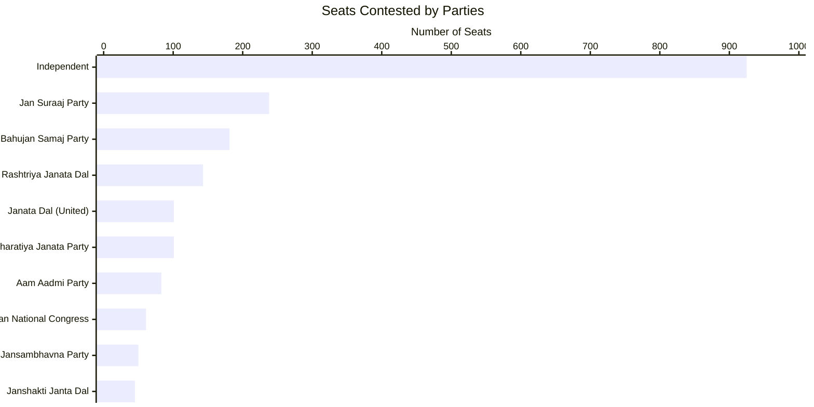

### Max and Mins

#### Maximum votes for a candidate
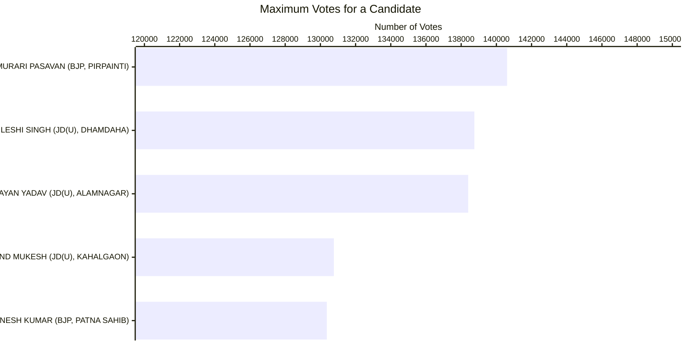

#### Least votes for a winning candidate
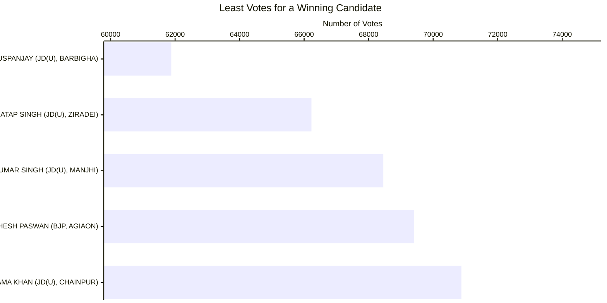

#### Max votes for a losing candidate
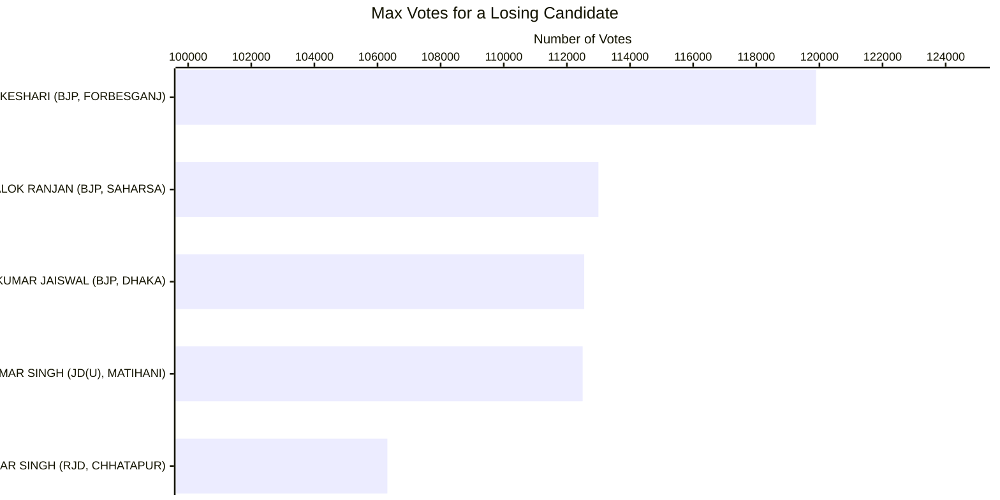

#### Candidates winning by Max margin (Unilateral winner)
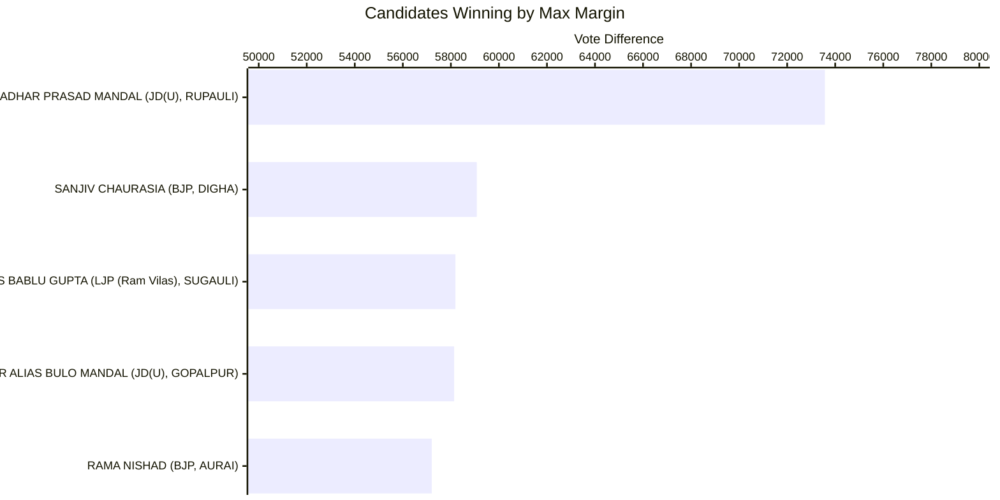

#### Candidates winning by Least margin (Fierce battle)
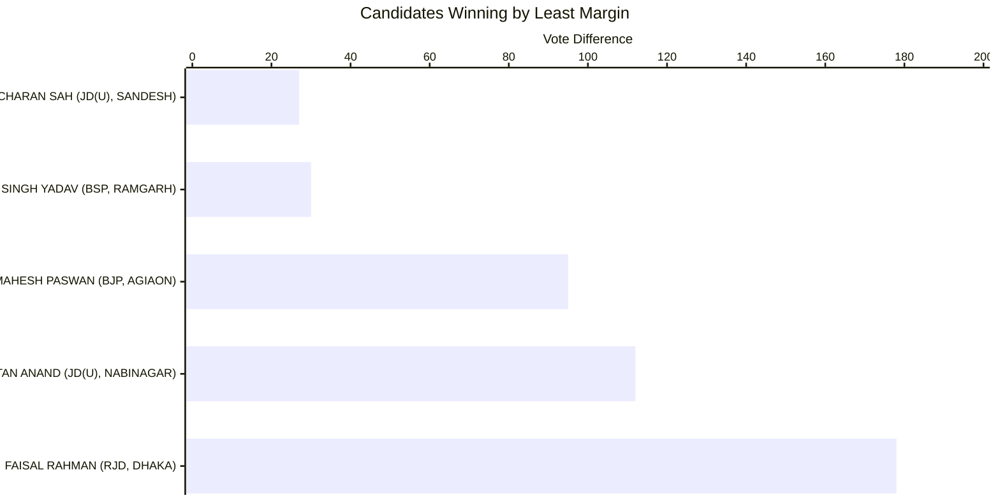
#### Max Total Votes in a Constituency
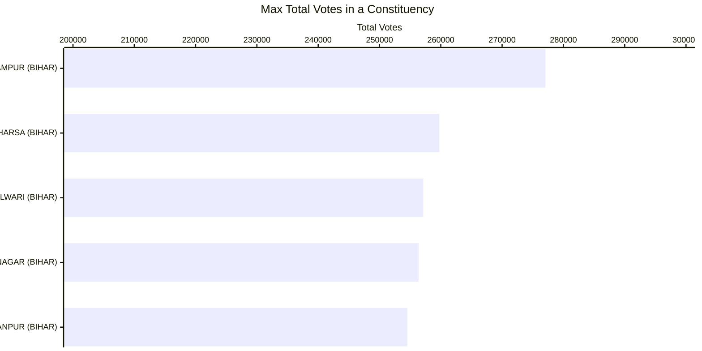

#### Min Total Votes Constituency
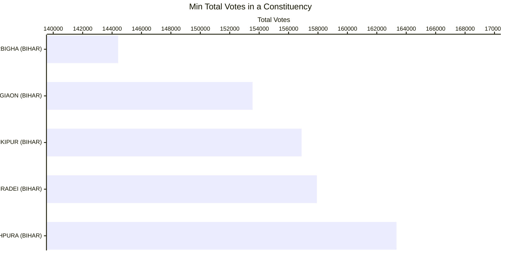

#### Max Candidates in a Constituency
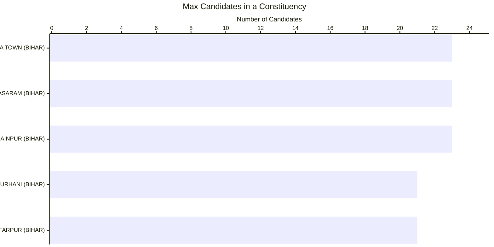

#### Least Candidates in a Constituency
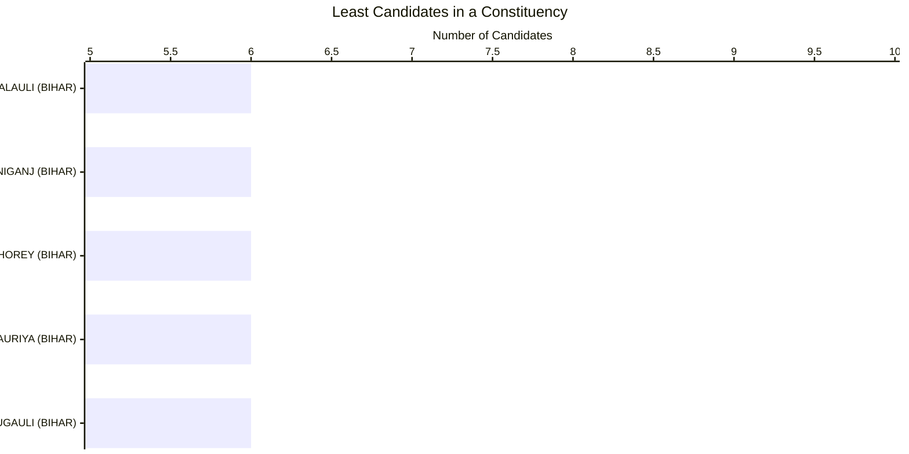

#### Total Vote Share of Parties
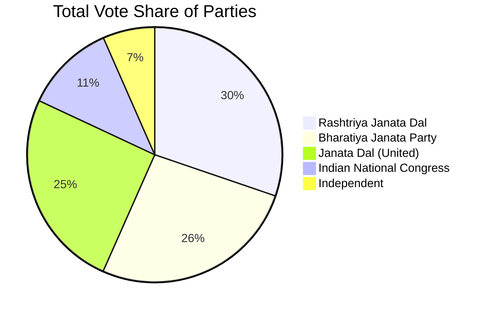

#### Maximum Vote Share of Winning Candidate
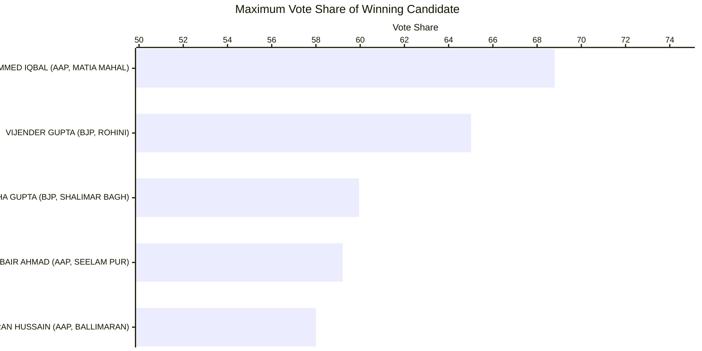

#### Least Vote Share for a Winning Candidate
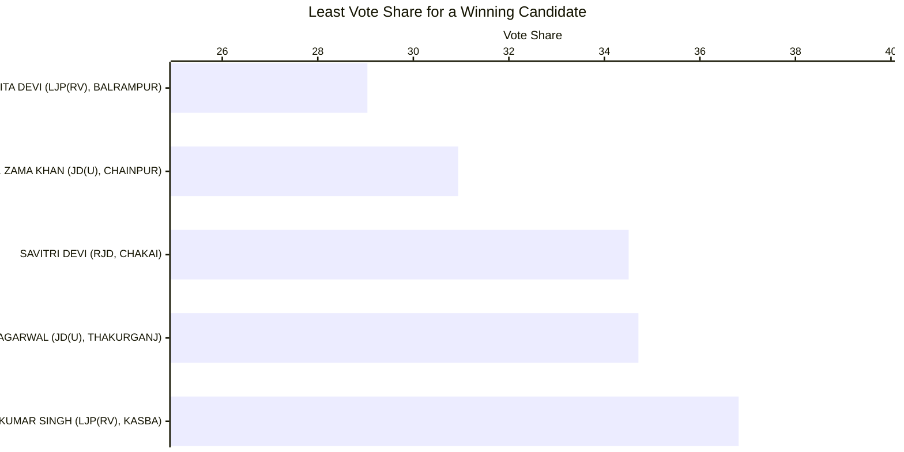

#### Max Vote Share of a Losing Candidate
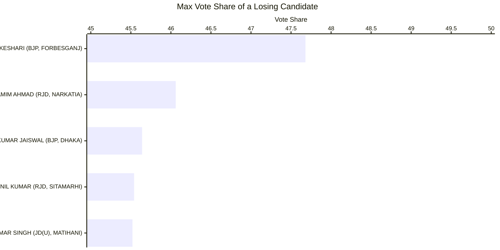

#### Seats in which Parties Lost Deposits (less than 1/6 vote share)
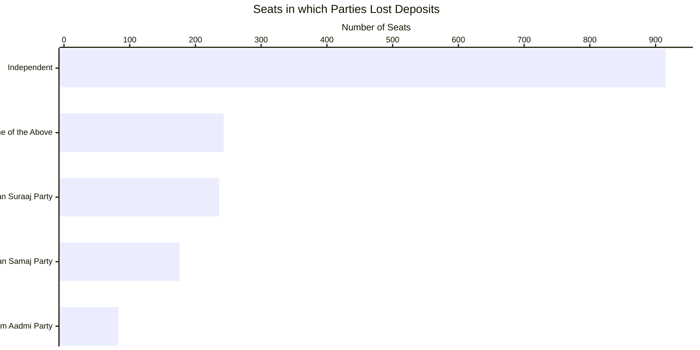

#### Gold (Seats that Parties Won)
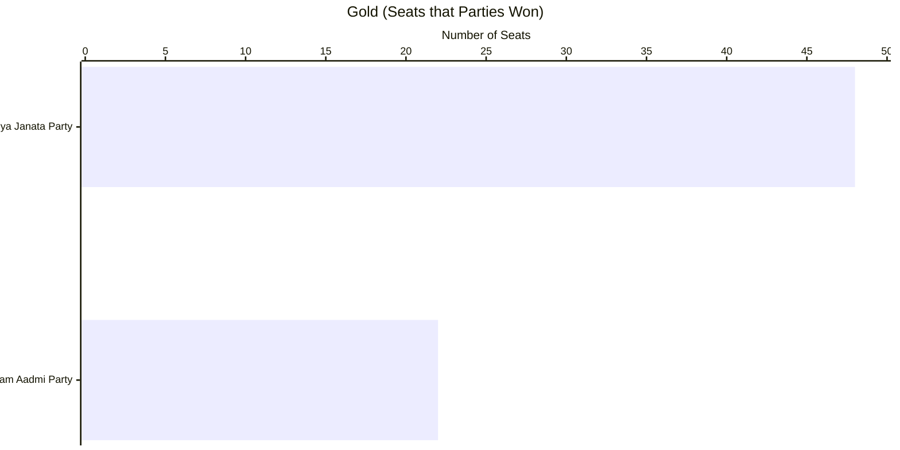

#### Silver (Seats that Parties Came in Second)
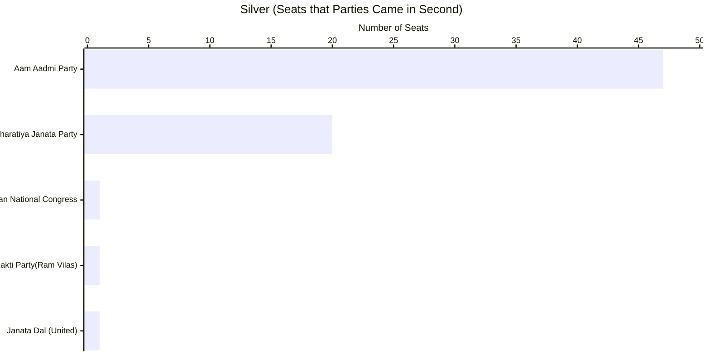

#### Cost per Vote - Best Value
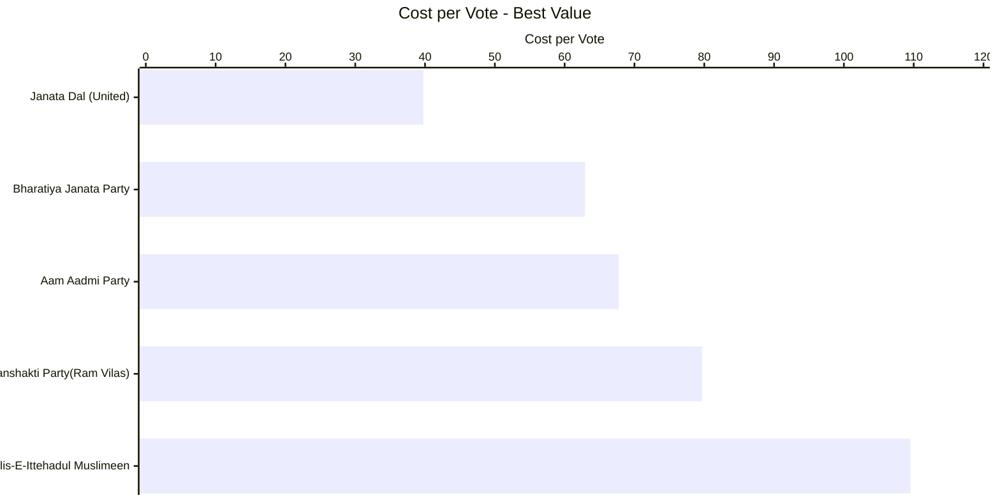

#### Cost per Vote - Worst Value
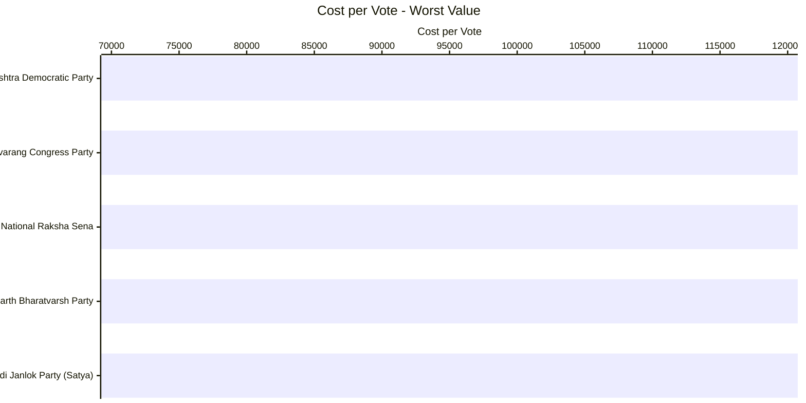

#### Success Ratio - Best

|Party                  |Seats Participated|Seats Won|Success Ratio|
|-----------------------|------------------|---------|-------------|
|Bharatiya Janata Party |68                |48       |70.5882      |
|Aam Aadmi Party        |70                |22       |31.4286      |

#### Success Ratio - Worst

|Party                    |Seats Participated|Seats Won|Success Ratio|
|-------------------------|------------------|---------|-------------|
|Indian National Congress |70                |1        |1.4286       |

### Multiple Seat Participation

#### Results of Candidates participating in multiple seats

|Candidate            |Constituency    |State     |Party                        |Result|
|---------------------|----------------|----------|-----------------------------|------|
|ASHOK KUMAR          |ROHTAS NAGAR    |NEW DELHI |Bahujan Samaj Party          |LOST  |
|ASHOK KUMAR          |MUSTAFABAD      |NEW DELHI |Bahujan Samaj Party          |LOST  |
|MUKESH KUMAR         |MANGOL PURI     |NEW DELHI |Bahujan Samaj Party          |LOST  |
|MUKESH KUMAR         |NANGLOI JAT     |NEW DELHI |Bahujan Samaj Party          |LOST  |
|MUKESH KUMAR         |KONDLI          |NEW DELHI |Bahujan Samaj Party          |LOST  |
|ASHOK KUMAR          |AMBEDKAR NAGAR  |NEW DELHI |Independent                  |LOST  |
|ASHOK KUMAR          |HARI NAGAR      |NEW DELHI |Independent                  |LOST  |
|DEEPAK KUMAR         |SULTANPUR MAJRA |NEW DELHI |Independent                  |LOST  |
|DEEPAK KUMAR         |KAROL BAGH      |NEW DELHI |Independent                  |LOST  |
|RAVI                 |KALKAJI         |NEW DELHI |Independent                  |LOST  |
|RAVI                 |MADIPUR         |NEW DELHI |Independent                  |LOST  |
|CHARAN SINGH MALIYAN |GOKALPUR        |NEW DELHI |Right to Recall Party        |LOST  |
|CHARAN SINGH MALIYAN |SEEMAPURI       |NEW DELHI |Right to Recall Party        |LOST  |

### Close Contest Matrix
This matrix provides the number of seats in which parties lost by the number of votes provided in the columns.

| PARTY                           | < 500 | < 2500 | < 5000 | < 10000 | < 15000 | < 25000 | < 50000 |
|---------------------------------|-------|--------|--------|---------|---------|---------|---------|
| Aam Aadmi Party                 | 2     | 7      | 9      | 16      | 27      | 35      | 47      |
| Bharatiya Janata Party          | 0     | 1      | 4      | 8       | 11      | 16      | 20      |
| Indian National Congress        | 0     | 0      | 0      | 0       | 1       | 1       | 1       |
| Janata Dal (United)             | 0     | 0      | 0      | 0       | 0       | 1       | 1       |
| Lok Janshakti Party (Ram Vilas) | 0     | 0      | 0      | 0       | 0       | 0       | 1       |

#### Party Specific Close Contest Matrix

##### Bharatiya Janata Party

| Constituency     | State     | Runner up Votes | Winning Party      | Winning Votes | Vote Difference |
|------------------|-----------|-----------------|--------------------|---------------|-----------------|
| DELHI CANTT      | NEW DELHI | 20162           | Aam Aadmi Party    | 22191         | 2029            |
| KALKAJI          | NEW DELHI | 48633           | Aam Aadmi Party    | 52154         | 3521            |
| PATEL NAGAR      | NEW DELHI | 53463           | Aam Aadmi Party    | 57512         | 4049            |
| AMBEDKAR NAGAR   | NEW DELHI | 42055           | Aam Aadmi Party    | 46285         | 4230            |
| KONDLI           | NEW DELHI | 55499           | Aam Aadmi Party    | 61792         | 6293            |
| SADAR BAZAR      | NEW DELHI | 49870           | Aam Aadmi Party    | 56177         | 6307            |
| KAROL BAGH       | NEW DELHI | 44867           | Aam Aadmi Party    | 52297         | 7430            |
| GOKALPUR         | NEW DELHI | 72297           | Aam Aadmi Party    | 80504         | 8207            |
| SEEMAPURI        | NEW DELHI | 55985           | Aam Aadmi Party    | 66353         | 10368           |
| TILAK NAGAR      | NEW DELHI | 40478           | Aam Aadmi Party    | 52134         | 11656           |
| TUGHLAKABAD      | NEW DELHI | 47444           | Aam Aadmi Party    | 62155         | 14711           |
| CHANDNI CHOWK    | NEW DELHI | 22421           | Aam Aadmi Party    | 38993         | 16572           |
| SULTANPUR MAJRA  | NEW DELHI | 41641           | Aam Aadmi Party    | 58767         | 17126           |
| BABARPUR         | NEW DELHI | 57198           | Aam Aadmi Party    | 76192         | 18994           |
| KIRARI           | NEW DELHI | 83909           | Aam Aadmi Party    | 105780        | 21871           |
| OKHLA            | NEW DELHI | 65304           | Aam Aadmi Party    | 88943         | 23639           |
| BADARPUR         | NEW DELHI | 87103           | Aam Aadmi Party    | 112991        | 25888           |
| BALLIMARAN       | NEW DELHI | 27181           | Aam Aadmi Party    | 57004         | 29823           |
| SEELAM PUR       | NEW DELHI | 36532           | Aam Aadmi Party    | 79009         | 42477           |
| MATIA MAHAL      | NEW DELHI | 15396           | Aam Aadmi Party    | 58120         | 42724           |

##### AAP Close Fight

| Constituency    | State     | Runner up Votes | Winning Party              | Winning Votes | Vote Difference |
|-----------------|-----------|-----------------|----------------------------|---------------|-----------------|
| SANGAM VIHAR    | NEW DELHI | 53705           | Bharatiya Janata Party     | 54049         | 344             |
| TRILOKPURI      | NEW DELHI | 57825           | Bharatiya Janata Party     | 58217         | 392             |
| JANGPURA        | NEW DELHI | 38184           | Bharatiya Janata Party     | 38859         | 675             |
| TIMARPUR        | NEW DELHI | 54773           | Bharatiya Janata Party     | 55941         | 1168            |
| RAJINDER NAGAR  | NEW DELHI | 45440           | Bharatiya Janata Party     | 46671         | 1231            |
| MEHRAULI        | NEW DELHI | 46567           | Bharatiya Janata Party     | 48349         | 1782            |
| MALVIYA NAGAR   | NEW DELHI | 37433           | Bharatiya Janata Party     | 39564         | 2131            |
| GREATER KAILASH | NEW DELHI | 46406           | Bharatiya Janata Party     | 49594         | 3188            |
| NEW DELHI       | NEW DELHI | 25999           | Bharatiya Janata Party     | 30088         | 4089            |
| SHAHDARA        | NEW DELHI | 57610           | Bharatiya Janata Party     | 62788         | 5178            |
| CHHATARPUR      | NEW DELHI | 74230           | Bharatiya Janata Party     | 80469         | 6239            |
| MANGOL PURI     | NEW DELHI | 55752           | Bharatiya Janata Party     | 62007         | 6255            |
| HARI NAGAR      | NEW DELHI | 43547           | Bharatiya Janata Party     | 50179         | 6632            |
| DWARKA          | NEW DELHI | 61308           | Bharatiya Janata Party     | 69137         | 7829            |
| NERELA          | NEW DELHI | 78619           | Bharatiya Janata Party     | 87215         | 8596            |
| PALAM           | NEW DELHI | 73094           | Bharatiya Janata Party     | 82046         | 8952            |
| MUNDKA          | NEW DELHI | 79289           | Bharatiya Janata Party     | 89839         | 10550           |
| MADIPUR         | NEW DELHI | 41120           | Bharatiya Janata Party     | 52019         | 10899           |
| BIJWASAN        | NEW DELHI | 53675           | Bharatiya Janata Party     | 64951         | 11276           |
| WAZIRPUR        | NEW DELHI | 43296           | Bharatiya Janata Party     | 54721         | 11425           |

##### Indian National Congress

|Constituency   |State     |Runner up Votes|Winning Party             |Winning Votes|Vote Difference|
|---------------|----------|---------------|--------------------------|-------------|---------------|
|KASTURBA NAGAR |NEW DELHI |27019          |Bharatiya Janata Party    |38067        |11048          |

### Advanced Join Insights

#### Crowding pressure seats

Crowded ballots with thin margins are visualized below using "others" vote share as a proxy for fragmentation.

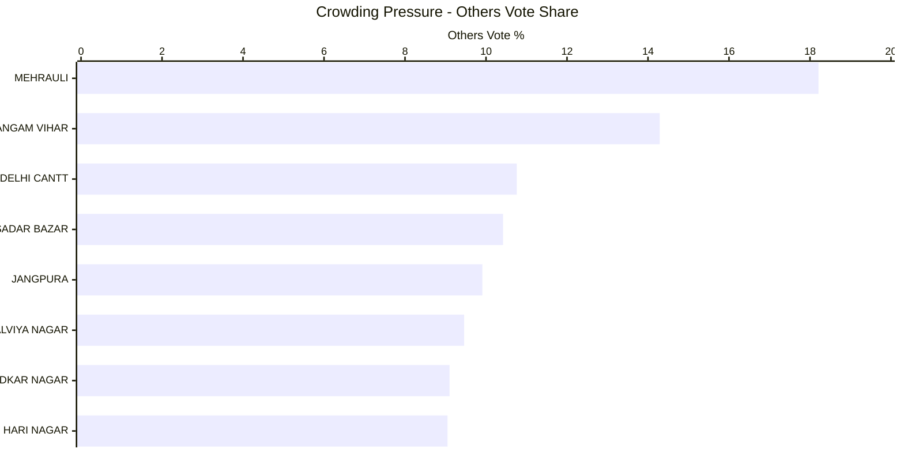

#### Runner-up overperformance vs party baseline

These runner-up candidates beat their party-wide average vote share even in defeat.

```mermaid
---
config:
    xyChart:
        width: 1200
        height: 600
        chartOrientation: horizontal
        dataLabels:
            enabled: true
            placement: end
---
xychart-beta
    title "Runner-up Overperformance"
    x-axis ["KASTURBA NAGAR", "RAJINDER NAGAR", "TRILOKPURI", "SHAHDARA", "CHHATARPUR", "MANGOL PURI", "TIMARPUR", "NERELA"]
    y-axis "Overperformance %" 0 --> 30
    bar [25.29, 2.99, 2.04, 1.79, 1.43, 1.41, 1.32, 1.24]
```

#### HHI win mix by party

Competition bands (Herfindahl-Hirschman Index) show which parties dominate different contest types.

```mermaid
---
config:
    xyChart:
        width: 1200
        height: 600
        dataLabels:
            enabled: true
            placement: end
---
xychart-beta
    title "HHI Win Mix by Party"
    x-axis ["Fragmented", "Competitive", "Dominant"]
    y-axis "Seats Won" 0 --> 30
    bar "Aam Aadmi Party" [1, 16, 5]
    bar "Bharatiya Janata Party" [3, 23, 22]
```

#### Third-place spoilers in tight races

Third-place candidacies that materially exceeded their party’s norm highlight potential spoiler roles.

```mermaid
---
config:
    xyChart:
        width: 1200
        height: 600
        chartOrientation: horizontal
        dataLabels:
            enabled: true
            placement: end
---
xychart-beta
    title "Third-place Overperformance"
    x-axis ["MEHRAULI", "SANGAM VIHAR", "DELHI CANTT", "JANGPURA", "SADAR BAZAR", "MALVIYA NAGAR", "NEW DELHI", "AMBEDKAR NAGAR"]
    y-axis "Overperformance %" 0 --> 9
    bar [8.16, 5.93, 2.27, 1.91, 1.80, 1.27, 0.72, 0.69]
```