# Table of contents

- [Analysis of Haryana Assembly Elections October 2024](#analysis-of-haryana-assembly-elections-october-2024)
   * [Analysis](#analysis)
      + [Seats contested by Parties](#seats-contested-by-parties)
      + [Max and Mins](#max-and-mins)
         - [Maximum votes for a candidate](#maximum-votes-for-a-candidate)
         - [Least votes for a winning candidate](#least-votes-for-a-winning-candidate)
         - [Max votes for a losing candidate](#max-votes-for-a-losing-candidate)
         - [Candidates winning by Max margin (Unilateral winner)](#candidates-winning-by-max-margin-unilateral-winner)
         - [Candidates winning by Least margin (Fierce battle)](#candidates-winning-by-least-margin-fierce-battle)
      + [Max and Mins - Constituencies](#max-and-mins---constituencies)
         - [Max Total Votes in a Constituency](#max-total-votes-in-a-constituency)
         - [Min Total Votes Constituency](#min-total-votes-constituency)
         - [Max candidates in a Constituency](#max-candidates-in-a-constituency)
         - [Least candidates in a Constituency](#least-candidates-in-a-constituency)
      + [Vote Shares](#vote-shares)
         - [Total Vote Share of Parties](#total-vote-share-of-parties)
         - [Maximum Vote share of Winning Candidate](#maximum-vote-share-of-winning-candidate)
         - [Least Vote share for a winning candidate](#least-vote-share-for-a-winning-candidate)
         - [Max Vote share of a losing candidate](#max-vote-share-of-a-losing-candidate)
         - [Seats in which Parties lost deposits (less than 1/6 vote share)](#seats-in-which-parties-lost-deposits-less-than-16-vote-share)
      + [Medals](#medals)
         - [Gold (Seats that Parties won)](#gold-seats-that-parties-won)
         - [Silver (Seats that Parties came in second)](#silver-seats-that-parties-came-in-second)
      + [Strike Rates](#strike-rates)
         - [Cost per vote - Best Value per vote](#cost-per-vote---best-value-per-vote)
         - [Cost per vote - Worst Value per vote](#cost-per-vote---worst-value-per-vote)
         - [Success Ratio - Best](#success-ratio---best)
         - [Success Ratio - Worst](#success-ratio---worst)
      + [Multiple Seat Participation](#multiple-seat-participation)
         - [Candidates participating in multiple seats (matches names)](#candidates-participating-in-multiple-seats-matches-names)
      + [Close Contest Matrix](#close-contest-matrix)
         - [Party Specific Close Contest Matrix](#party-specific-close-contest-matrix)
            * [Bharatiya Janata Party](#bharatiya-janata-party)
            * [Indian National Congress](#indian-national-congress)
        + [Advanced Join Insights](#advanced-join-insights)
            - [Crowding pressure seats](#crowding-pressure-seats)
            - [Runner-up overperformance vs party baseline](#runner-up-overperformance-vs-party-baseline)
            - [HHI win mix by party](#hhi-win-mix-by-party)
            - [Third-place spoilers in tight races](#third-place-spoilers-in-tight-races)

# Analysis of New Delhi Assembly Elections February 2025

The 2025 Delhi Legislative Assembly elections were held in Delhi on 5 February 2025 to elect all 70 members of the Delhi Legislative Assembly. The counting of votes and declaration of result took place on 8 February 2025. ([wiki](https://en.wikipedia.org/wiki/2025_Delhi_Legislative_Assembly_election)).

This page provides the highlights of the results. Complete results of the analysis can be seen [here](https://github.com/arjunswaj/elections/tree/delhi-2025/result/Bihar).

## Analysis
A total of 2,616 candidates contested in the Bihar assembly elections and about 5.02 Crore (`50207733`) votes were cast during this period.

### Seats contested by Parties
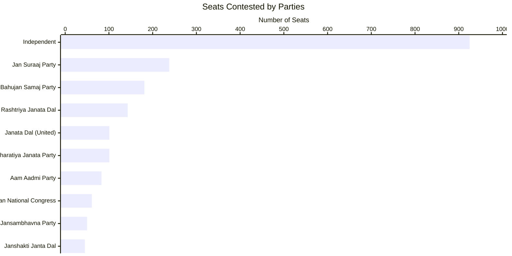

### Max and Mins

#### Maximum votes for a candidate
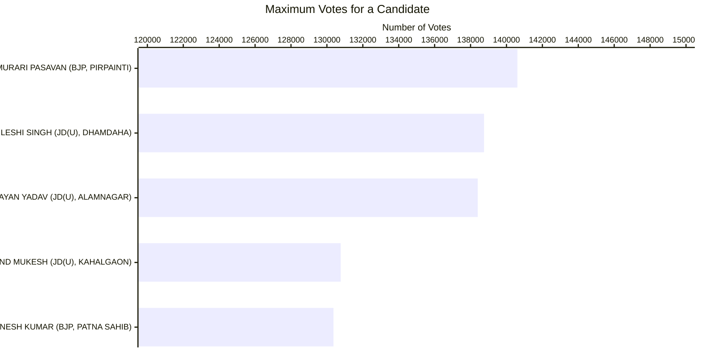

#### Least votes for a winning candidate
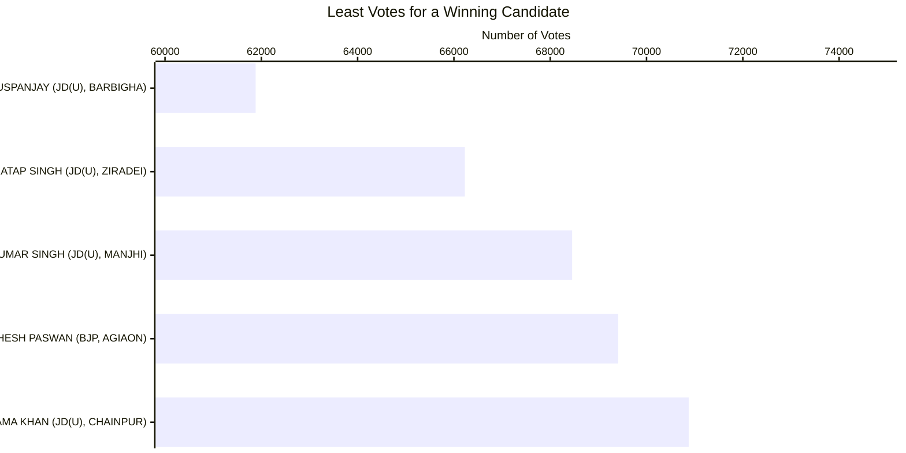

#### Max votes for a losing candidate
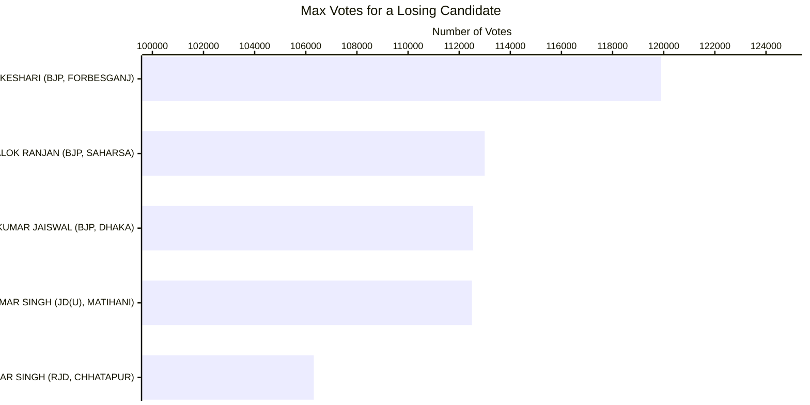

#### Candidates winning by Max margin (Unilateral winner)
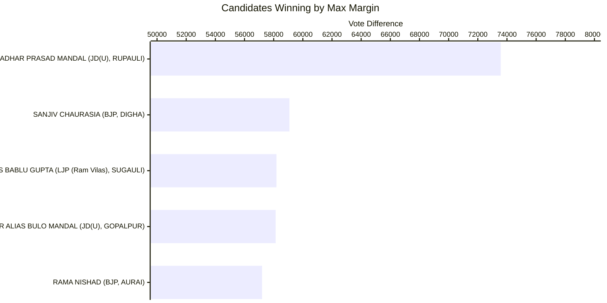

#### Candidates winning by Least margin (Fierce battle)
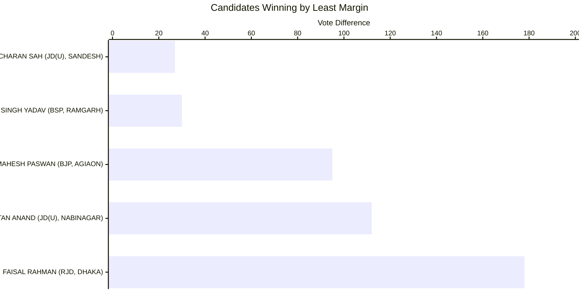
#### Max Total Votes in a Constituency
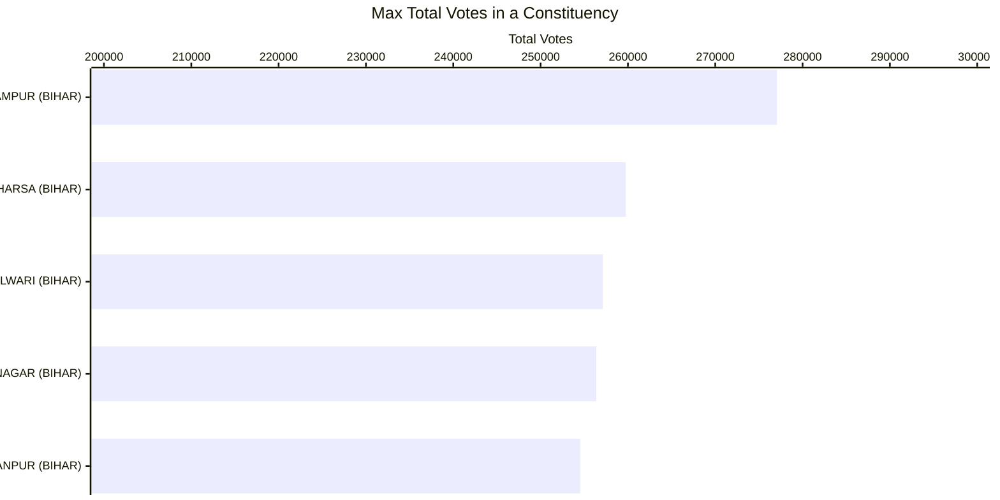

#### Min Total Votes Constituency
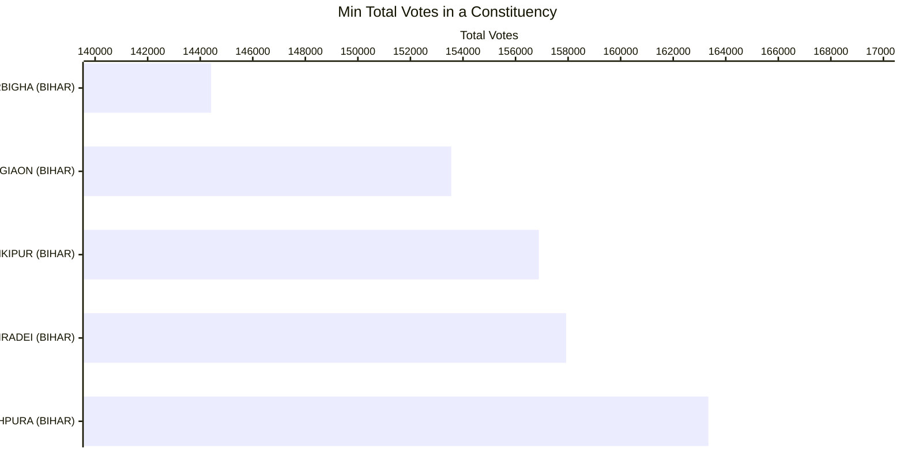

#### Max Candidates in a Constituency
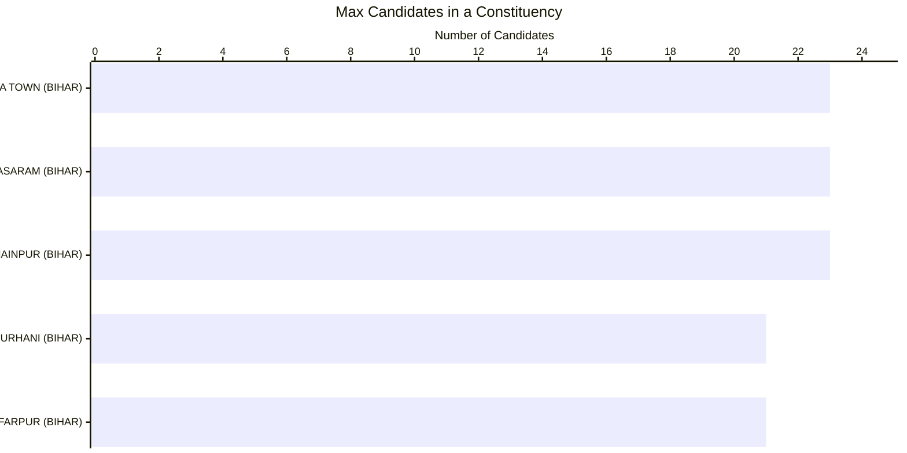

#### Least Candidates in a Constituency
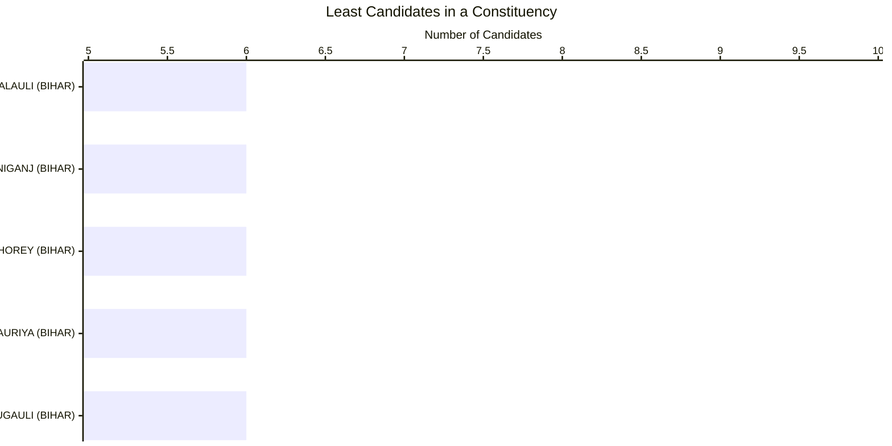

#### Total Vote Share of Parties
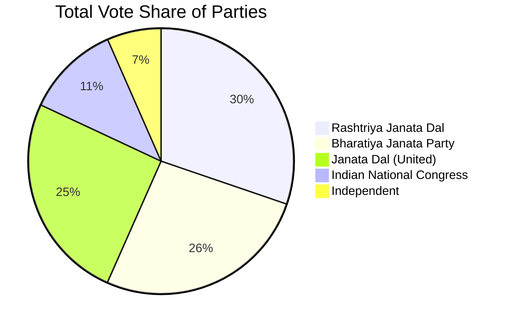

#### Maximum Vote Share of Winning Candidate
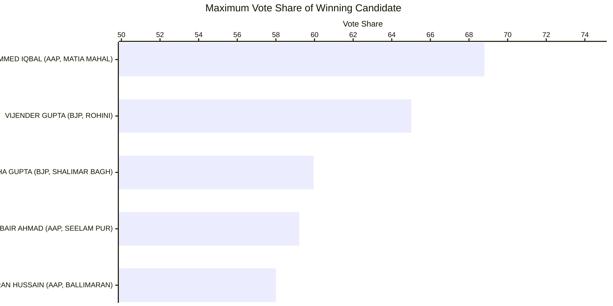

#### Least Vote Share for a Winning Candidate
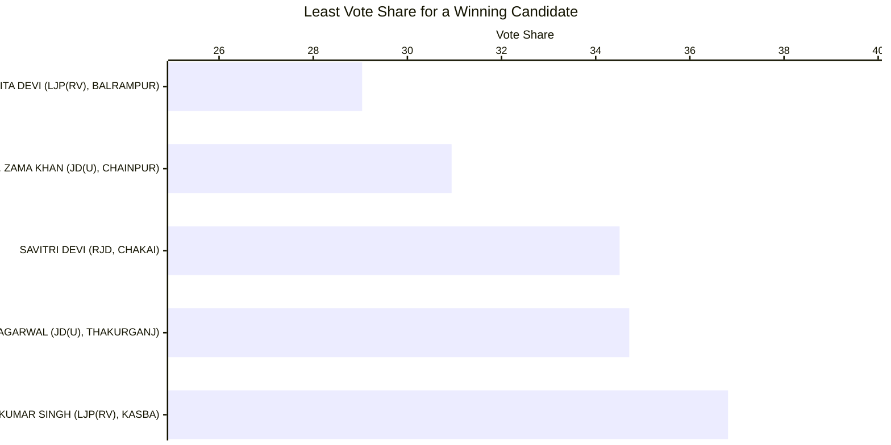

#### Max Vote Share of a Losing Candidate
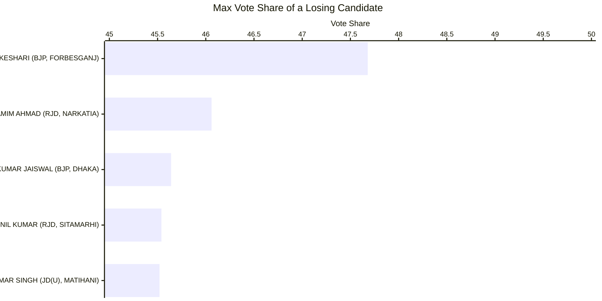

#### Seats in which Parties Lost Deposits (less than 1/6 vote share)
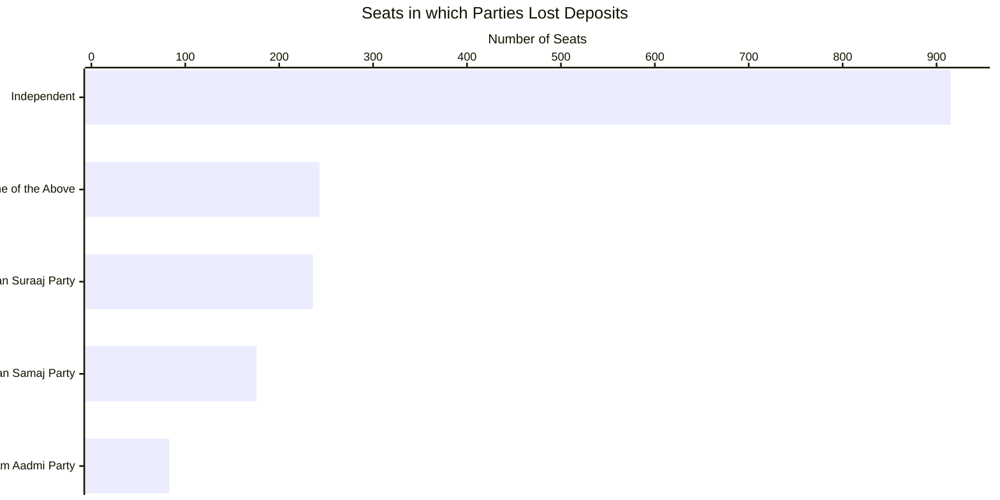

#### Gold (Seats that Parties Won)
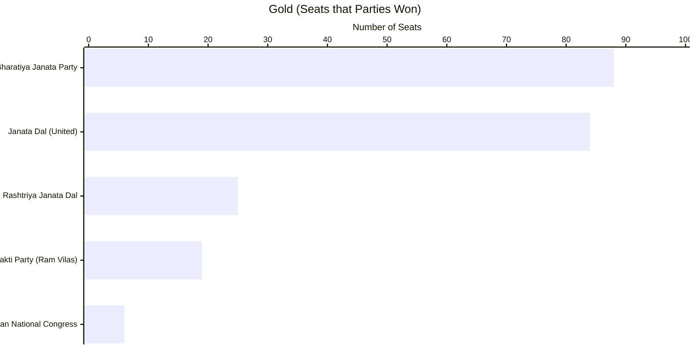

#### Silver (Seats that Parties Came in Second)
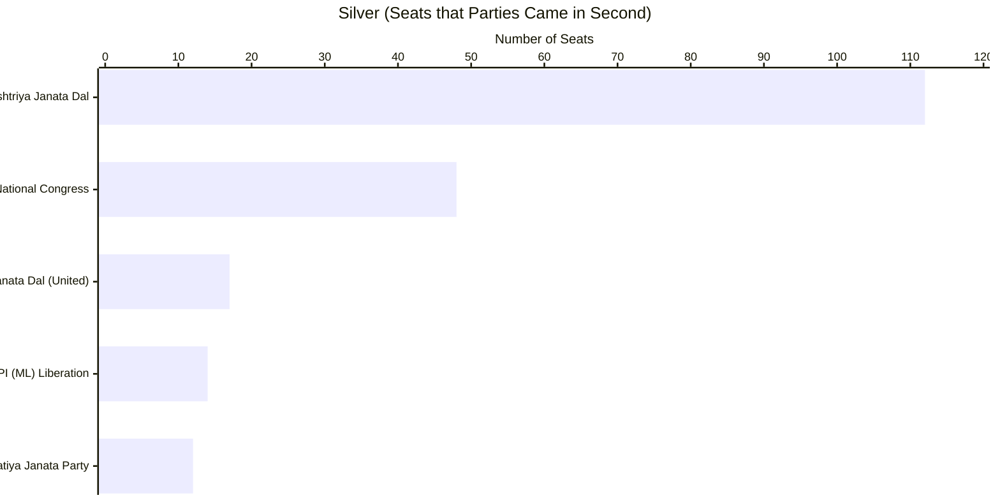

#### Cost per Vote - Best Value
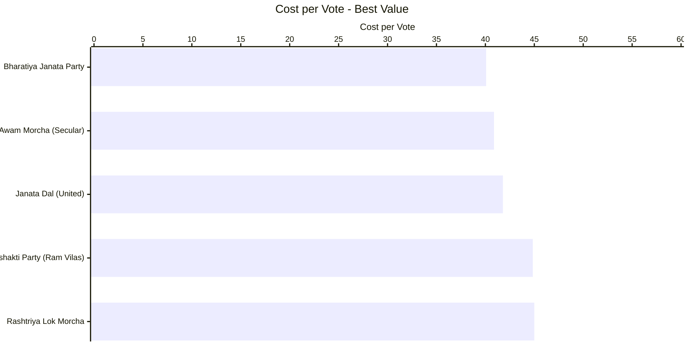

#### Cost per Vote - Worst Value
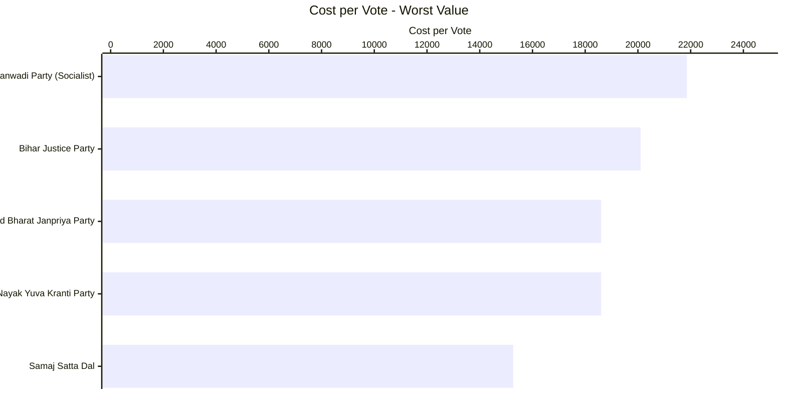

#### Success Ratio - Best

|Party                              |Seats Participated|Seats Won|Success Ratio|
|-----------------------------------|------------------|---------|-------------|
|Bharatiya Janata Party             |101               |88       |87.1287      |
|Hindustani Awam Morcha (Secular)   |6                 |5        |83.3333      |
|Janata Dal (United)                |101               |84       |83.1683      |
|Lok Janshakti Party (Ram Vilas)    |28                |19       |67.8571      |
|Rashtriya Lok Morcha               |6                 |4        |66.6667      |

#### Success Ratio - Worst

|Party                                        |Seats Participated|Seats Won|Success Ratio|
|---------------------------------------------|------------------|---------|-------------|
|Bahujan Samaj Party                          |179               |1        |0.5587       |
|Indian National Congress                     |61                |6        |9.8361       |
|Communist Party of India (Marxist-Leninist) (Liberation) |20      |2        |10.0000      |
|Rashtriya Janata Dal                         |143               |25       |17.4825      |
|All India Majlis-E-Ittehadul Muslimeen       |28                |5        |17.8571      |

### Multiple Seat Participation

#### Results of Candidates participating in multiple seats

|Candidate            |Constituency       |State |Party                               |Result|
|---------------------|-------------------|------|------------------------------------|------|
|SANJAY KUMAR SINGH   |SIMRI BAKHTIARPUR  |BIHAR |Lok Janshakti Party (Ram Vilas)     |WON   |
|SANJAY KUMAR SINGH   |MAHUA              |BIHAR |Lok Janshakti Party (Ram Vilas)     |WON   |
|ASHOK KUMAR          |SASARAM            |BIHAR |Bahujan Samaj Party                 |LOST  |
|ASHOK KUMAR          |KURTHA             |BIHAR |Bahujan Samaj Party                 |LOST  |
|ASHOK KUMAR          |NAWADA             |BIHAR |Bahujan Samaj Party                 |LOST  |

### Close Contest Matrix
This matrix provides the number of seats in which parties lost by the number of votes provided in the columns.

| PARTY                           | < 500 | < 2500 | < 5000 | < 10000 | < 15000 | < 25000 | < 50000 |
|---------------------------------|-------|--------|--------|---------|---------|---------|---------|
| All India Majlis-E-Ittehadul Muslimeen | 1 | 1 | 1 | 2 | 2 | 2 | 2 |
| Bahujan Samaj Party             | 0     | 0      | 0      | 0       | 0       | 0       | 1       |
| Bharatiya Janata Party          | 3     | 5      | 6      | 8       | 10      | 10      | 11      |
| Communist Party of India        | 0     | 0      | 0      | 0       | 0       | 2       | 4       |
| Communist Party of India (Marxist) | 0  | 0      | 0      | 1       | 3       | 3       | 3       |

#### Party Specific Close Contest Matrix

##### Bharatiya Janata Party

| Constituency  | State | Constituency Code | Runner up Votes | Winning Party                    | Winning Votes | Vote Difference |
|---------------|-------|-------------------|-----------------|----------------------------------|---------------|-----------------|
| RAMGARH       | BIHAR | S04203            | 72659           | Bahujan Samaj Party              | 72689         | 30              |
| DHAKA         | BIHAR | S0421             | 112549          | Rashtriya Janata Dal             | 112727        | 178             |
| FORBESGANJ    | BIHAR | S0448             | 119893          | Indian National Congress         | 120114        | 221             |
| CHANPATIA     | BIHAR | S047              | 86936           | Indian National Congress         | 87538         | 602             |
| SAHARSA       | BIHAR | S0475             | 112998          | Indian Inclusive Party           | 115036        | 2038            |

##### Rashtriya Janata Dal

| Constituency | State | Constituency Code | Runner up Votes | Winning Party                    | Winning Votes | Vote Difference |
|--------------|-------|-------------------|-----------------|----------------------------------|---------------|-----------------|
| SANDESH      | BIHAR | S04192            | 80571           | Janata Dal (United)              | 80598         | 27              |
| NABINAGAR    | BIHAR | S04221            | 80268           | Janata Dal (United)              | 80380         | 112             |
| BAKHTIARPUR  | BIHAR | S04180            | 87539           | Lok Janshakti Party (Ram Vilas)  | 88520         | 981             |
| TARAIYA      | BIHAR | S04116            | 84235           | Bharatiya Janata Party           | 85564         | 1329            |
| NARKATIA     | BIHAR | S0412             | 103007          | Janata Dal (United)              | 104450        | 1443            |

##### Janata Dal (United)

| Constituency  | State | Constituency Code | Runner up Votes | Winning Party                                          | Winning Votes | Vote Difference |
|---------------|-------|-------------------|-----------------|--------------------------------------------------------|---------------|-----------------|
| JEHANABAD     | BIHAR | S04216            | 85609           | Rashtriya Janata Dal                                   | 86402         | 793             |
| VALMIKI NAGAR | BIHAR | S041              | 106055          | Indian National Congress                               | 107730        | 1675            |
| KARAKAT       | BIHAR | S04213            | 71321           | Communist Party of India (Marxist-Leninist) (Liberation) | 74157      | 2836            |
| MAHISHI       | BIHAR | S0477             | 90012           | Rashtriya Janata Dal                                   | 93752         | 3740            |
| MATIHANI      | BIHAR | S04144            | 112499          | Rashtriya Janata Dal                                   | 117789        | 5290            |

##### Indian National Congress

| Constituency | State | Constituency Code | Runner up Votes | Winning Party               | Winning Votes | Vote Difference |
|--------------|-------|-------------------|-----------------|-----------------------------|---------------|-----------------|
| BIKRAM       | BIHAR | S04191            | 95588           | Bharatiya Janata Party      | 101189        | 5601            |
| BAGAHA       | BIHAR | S044              | 100562          | Bharatiya Janata Party      | 106875        | 6313            |
| AURANGABAD   | BIHAR | S04223            | 80406           | Bharatiya Janata Party      | 87200         | 6794            |
| RAJPUR       | BIHAR | S04202            | 71565           | Janata Dal (United)         | 80701         | 9136            |
| BARARI       | BIHAR | S0468             | 96858           | Janata Dal (United)         | 107842        | 10984           |

### Advanced Join Insights

#### Crowding pressure seats

Crowded ballots with thin margins are visualized below using "others" vote share as a proxy for fragmentation.

|Constituency | Winning Party                   | Runner Up Party                          | Candidates | Others Vote % | Margin Votes | Postal Vote Gap | Crowding Band   |
|-------------|---------------------------------|------------------------------------------|------------|---------------|--------------|-----------------|-----------------|
| BALRAMPUR   | Lok Janshakti Party (Ram Vilas) | All India Majlis-E-Ittehadul Muslimeen   | 19         | 42.04         | 389          | 38              | Ultra-crowded   |
| CHAINPUR    | Janata Dal (United)             | Rashtriya Janata Dal                     | 23         | 41.74         | 8362         | -58             | Ultra-crowded   |
| THAKURGANJ  | Janata Dal (United)             | All India Majlis-E-Ittehadul Muslimeen   | 11         | 34.16         | 8822         | 183             | Crowded         |
| MANJHI      | Janata Dal (United)             | Communist Party of India (Marxist)       | 13         | 28.45         | 9787         | 76              | Crowded         |
| RAJPUR      | Janata Dal (United)             | Indian National Congress                 | 14         | 27.94         | 9136         | -19             | Crowded         |

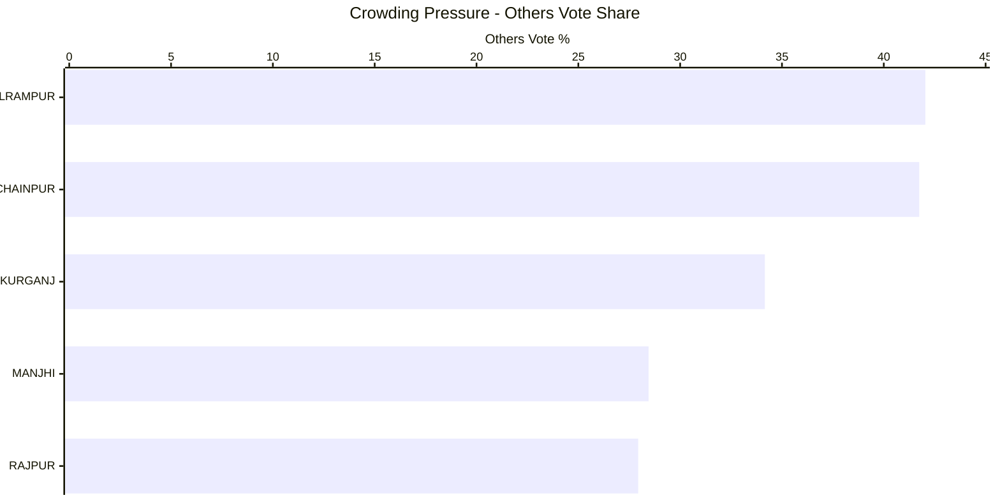

#### Runner-up overperformance vs party baseline

These runner-up candidates beat their party-wide average vote share even in defeat.

|Constituency      |Runner Up Candidate                      |Party               |Runner Up %|Party Avg %|Overperformance %|
|------------------|-----------------------------------------|--------------------|-----------|-----------|-----------------|
|PARIHAR           |RITU JAISWAL                             |Independent         |31.17      |1.33       |29.84            |
|MARHAURA          |NAVEEN KUMAR SINGH URAF ABHAY SINGH      |Jan Suraaj Party    |32.42      |3.48       |28.94            |
|MOHANIA           |RAVI SHANKAR PASWAN                     |Independent         |30.15      |1.33       |28.82            |
|KUSHESHWAR ASTHAN |GANESH BHARTI                           |Independent         |30.03      |1.33       |28.70            |
|KARGAHAR          |UDAY PRATAP SINGH                       |Bahujan Samaj Party |25.87      |2.21       |23.66            |

```mermaid
---
config:
    xyChart:
        width: 1200
        height: 600
        chartOrientation: horizontal
        dataLabels:
            enabled: true
            placement: end
---
xychart-beta
    title "Runner-up Overperformance"
    x-axis ["PARIHAR", "MARHAURA", "MOHANIA", "KUSHESHWAR ASTHAN", "KARGAHAR"]
    y-axis "Overperformance %" 0 --> 35
    bar [29.84, 28.94, 28.82, 28.70, 23.66]
```

#### HHI win mix by party

Competition bands (Herfindahl-Hirschman Index) show which parties dominate different contest types.

|Party                              |HHI Band    |Seats Won|
|-----------------------------------|------------|---------|
|Bharatiya Janata Party             |Competitive |74       |
|Bharatiya Janata Party             |Dominant    |6        |
|Janata Dal (United)                |Competitive |61       |
|Janata Dal (United)                |Fragmented  |24       |
|Rashtriya Janata Dal               |Competitive |19       |
|Lok Janshakti Party (Ram Vilas)    |Competitive |10       |
|All India Majlis-E-Ittehadul Muslimeen | Fragmented | 5   |

```mermaid
---
config:
    xyChart:
        width: 1200
        height: 600
        dataLabels:
            enabled: true
            placement: end
---
xychart-beta
    title "HHI Win Mix by Party"
    x-axis ["Fragmented", "Competitive", "Dominant"]
    y-axis "Seats Won" 0 --> 80
    bar "Bharatiya Janata Party" [0, 74, 6]
    bar "Janata Dal (United)" [24, 61, 0]
    bar "Rashtriya Janata Dal" [0, 19, 0]
    bar "Lok Janshakti Party (Ram Vilas)" [0, 10, 0]
    bar "All India Majlis-E-Ittehadul Muslimeen" [5, 0, 0]
```

#### Third-place spoilers in tight races

Third-place candidacies that materially exceeded their party’s norm highlight potential spoiler roles.

```mermaid
---
config:
    xyChart:
        width: 1200
        height: 600
        chartOrientation: horizontal
        dataLabels:
            enabled: true
            placement: end
---
xychart-beta
    title "Third-place Overperformance"
    x-axis ["CHAINPUR", "MORWA", "CHANPATIA", "KARAKAT", "MANJHI"]
    y-axis "Overperformance %" 0 --> 25
    bar [20.14, 13.94, 13.54, 10.54, 9.44]
```