# Table of contents

- [Analysis of Haryana Assembly Elections October 2024](#analysis-of-haryana-assembly-elections-october-2024)
   * [Analysis](#analysis)
      + [Seats contested by Parties](#seats-contested-by-parties)
      + [Max and Mins](#max-and-mins)
         - [Maximum votes for a candidate](#maximum-votes-for-a-candidate)
         - [Least votes for a winning candidate](#least-votes-for-a-winning-candidate)
         - [Max votes for a losing candidate](#max-votes-for-a-losing-candidate)
         - [Candidates winning by Max margin (Unilateral winner)](#candidates-winning-by-max-margin-unilateral-winner)
         - [Candidates winning by Least margin (Fierce battle)](#candidates-winning-by-least-margin-fierce-battle)
      + [Max and Mins - Constituencies](#max-and-mins---constituencies)
         - [Max Total Votes in a Constituency](#max-total-votes-in-a-constituency)
         - [Min Total Votes Constituency](#min-total-votes-constituency)
         - [Max candidates in a Constituency](#max-candidates-in-a-constituency)
         - [Least candidates in a Constituency](#least-candidates-in-a-constituency)
      + [Vote Shares](#vote-shares)
         - [Total Vote Share of Parties](#total-vote-share-of-parties)
         - [Maximum Vote share of Winning Candidate](#maximum-vote-share-of-winning-candidate)
         - [Least Vote share for a winning candidate](#least-vote-share-for-a-winning-candidate)
         - [Max Vote share of a losing candidate](#max-vote-share-of-a-losing-candidate)
         - [Seats in which Parties lost deposits (less than 1/6 vote share)](#seats-in-which-parties-lost-deposits-less-than-16-vote-share)
      + [Medals](#medals)
         - [Gold (Seats that Parties won)](#gold-seats-that-parties-won)
         - [Silver (Seats that Parties came in second)](#silver-seats-that-parties-came-in-second)
      + [Strike Rates](#strike-rates)
         - [Cost per vote - Best Value per vote](#cost-per-vote---best-value-per-vote)
         - [Cost per vote - Worst Value per vote](#cost-per-vote---worst-value-per-vote)
         - [Success Ratio - Best](#success-ratio---best)
         - [Success Ratio - Best](#success-ratio---best-1)
      + [Multiple Seat Participation](#multiple-seat-participation)
         - [Candidates participating in multiple seats (matches names)](#candidates-participating-in-multiple-seats-matches-names)
      + [Close Contest Matrix](#close-contest-matrix)
         - [Party Specific Close Contest Matrix](#party-specific-close-contest-matrix)
            * [Bharatiya Janata Party](#bharatiya-janata-party)
            * [Indian National Congress](#indian-national-congress)

# Analysis of Haryana Assembly Elections October 2024

The 2024 Haryana Legislative Assembly elections were held in Haryana on 5 October 2024 to elect all 90 members of the Haryana Legislative Assembly ([wiki](https://en.wikipedia.org/wiki/2024_Haryana_Legislative_Assembly_election)).

This page provides the highlights of the results. Complete results of the analysis can be seen [here](https://github.com/arjunswaj/elections/tree/haryana-jk-2024/result/Haryana).

## Analysis
A total of 1031 candidates contested in the elections and around 1.38 Crores (`13891280`) votes were casted during this period.

### Seats contested by Parties
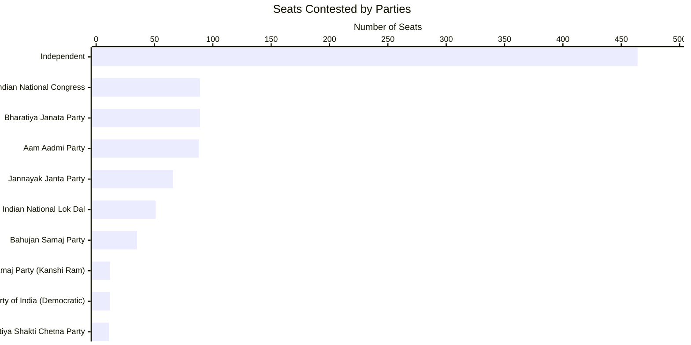

### Max and Mins

#### Maximum votes for a candidate
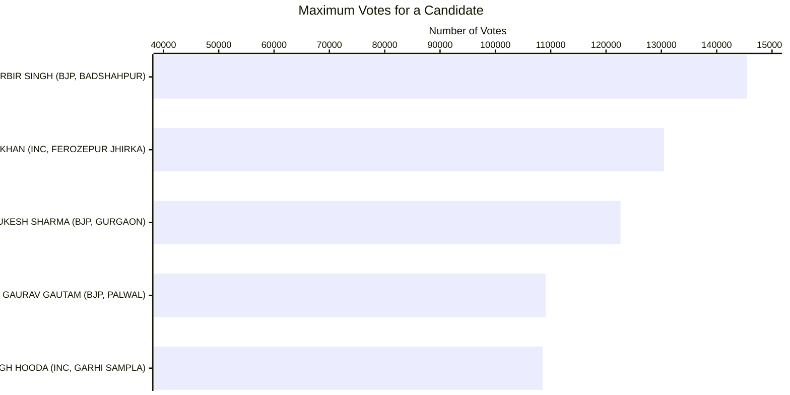

#### Least votes for a winning candidate
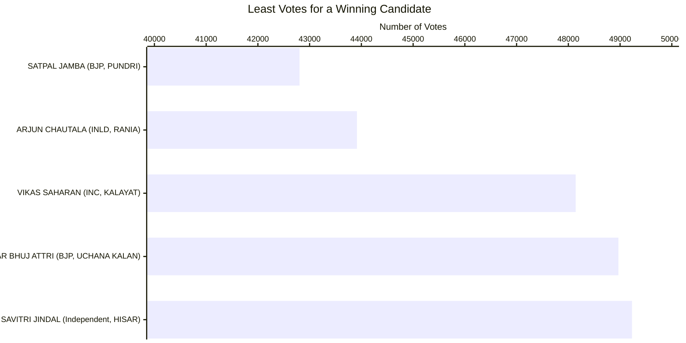

#### Max votes for a losing candidate
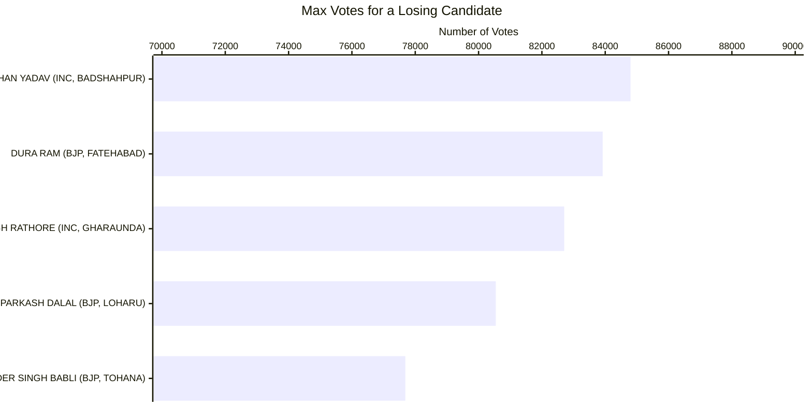

#### Candidates winning by Max margin (Unilateral winner)
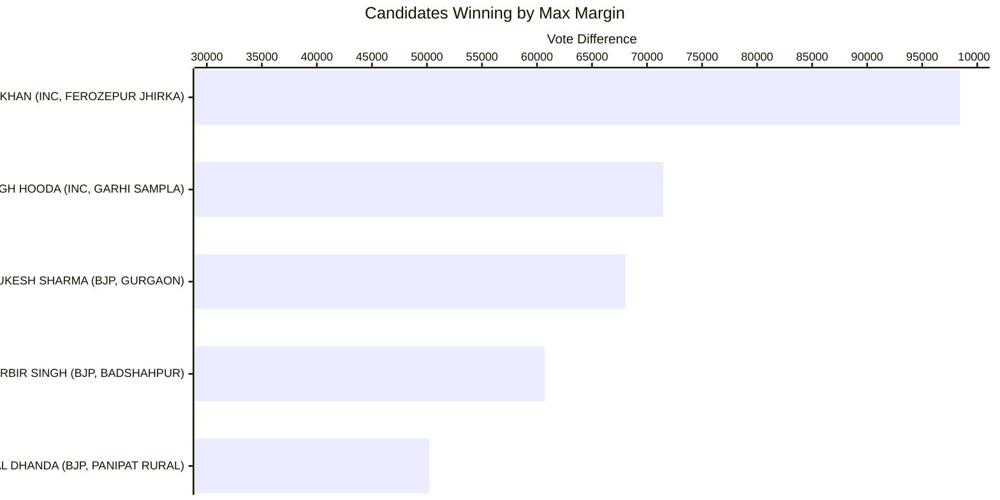

#### Candidates winning by Least margin (Fierce battle)
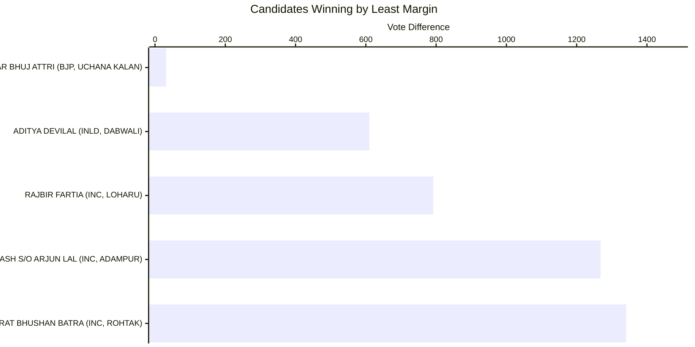

#### Max Total Votes in a Constituency
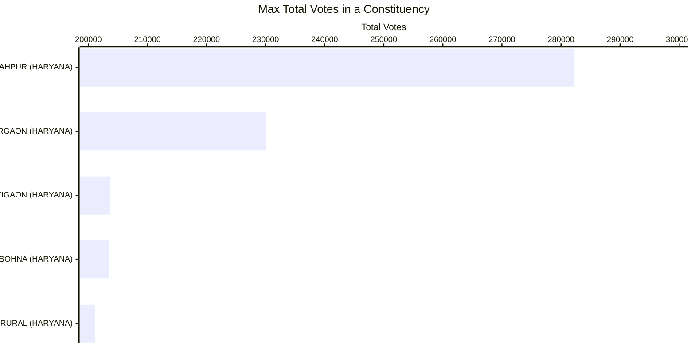

#### Min Total Votes Constituency
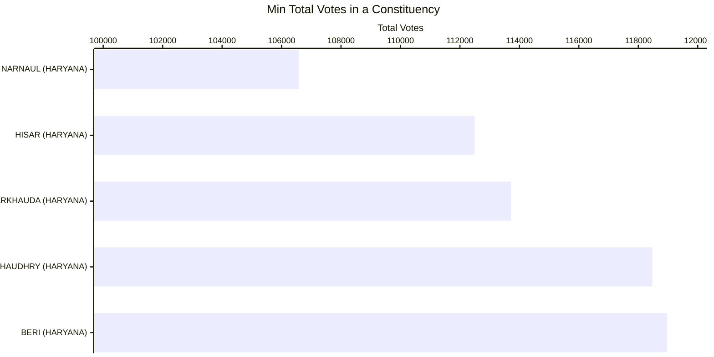

#### Max candidates in a Constituency
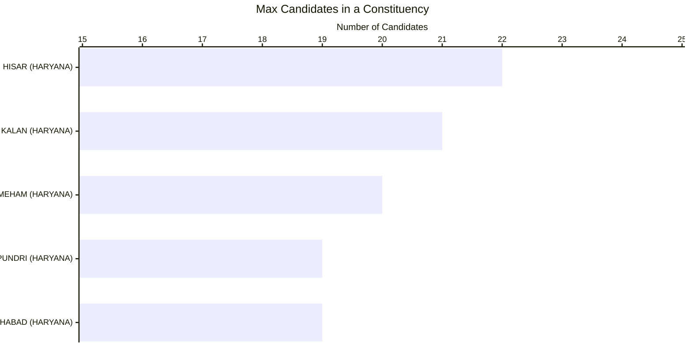

#### Least candidates in a Constituency
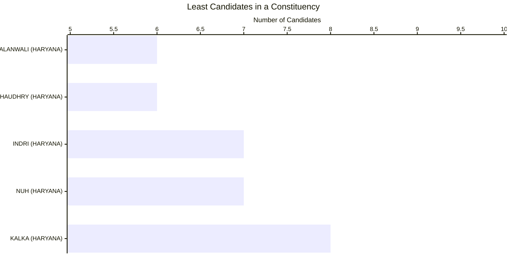

#### Total Vote Share of Parties
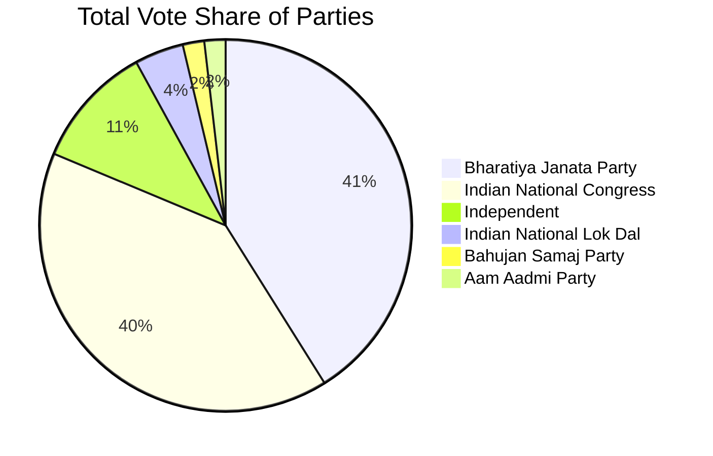

#### Maximum Vote share of Winning Candidate
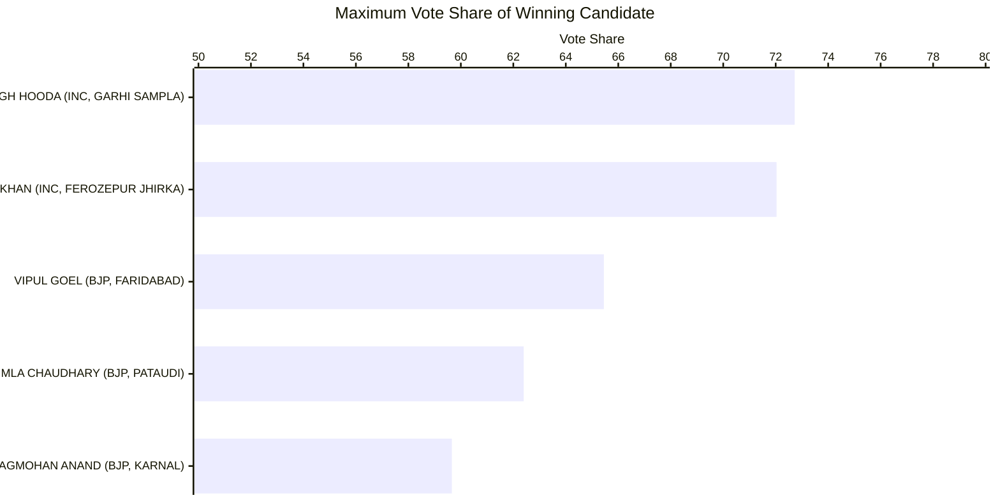

#### Least Vote share for a winning candidate
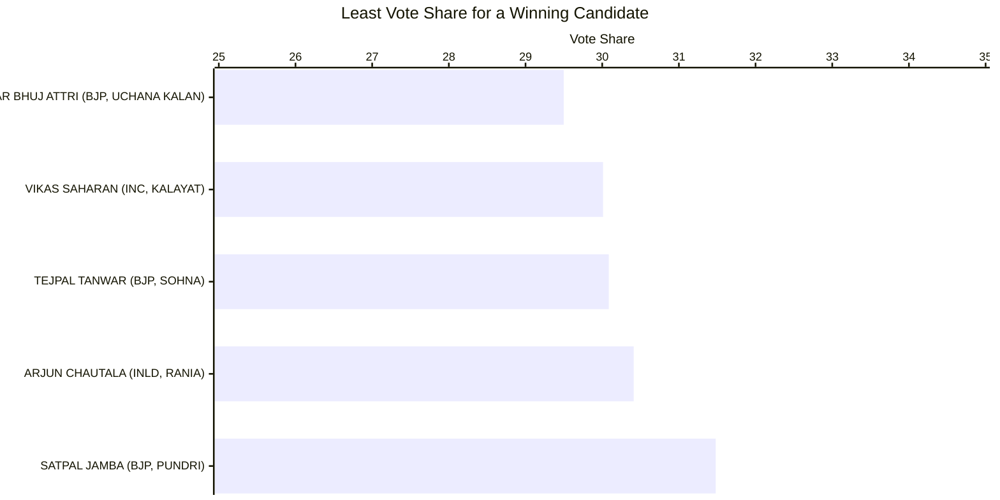

#### Max Vote share of a losing candidate
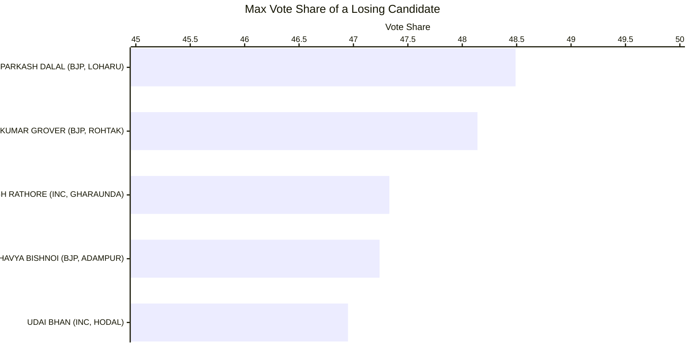

#### Seats in which Parties lost deposits (less than 1/6 vote share)
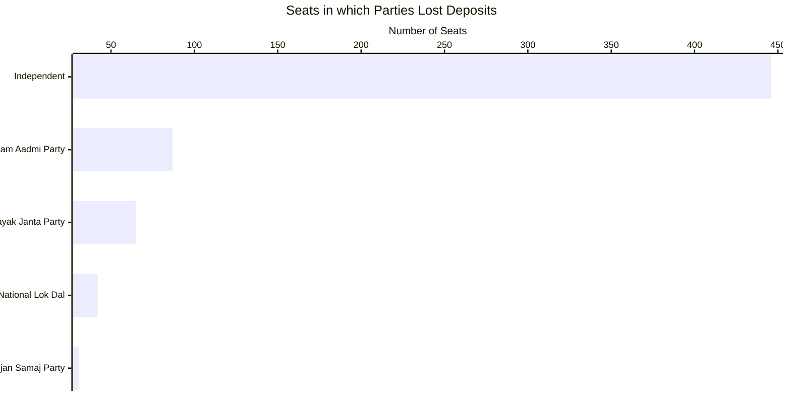

#### Gold (Seats that Parties won)
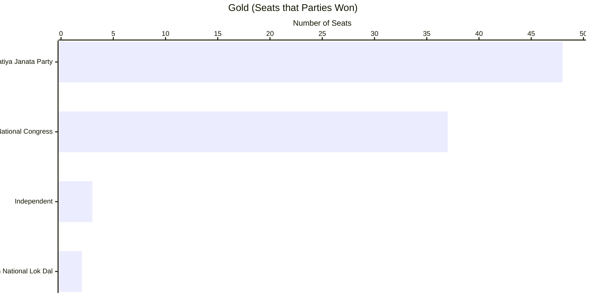

#### Silver (Seats that Parties came in second)
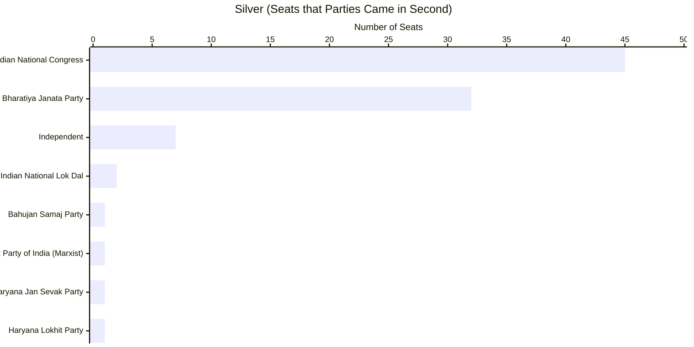

#### Cost per vote - Best Value per vote
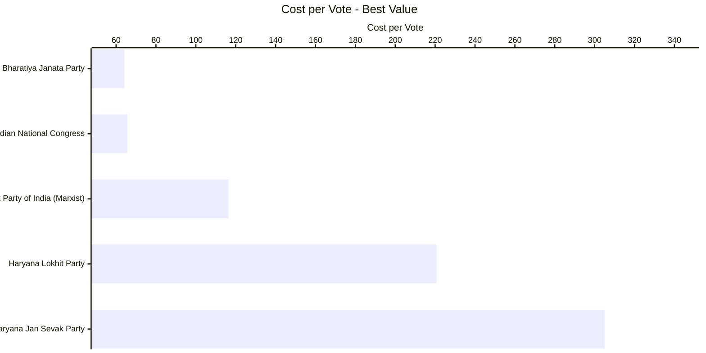

#### Cost per vote - Worst Value per vote
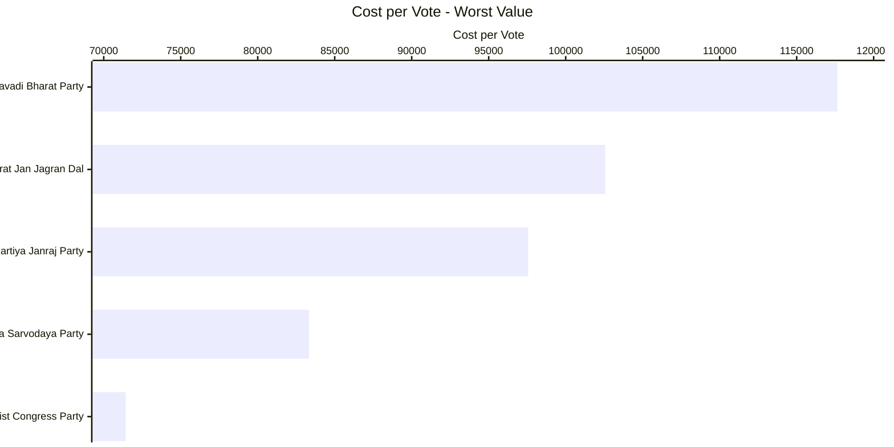

#### Success Ratio - Best
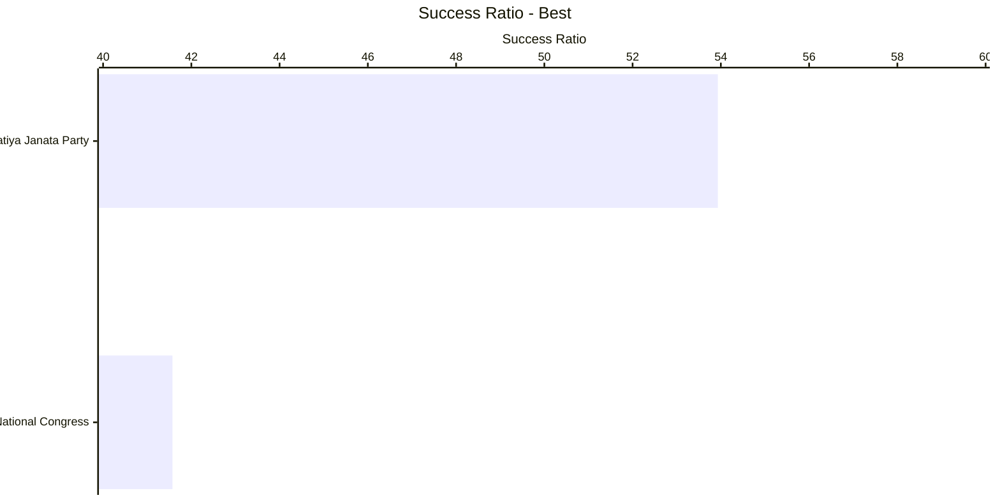

#### Success Ratio - Worst
```mermaid
---
config:
    xyChart:
        width: 1200
        height: 600
        chartOrientation: horizontal
---
xychart-beta
    title "Success Ratio - Worst"
    x-axis ["Independent", "Indian National Lok Dal"]
    y-axis "Success Ratio" 0 --> 10
    bar [3.4483, 3.9216]
```

#### Candidates participating in multiple seats (matches names)
```mermaid
---
config:
    xyChart:
        width: 1200
        height: 600
        chartOrientation: horizontal
---
xychart-beta
    title "Candidates Participating in Multiple Seats"
    x-axis ["ANIL KUMAR", "RAJESH KUMAR", "SUNIL KUMAR"]
    y-axis "Number of Constituencies" 0 --> 5
    bar [4, 4, 4]
```

### Close Contest Matrix

This Matrix provides the number of seats in which parties lost by the number of votes provided in the columns.
|PARTY                                             |< 500|< 2500|< 5000|< 10000|< 15000|< 25000|< 50000|
|--------------------------------------------------|-----|------|------|-------|-------|-------|-------|
|Bahujan Samaj Party                               |0    |0     |1     |1      |1      |1      |1      |
|Bharatiya Janata Party                            |0    |6     |7     |13     |20     |26     |30     |
|Communist Party of India  (Marxist)               |0    |0     |0     |0      |0      |0      |1      |
|Haryana Jan Sevak Party                           |0    |0     |0     |0      |0      |1      |1      |
|Haryana Lokhit Party                              |0    |0     |0     |1      |1      |1      |1      |
|Independent                                       |0    |1     |1     |3      |3      |4      |6      |
|Indian National Congress                          |1    |4     |10    |13     |21     |33     |43     |
|Indian National Lok Dal                           |0    |0     |0     |0      |0      |1      |2      |

#### Party Specific Close Contest Matrix

##### Bharatiya Janata Party

|Constituency                                      |State   |Runner up Party Votes|Winning Party           |Winning Party Votes|Vote Difference|
|--------------------------------------------------|--------|---------------------|------------------------|-------------------|---------------|
|LOHARU                                            |HARYANA |80544               |Indian National Congress|81336              |792            |
|ADAMPUR                                           |HARYANA |64103               |Indian National Congress|65371              |1268           |
|ROHTAK                                            |HARYANA |58078               |Indian National Congress|59419              |1341           |
|SADHAURA                                          |HARYANA |55835               |Indian National Congress|57534              |1699           |
|PANCHKULA                                         |HARYANA |65400               |Indian National Congress|67397              |1997           |
|FATEHABAD                                         |HARYANA |83920               |Indian National Congress|86172              |2252           |
|THANESAR                                          |HARYANA |66833               |Indian National Congress|70076              |3243           |
|JULANA                                            |HARYANA |59065               |Indian National Congress|65080              |6015           |
|SHAHBAD                                           |HARYANA |54609               |Indian National Congress|61050              |6441           |
|PEHOWA                                            |HARYANA |57995               |Indian National Congress|64548              |6553           |


##### Indian National Congress

|Constituency                                      |State   |Runner up Party Votes|Winning Party           |Winning Party Votes|Vote Difference|
|--------------------------------------------------|--------|---------------------|------------------------|-------------------|---------------|
|UCHANA KALAN                                      |HARYANA |48936               |Bharatiya Janata Party  |48968              |32             |
|DABWALI                                           |HARYANA |55464               |Indian National Lok Dal |56074              |610            |
|DADRI                                            |HARYANA |63611               |Bharatiya Janata Party  |65568              |1957           |
|ASSANDH                                          |HARYANA |52455               |Bharatiya Janata Party  |54761              |2306           |
|HODAL                                            |HARYANA |66270               |Bharatiya Janata Party  |68865              |2595           |
|MAHENDRAGARH                                     |HARYANA |60388               |Bharatiya Janata Party  |63036              |2648           |
|SAFIDON                                          |HARYANA |54946               |Bharatiya Janata Party  |58983              |4037           |
|RANIA                                            |HARYANA |39723               |Indian National Lok Dal |43914              |4191           |
|GHARAUNDA                                        |HARYANA |82705               |Bharatiya Janata Party  |87236              |4531           |
|RAI                                              |HARYANA |59941               |Bharatiya Janata Party  |64614              |4673           |
