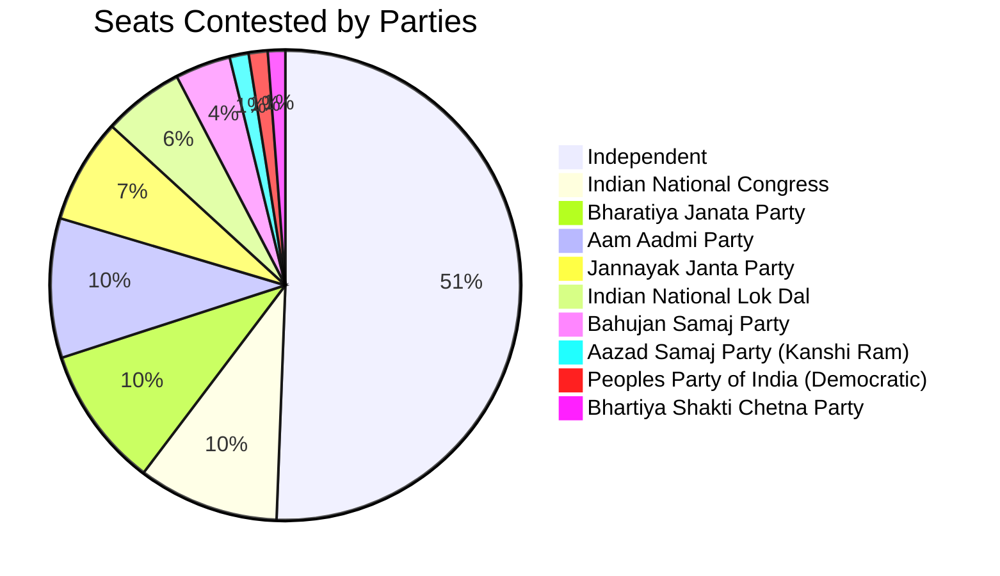
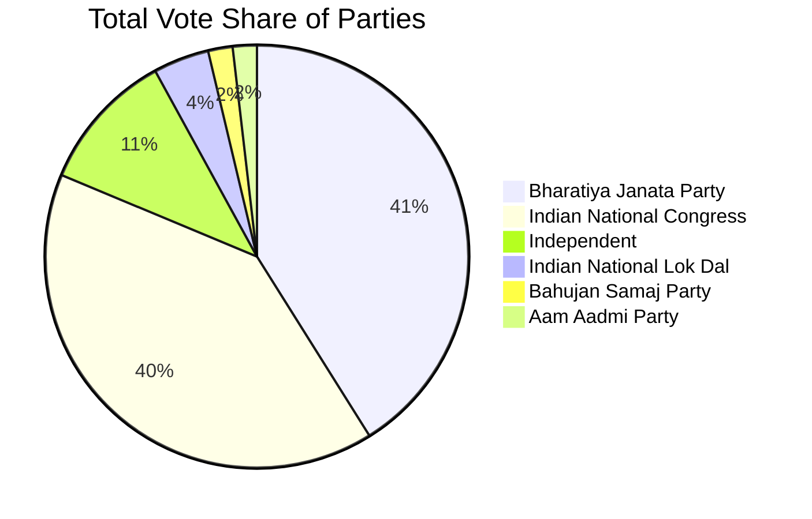

# Table of contents

- [Analysis of Haryana Assembly Elections October 2024](#analysis-of-haryana-assembly-elections-october-2024)
   * [Analysis](#analysis)
      + [Seats contested by Parties](#seats-contested-by-parties)
      + [Max and Mins](#max-and-mins)
         - [Maximum votes for a candidate](#maximum-votes-for-a-candidate)
         - [Least votes for a winning candidate](#least-votes-for-a-winning-candidate)
         - [Max votes for a losing candidate](#max-votes-for-a-losing-candidate)
         - [Candidates winning by Max margin (Unilateral winner)](#candidates-winning-by-max-margin-unilateral-winner)
         - [Candidates winning by Least margin (Fierce battle)](#candidates-winning-by-least-margin-fierce-battle)
      + [Max and Mins - Constituencies](#max-and-mins---constituencies)
         - [Max Total Votes in a Constituency](#max-total-votes-in-a-constituency)
         - [Min Total Votes Constituency](#min-total-votes-constituency)
         - [Max candidates in a Constituency](#max-candidates-in-a-constituency)
         - [Least candidates in a Constituency](#least-candidates-in-a-constituency)
      + [Vote Shares](#vote-shares)
         - [Total Vote Share of Parties](#total-vote-share-of-parties)
         - [Maximum Vote share of Winning Candidate](#maximum-vote-share-of-winning-candidate)
         - [Least Vote share for a winning candidate](#least-vote-share-for-a-winning-candidate)
         - [Max Vote share of a losing candidate](#max-vote-share-of-a-losing-candidate)
         - [Seats in which Parties lost deposits (less than 1/6 vote share)](#seats-in-which-parties-lost-deposits-less-than-16-vote-share)
      + [Medals](#medals)
         - [Gold (Seats that Parties won)](#gold-seats-that-parties-won)
         - [Silver (Seats that Parties came in second)](#silver-seats-that-parties-came-in-second)
      + [Strike Rates](#strike-rates)
         - [Cost per vote - Best Value per vote](#cost-per-vote---best-value-per-vote)
         - [Cost per vote - Worst Value per vote](#cost-per-vote---worst-value-per-vote)
         - [Success Ratio - Best](#success-ratio---best)
         - [Success Ratio - Best](#success-ratio---best-1)
      + [Multiple Seat Participation](#multiple-seat-participation)
         - [Candidates participating in multiple seats (matches names)](#candidates-participating-in-multiple-seats-matches-names)
      + [Close Contest Matrix](#close-contest-matrix)
         - [Party Specific Close Contest Matrix](#party-specific-close-contest-matrix)
            * [Bharatiya Janata Party](#bharatiya-janata-party)
            * [Indian National Congress](#indian-national-congress)

# Analysis of Haryana Assembly Elections October 2024

The 2024 Haryana Legislative Assembly elections were held in Haryana on 5 October 2024 to elect all 90 members of the Haryana Legislative Assembly ([wiki](https://en.wikipedia.org/wiki/2024_Haryana_Legislative_Assembly_election)).

This page provides the highlights of the results. Complete results of the analysis can be seen [here](https://github.com/arjunswaj/elections/tree/haryana-jk-2024/result/Haryana).

## Analysis
A total of 1031 candidates contested in the elections and around 1.38 Crores (`13891280`) votes were casted during this period.

### Seats contested by Parties


### Max and Mins

#### Maximum votes for a candidate
```mermaid
bar
  title Maximum Votes for a Candidate
  x-axis Candidate
  y-axis Number of Votes
  "RAO NARBIR SINGH (BJP, BADSHAHPUR)" : 145503
  "MAMMAN KHAN (INC, FEROZEPUR JHIRKA)" : 130497
  "MUKESH SHARMA (BJP, GURGAON)" : 122615
  "GAURAV GAUTAM (BJP, PALWAL)" : 109118
  "BHUPINDER SINGH HOODA (INC, GARHI SAMPLA)" : 108539
```
#### Least votes for a winning candidate
```mermaid
bar
  title Least Votes for a Winning Candidate
  x-axis Candidate
  y-axis Number of Votes
  "SATPAL JAMBA (BJP, PUNDRI)" : 42805
  "ARJUN CHAUTALA (INLD, RANIA)" : 43914
  "VIKAS SAHARAN (INC, KALAYAT)" : 48142
  "DEVENDER CHATAR BHUJ ATTRI (BJP, UCHANA KALAN)" : 48968
  "SAVITRI JINDAL (Independent, HISAR)" : 49231
```
#### Max votes for a losing candidate
```mermaid
bar
  title Max Votes for a Losing Candidate
  x-axis Candidate
  y-axis Number of Votes
  "VARDHAN YADAV (INC, BADSHAHPUR)" : 84798
  "DURA RAM (BJP, FATEHABAD)" : 83920
  "VARINDER SINGH RATHORE (INC, GHARAUNDA)" : 82705
  "JAI PARKASH DALAL (BJP, LOHARU)" : 80544
  "DEVENDER SINGH BABLI (BJP, TOHANA)" : 77686
```

#### Candidates winning by Max margin (Unilateral winner)
```mermaid
bar
  title Candidates Winning by Max Margin
  x-axis Candidate
  y-axis Vote Difference
  "MAMMAN KHAN (INC, FEROZEPUR JHIRKA)" : 98441
  "BHUPINDER SINGH HOODA (INC, GARHI SAMPLA)" : 71465
  "MUKESH SHARMA (BJP, GURGAON)" : 68045
  "RAO NARBIR SINGH (BJP, BADSHAHPUR)" : 60705
  "MAHIPAL DHANDA (BJP, PANIPAT RURAL)" : 50212
```

#### Candidates winning by Least margin (Fierce battle)
```mermaid
bar
  title Candidates Winning by Least Margin
  x-axis Candidate
  y-axis Vote Difference
  "DEVENDER CHATAR BHUJ ATTRI (BJP, UCHANA KALAN)" : 32
  "ADITYA DEVILAL (INLD, DABWALI)" : 610
  "RAJBIR FARTIA (INC, LOHARU)" : 792
  "CHANDER PARKASH S/O ARJUN LAL (INC, ADAMPUR)" : 1268
  "BHARAT BHUSHAN BATRA (INC, ROHTAK)" : 1341
```

#### Max Total Votes in a Constituency
```mermaid
bar
  title Max Total Votes in a Constituency
  x-axis Constituency
  y-axis Total Votes
  "BADSHAHPUR (HARYANA)" : 282285
  "GURGAON (HARYANA)" : 230104
  "TIGAON (HARYANA)" : 203714
  "SOHNA (HARYANA)" : 203562
  "PANIPAT RURAL (HARYANA)" : 201139
```

#### Min Total Votes Constituency
```mermaid
bar
  title Min Total Votes in a Constituency
  x-axis Constituency
  y-axis Total Votes
  "NARNAUL (HARYANA)" : 106576
  "HISAR (HARYANA)" : 112494
  "KHARKHAUDA (HARYANA)" : 113716
  "NANGAL CHAUDHRY (HARYANA)" : 118473
  "BERI (HARYANA)" : 118966
```

#### Max candidates in a Constituency
```mermaid
bar
  title Max Candidates in a Constituency
  x-axis Constituency
  y-axis Number of Candidates
  "HISAR (HARYANA)" : 22
  "UCHANA KALAN (HARYANA)" : 21
  "MEHAM (HARYANA)" : 20
  "PUNDRI (HARYANA)" : 19
  "FATEHABAD (HARYANA)" : 19
```

#### Least candidates in a Constituency
```mermaid
bar
  title Least Candidates in a Constituency
  x-axis Constituency
  y-axis Number of Candidates
  "KALANWALI (HARYANA)" : 6
  "NANGAL CHAUDHRY (HARYANA)" : 6
  "INDRI (HARYANA)" : 7
  "NUH (HARYANA)" : 7
  "KALKA (HARYANA)" : 8
```

#### Total Vote Share of Parties


#### Maximum Vote share of Winning Candidate
```mermaid
bar
  title Maximum Vote Share of Winning Candidate
  x-axis Candidate
  y-axis Vote Share
  "BHUPINDER SINGH HOODA (INC, GARHI SAMPLA)" : 72.7239
  "MAMMAN KHAN (INC, FEROZEPUR JHIRKA)" : 72.0317
  "VIPUL GOEL (BJP, FARIDABAD)" : 65.4504
  "BIMLA CHAUDHARY (BJP, PATAUDI)" : 62.3961
  "JAGMOHAN ANAND (BJP, KARNAL)" : 59.6576
```

#### Least Vote share for a winning candidate
```mermaid
bar
  title Least Vote Share for a Winning Candidate
  x-axis Candidate
  y-axis Vote Share
  "DEVENDER CHATAR BHUJ ATTRI (BJP, UCHANA KALAN)" : 29.4977
  "VIKAS SAHARAN (INC, KALAYAT)" : 30.0113
  "TEJPAL TANWAR (BJP, SOHNA)" : 30.0857
  "ARJUN CHAUTALA (INLD, RANIA)" : 30.4109
  "SATPAL JAMBA (BJP, PUNDRI)" : 31.4803
```

#### Max Vote share of a losing candidate
```mermaid
bar
  title Max Vote Share of a Losing Candidate
  x-axis Candidate
  y-axis Vote Share
  "JAI PARKASH DALAL (BJP, LOHARU)" : 48.49
  "MANISH KUMAR GROVER (BJP, ROHTAK)" : 48.14
  "VARINDER SINGH RATHORE (INC, GHARAUNDA)" : 47.33
  "BHAVYA BISHNOI (BJP, ADAMPUR)" : 47.24
  "UDAI BHAN (INC, HODAL)" : 46.95
```

#### Seats in which Parties lost deposits (less than 1/6 vote share)
```mermaid
bar
  title Seats in which Parties Lost Deposits
  x-axis Party
  y-axis Number of Seats
  "Independent" : 446
  "Aam Aadmi Party" : 87
  "Jannayak Janta Party" : 65
  "Indian National Lok Dal" : 42
  "Bahujan Samaj Party" : 31
```

#### Gold (Seats that Parties won)
```mermaid
bar
  title Gold (Seats that Parties Won)
  x-axis Party
  y-axis Number of Seats
  "Bharatiya Janata Party" : 48
  "Indian National Congress" : 37
  "Independent" : 3
  "Indian National Lok Dal" : 2
```

#### Silver (Seats that Parties came in second)
```mermaid
bar
  title Silver (Seats that Parties Came in Second)
  x-axis Party
  y-axis Number of Seats
  "Indian National Congress" : 45
  "Bharatiya Janata Party" : 32
  "Independent" : 7
  "Indian National Lok Dal" : 2
  "Bahujan Samaj Party" : 1
  "Communist Party of India (Marxist)" : 1
  "Haryana Jan Sevak Party" : 1
  "Haryana Lokhit Party" : 1
```

#### Cost per vote - Best Value per vote
```mermaid
bar
  title Cost per Vote - Best Value
  x-axis Party
  y-axis Cost per Vote
  "Bharatiya Janata Party" : 64.1580
  "Indian National Congress" : 65.5544
  "Communist Party of India (Marxist)" : 116.3704
  "Haryana Lokhit Party" : 220.7140
  "Haryana Jan Sevak Party" : 305.0873
```

#### Cost per vote - Worst Value per vote
```mermaid
bar
  title Cost per Vote - Worst Value
  x-axis Party
  y-axis Cost per Vote
  "Rashtravadi Bharat Party" : 117647.0588
  "Bharat Jan Jagran Dal" : 102564.1026
  "Bhartiya Janraj Party" : 97560.9756
  "Bhartiya Sarvodaya Party" : 83333.3333
  "Nationalist Congress Party" : 71428.5714
```

#### Success Ratio - Best
```mermaid
bar
  title Success Ratio - Best
  x-axis Party
  y-axis Success Ratio
  "Bharatiya Janata Party" : 53.9326
  "Indian National Congress" : 41.5730
```

#### Success Ratio - Worst
```mermaid
bar
  title Success Ratio - Worst
  x-axis Party
  y-axis Success Ratio
  "Independent" : 3.4483
  "Indian National Lok Dal" : 3.9216
```

#### Candidates participating in multiple seats (matches names)
```mermaid
bar
  title Candidates Participating in Multiple Seats
  x-axis Candidate
  y-axis Number of Constituencies
  "ANIL KUMAR" : 4
  "RAJESH KUMAR" : 4
  "SUNIL KUMAR" : 4
```

### Close Contest Matrix

This Matrix provides the number of seats in which parties lost by the number of votes provided in the columns.
|PARTY                                             |< 500|< 2500|< 5000|< 10000|< 15000|< 25000|< 50000|
|--------------------------------------------------|-----|------|------|-------|-------|-------|-------|
|Bahujan Samaj Party                               |0    |0     |1     |1      |1      |1      |1      |
|Bharatiya Janata Party                            |0    |6     |7     |13     |20     |26     |30     |
|Communist Party of India  (Marxist)               |0    |0     |0     |0      |0      |0      |1      |
|Haryana Jan Sevak Party                           |0    |0     |0     |0      |0      |1      |1      |
|Haryana Lokhit Party                              |0    |0     |0     |1      |1      |1      |1      |
|Independent                                       |0    |1     |1     |3      |3      |4      |6      |
|Indian National Congress                          |1    |4     |10    |13     |21     |33     |43     |
|Indian National Lok Dal                           |0    |0     |0     |0      |0      |1      |2      |

#### Party Specific Close Contest Matrix

##### Bharatiya Janata Party

|Constituency                                      |State   |Runner up Party Votes|Winning Party           |Winning Party Votes|Vote Difference|
|--------------------------------------------------|--------|---------------------|------------------------|-------------------|---------------|
|LOHARU                                            |HARYANA |80544               |Indian National Congress|81336              |792            |
|ADAMPUR                                           |HARYANA |64103               |Indian National Congress|65371              |1268           |
|ROHTAK                                            |HARYANA |58078               |Indian National Congress|59419              |1341           |
|SADHAURA                                          |HARYANA |55835               |Indian National Congress|57534              |1699           |
|PANCHKULA                                         |HARYANA |65400               |Indian National Congress|67397              |1997           |
|FATEHABAD                                         |HARYANA |83920               |Indian National Congress|86172              |2252           |
|THANESAR                                          |HARYANA |66833               |Indian National Congress|70076              |3243           |
|JULANA                                            |HARYANA |59065               |Indian National Congress|65080              |6015           |
|SHAHBAD                                           |HARYANA |54609               |Indian National Congress|61050              |6441           |
|PEHOWA                                            |HARYANA |57995               |Indian National Congress|64548              |6553           |


##### Indian National Congress

|Constituency                                      |State   |Runner up Party Votes|Winning Party           |Winning Party Votes|Vote Difference|
|--------------------------------------------------|--------|---------------------|------------------------|-------------------|---------------|
|UCHANA KALAN                                      |HARYANA |48936               |Bharatiya Janata Party  |48968              |32             |
|DABWALI                                           |HARYANA |55464               |Indian National Lok Dal |56074              |610            |
|DADRI                                            |HARYANA |63611               |Bharatiya Janata Party  |65568              |1957           |
|ASSANDH                                          |HARYANA |52455               |Bharatiya Janata Party  |54761              |2306           |
|HODAL                                            |HARYANA |66270               |Bharatiya Janata Party  |68865              |2595           |
|MAHENDRAGARH                                     |HARYANA |60388               |Bharatiya Janata Party  |63036              |2648           |
|SAFIDON                                          |HARYANA |54946               |Bharatiya Janata Party  |58983              |4037           |
|RANIA                                            |HARYANA |39723               |Indian National Lok Dal |43914              |4191           |
|GHARAUNDA                                        |HARYANA |82705               |Bharatiya Janata Party  |87236              |4531           |
|RAI                                              |HARYANA |59941               |Bharatiya Janata Party  |64614              |4673           |
