# Table of contents

- [Analysis of Jammu & Kashmir Assembly Elections October 2024](#analysis-of-jammu--kashmir-assembly-elections-october-2024)
   * [Analysis](#analysis)
      + [Seats contested by Parties](#seats-contested-by-parties)
      + [Max and Mins](#max-and-mins)
         - [Maximum votes for a candidate](#maximum-votes-for-a-candidate)
         - [Least votes for a winning candidate](#least-votes-for-a-winning-candidate)
         - [Max votes for a losing candidate](#max-votes-for-a-losing-candidate)
         - [Candidates winning by Max margin (Unilateral winner)](#candidates-winning-by-max-margin-unilateral-winner)
         - [Candidates winning by Least margin (Fierce battle)](#candidates-winning-by-least-margin-fierce-battle)
      + [Max and Mins - Constituencies](#max-and-mins---constituencies)
         - [Max Total Votes in a Constituency](#max-total-votes-in-a-constituency)
         - [Min Total Votes Constituency](#min-total-votes-constituency)
         - [Max candidates in a Constituency](#max-candidates-in-a-constituency)
         - [Least candidates in a Constituency](#least-candidates-in-a-constituency)
      + [Vote Shares](#vote-shares)
         - [Total Vote Share of Parties](#total-vote-share-of-parties)
         - [Maximum Vote share of Winning Candidate](#maximum-vote-share-of-winning-candidate)
         - [Least Vote share for a winning candidate](#least-vote-share-for-a-winning-candidate)
         - [Max Vote share of a losing candidate](#max-vote-share-of-a-losing-candidate)
         - [Seats in which Parties lost deposits (less than 1/6 vote share)](#seats-in-which-parties-lost-deposits-less-than-16-vote-share)
      + [Medals](#medals)
         - [Gold (Seats that Parties won)](#gold-seats-that-parties-won)
         - [Silver (Seats that Parties came in second)](#silver-seats-that-parties-came-in-second)
      + [Strike Rates](#strike-rates)
         - [Cost per vote - Best Value per vote](#cost-per-vote---best-value-per-vote)
         - [Cost per vote - Worst Value per vote](#cost-per-vote---worst-value-per-vote)
         - [Success Ratio - Best](#success-ratio---best)
         - [Success Ratio - Worst](#success-ratio---worst)
      + [Multiple Seat Participation](#multiple-seat-participation)
         - [Candidates participating in multiple seats (matches names)](#candidates-participating-in-multiple-seats-matches-names)
      + [Close Contest Matrix](#close-contest-matrix)
         - [Party Specific Close Contest Matrix](#party-specific-close-contest-matrix)
            * [Bharatiya Janata Party](#bharatiya-janata-party)
            * [Indian National Congress](#indian-national-congress)

# Analysis of Jammu & Kashmir Assembly Elections October 2024

Election for the Jammu and Kashmir Legislative Assembly was held in Indian-administered Jammu and Kashmir from 18 September to 1 October 2024 in 3 phases to elect its 90 members. The results of the elections were announced on 8 October 2024 ([wiki](https://en.wikipedia.org/wiki/2024_Jammu_and_Kashmir_Legislative_Assembly_election)).

This page provides the highlights of the results. Complete results of the analysis can be seen [here](https://github.com/arjunswaj/elections/tree/haryana-jk-2024/result/Jammu%26Kashmir).

## Analysis
A total of 873 candidates contested in the elections and around 57 Lakhs (`5702324`) votes were casted during this period.

### Seats contested by Parties

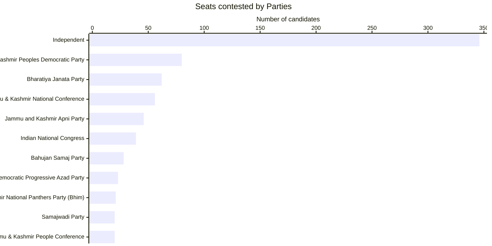

### Max and Mins

#### Maximum votes for a candidate

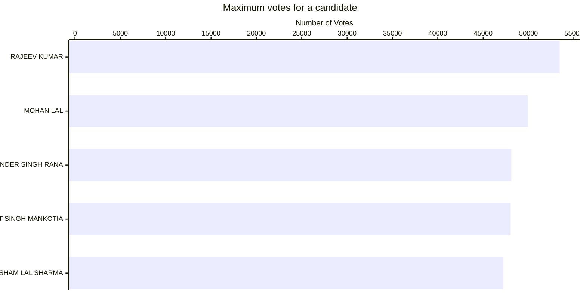

#### Least votes for a winning candidate

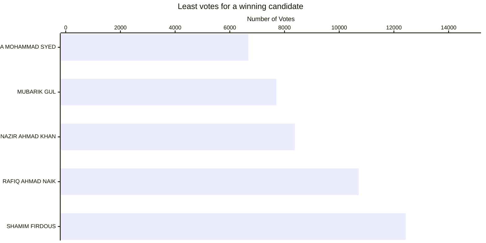

#### Max votes for a losing candidate

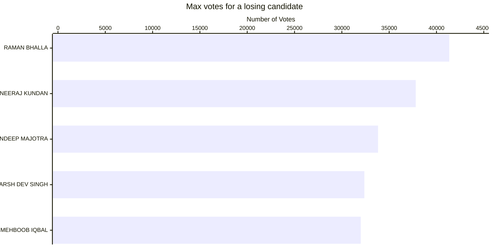

#### Candidates winning by Max margin (Unilateral winner)

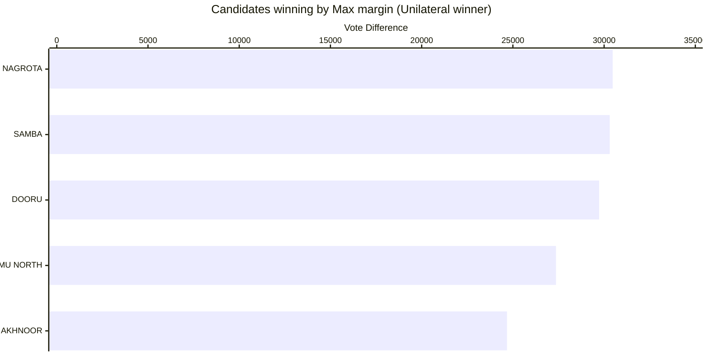

#### Candidates winning by Least margin (Fierce battle)

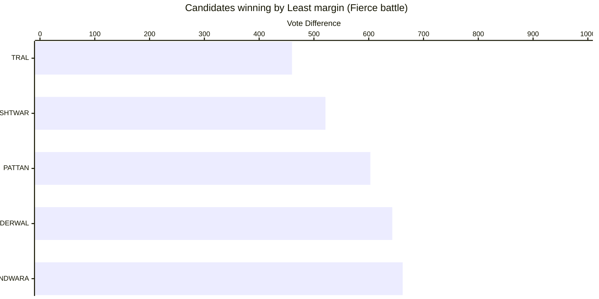

### Max and Mins - Constituencies

#### Max Total Votes in a Constituency

#### Min Total Votes Constituency

#### Max candidates in a Constituency

#### Least candidates in a Constituency

### Vote Shares

#### Total Vote Share of Parties

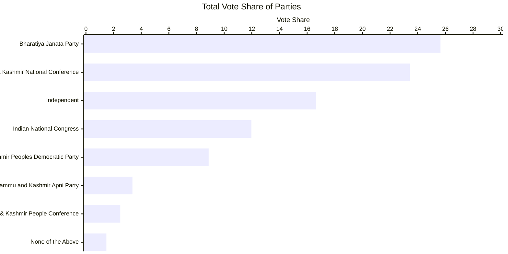

#### Maximum Vote share of Winning Candidate

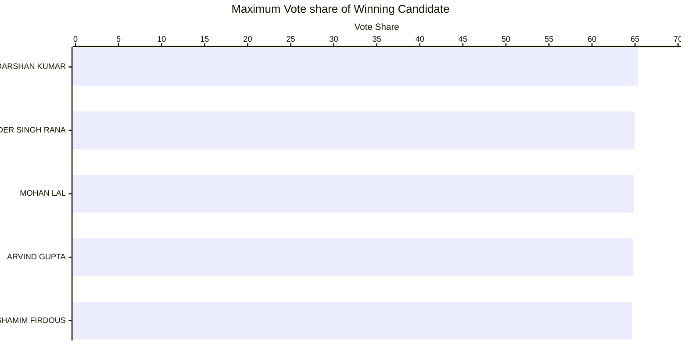

#### Least Vote share for a winning candidate

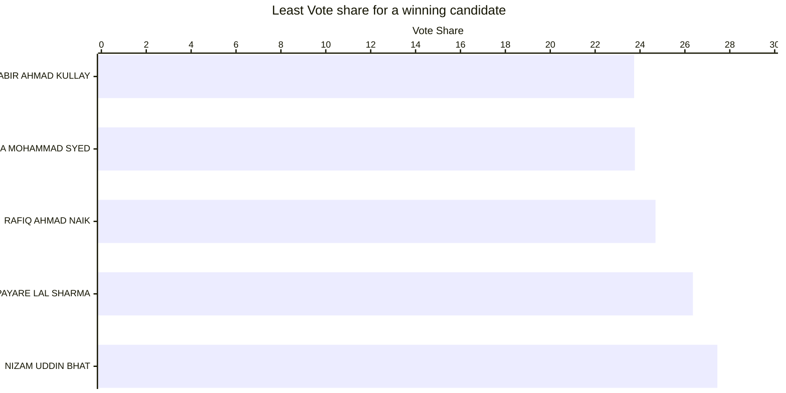

#### Max Vote share of a losing candidate

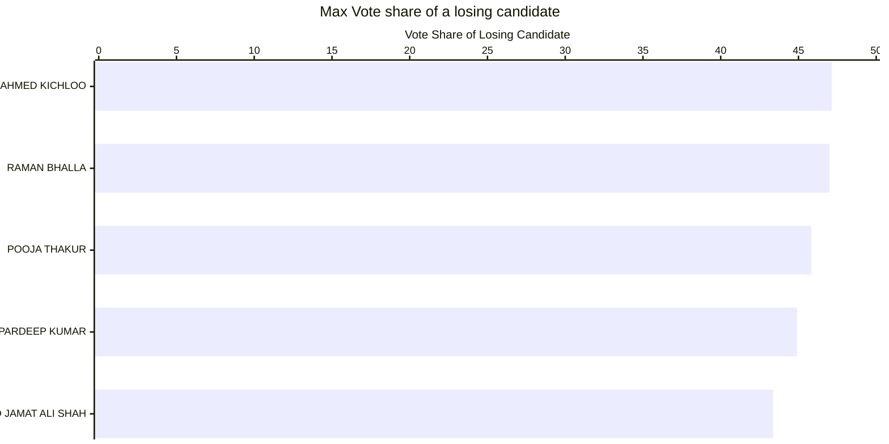

#### Seats in which Parties lost deposits (less than 1/6 vote share)

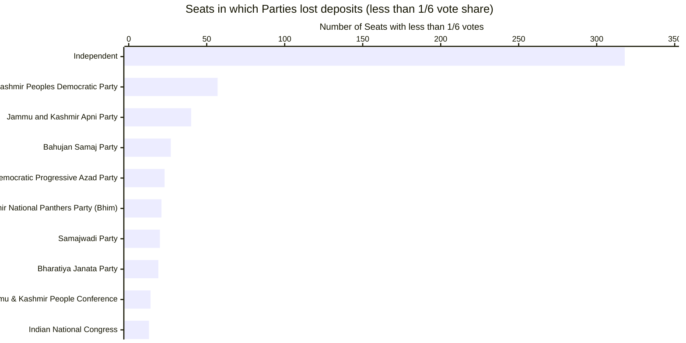

### Medals

#### Gold (Seats that Parties won)

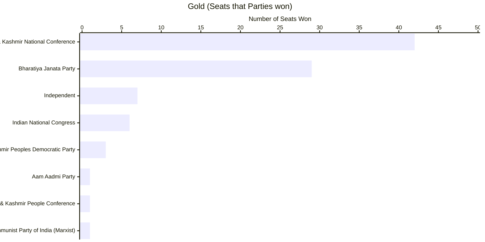

#### Silver (Seats that Parties came in second)

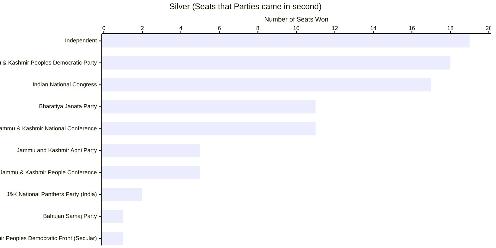

### Strike Rates

A candidate could spend a max 40 Lakhs during campaigning. Assuming candidate has maxed out the purse below.

#### Cost per vote - Best Value per vote

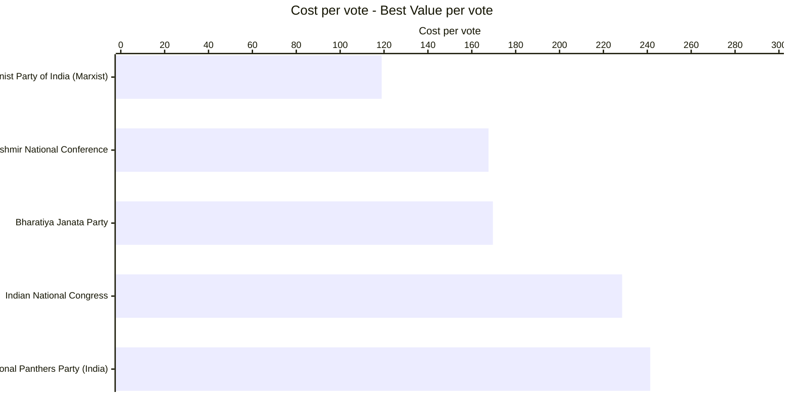

#### Cost per vote - Worst Value per vote

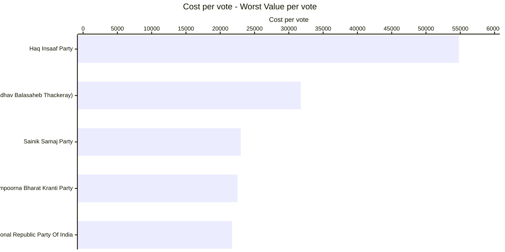

#### Success Ratio - Best

|Party                                        |Seats Participated|Seats Won|Success Ratio|
|---------------------------------------------|------------------|---------|-------------|
|Communist Party of India  (Marxist)          |1                 |1        |100.0000     |
|Jammu & Kashmir National Conference          |56                |42       |75.0000      |
|Bharatiya Janata Party                       |62                |29       |46.7742      |

#### Success Ratio - Worst

|Party                                        |Seats Participated|Seats Won|Success Ratio|
|---------------------------------------------|------------------|---------|-------------|
|Jammu & Kashmir Peoples Democratic Party     |80                |3        |3.7500       |
|Jammu & Kashmir People Conference            |20                |1        |5.0000       |
|Independent                                  |83                |7        |8.4337       |
|Aam Aadmi Party                              |7                 |1        |14.2857      |
|Indian National Congress                     |39                |6        |15.3846      |

### Multiple Seat Participation

#### Candidates participating in multiple seats (matches names)

|Candidate             |Number of Constituencies Contested at|
|----------------------|-------------------------------------|
|RAVINDER SINGH        |3                                    |
|BALBIR SINGH          |2                                    |
|BILAL AHMAD BHAT      |2                                    |
|GAZANFAR ALI          |2                                    |
|GHULAM NABI BHAT      |2                                    |
|MANOJ KUMAR           |2                                    |
|NAZIR AHMAD MIR       |2                                    |
|OMAR ABDULLAH         |2                                    |

#### Results of Candidates participating in multiple seats (at least 1 win)

|Candidate             |Constituency  |State          |Party                          |Result|
|----------------------|--------------|---------------|-------------------------------|------|
|OMAR ABDULLAH         |BUDGAM        |JAMMU & KASHMIR|Jammu & Kashmir National Conference|WON   |
|OMAR ABDULLAH         |GANDERBAL     |JAMMU & KASHMIR|Jammu & Kashmir National Conference|WON   |
|SAJAD GANI LONE       |HANDWARA      |JAMMU & KASHMIR|Jammu & Kashmir People Conference|WON   |
|SAJAD GANI LONE       |KUPWARA      |JAMMU & KASHMIR|Jammu & Kashmir People Conference|LOST   |

### Close Contest Matrix
This Matrix provides the number of seats in which parties lost by the number of votes provided in the columns.

|PARTY                                             |< 500|< 2500|< 5000|< 10000|< 15000|< 25000|< 50000|
|--------------------------------------------------|-----|------|------|-------|-------|-------|-------|
|Bahujan Samaj Party                               |0    |0     |0     |0      |1      |1      |1      |
|Bharatiya Janata Party                            |0    |3     |4     |8      |9      |11     |11     |
|Independent                                       |0    |5     |6     |11     |17     |18     |19     |
|Indian National Congress                          |1    |2     |3     |5      |8      |17     |17     |
|J&K National Panthers Party (India)               |0    |0     |0     |1      |1      |2      |2      |
|Jammu & Kashmir National Conference               |0    |4     |4     |6      |8      |9      |11     |
|Jammu & Kashmir People Conference                 |0    |2     |3     |4      |4      |5      |5      |
|Jammu & Kashmir Peoples Democratic Party          |0    |2     |4     |8      |14     |17     |18     |
|Jammu and Kashmir Apni Party                      |0    |0     |1     |3      |5      |5      |5      |
|Jammu And Kashmir Peoples Democratic Front (Secular)|0  |0     |0     |0      |1      |1      |1      |

#### Party Specific Close Contest Matrix

##### Bharatiya Janata Party

|Constituency                                      |State   |Runner up Party Votes|Winning Party           |Winning Party Votes|Vote Difference|
|--------------------------------------------------|--------|---------------------|------------------------|-------------------|---------------|
|GUREZ                                             |JAMMU & KASHMIR|7246        |Jammu & Kashmir National Conference|8378|1132|
|RAJOURI                                           |JAMMU & KASHMIR|27519      |Indian National Congress|28923|1404|
|BANI                                              |JAMMU & KASHMIR|16624      |Independent|18672|2048|
|DODA                                              |JAMMU & KASHMIR|18690      |Aam Aadmi Party|23228|4538|
|THANNAMANDI                                       |JAMMU & KASHMIR|26466      |Independent|32645|6179|
|CHHAMB                                            |JAMMU & KASHMIR|27056      |Independent|33985|6929|
|NOWSHERA                                          |JAMMU & KASHMIR|27250      |Jammu & Kashmir National Conference|35069|7819|
|HABBAKADAL                                        |JAMMU & KASHMIR|2899       |Jammu & Kashmir National Conference|12437|9538|
|MENDHAR                                           |JAMMU & KASHMIR|17270      |Jammu & Kashmir National Conference|32176|14906|
|BUDHAL                                            |JAMMU & KASHMIR|23135      |Jammu & Kashmir National Conference|42043|18908|
|POONCH HAVELI                                     |JAMMU & KASHMIR|20928      |Jammu & Kashmir National Conference|41807|20879|

##### Indian National Congress

|Constituency                                      |State            |Runner up Party Votes|Winning Party                                   |Winning Party Votes|Vote Difference|
|--------------------------------------------------|-----------------|---------------------|------------------------------------------------|-------------------|---------------|
|TRAL                                              |JAMMU & KASHMIR  |10250               |Jammu & Kashmir Peoples Democratic Party        |10710              |460            |
|R. S. PURA- JAMMU SOUTH                           |JAMMU & KASHMIR  |41351               |Bharatiya Janata Party                          |43317              |1966           |
|DODA WEST                                         |JAMMU & KASHMIR  |30511               |Bharatiya Janata Party                          |33964              |3453           |
|HIRANAGAR                                         |JAMMU & KASHMIR  |28127               |Bharatiya Janata Party                          |36737              |8610           |
|SURANKOTE                                         |JAMMU & KASHMIR  |25350               |Independent                                     |34201              |8851           |
|SUCHETGARH                                        |JAMMU & KASHMIR  |28161               |Bharatiya Janata Party                          |39302              |11141          |
|BAHU                                              |JAMMU & KASHMIR  |29134               |Bharatiya Janata Party                          |40385              |11251          |
|RAMGARH                                           |JAMMU & KASHMIR  |21470               |Bharatiya Janata Party                          |35672              |14202          |
|BISHNAH                                           |JAMMU & KASHMIR  |37808               |Bharatiya Janata Party                          |53435              |15627          |
|BASOHLI                                           |JAMMU & KASHMIR  |15840               |Bharatiya Janata Party                          |31874              |16034          |

##### Jammu & Kashmir National Conference

|Constituency                                      |State            |Runner up Party Votes|Winning Party                                   |Winning Party Votes|Vote Difference|
|--------------------------------------------------|-----------------|---------------------|------------------------------------------------|-------------------|---------------|
|KISHTWAR                                           |JAMMU & KASHMIR  |28532               |Bharatiya Janata Party                          |29053              |521            |
|HANDWARA                                           |JAMMU & KASHMIR  |29150               |Jammu & Kashmir People Conference               |29812              |662            |
|SHOPIAN                                            |JAMMU & KASHMIR  |12906               |Independent                                     |14113              |1207           |
|PADDER                                             |JAMMU & KASHMIR  |15490               |Bharatiya Janata Party                          |17036              |1546           |
|PULWAMA                                            |JAMMU & KASHMIR  |16568               |Jammu & Kashmir Peoples Democratic Party        |24716              |8148           |
|KUPWARA                                            |JAMMU & KASHMIR  |17976               |Jammu & Kashmir Peoples Democratic Party        |27773              |9797           |
|BHADARWAH                                          |JAMMU & KASHMIR  |31998               |Bharatiya Janata Party                          |42128              |10130          |
|KALAKOTE                                           |JAMMU & KASHMIR  |20601               |Bharatiya Janata Party                          |35010              |14409          |
|VIJAYPUR                                           |JAMMU & KASHMIR  |13819               |Bharatiya Janata Party                          |32859              |19040          |
|JAMMU NORTH                                        |JAMMU & KASHMIR  |19856               |Bharatiya Janata Party                          |47219              |27363          |
|NAGROTA                                            |JAMMU & KASHMIR  |17641               |Bharatiya Janata Party                          |48113              |30472          |
