# Table of contents

- [Analysis of Assam Assembly Elections May 2026](#analysis-of-assam-assembly-elections-may-2026)
* [Analysis](#analysis)
+ [Seats contested by Parties](#seats-contested-by-parties)
+ [Max and Mins](#max-and-mins)
- [Maximum votes for a candidate](#maximum-votes-for-a-candidate)
- [Least votes for a winning candidate](#least-votes-for-a-winning-candidate)
- [Max votes for a losing candidate](#max-votes-for-a-losing-candidate)
- [Candidates winning by Max margin (Unilateral winner)](#candidates-winning-by-max-margin-unilateral-winner)
- [Candidates winning by Least margin (Fierce battle)](#candidates-winning-by-least-margin-fierce-battle)
+ [Max and Mins - Constituencies](#max-and-mins---constituencies)
- [Max Total Votes in a Constituency](#max-total-votes-in-a-constituency)
- [Min Total Votes Constituency](#min-total-votes-constituency)
- [Max candidates in a Constituency](#max-candidates-in-a-constituency)
- [Least candidates in a Constituency](#least-candidates-in-a-constituency)
+ [Vote Shares](#vote-shares)
- [Total Vote Share of Parties](#total-vote-share-of-parties)
- [Maximum Vote share of Winning Candidate](#maximum-vote-share-of-winning-candidate)
- [Least Vote share for a winning candidate](#least-vote-share-for-a-winning-candidate)
- [Max Vote share of a losing candidate](#max-vote-share-of-a-losing-candidate)
- [Seats in which Parties lost deposits (less than 1/6 vote share)](#seats-in-which-parties-lost-deposits-less-than-16-vote-share)
+ [Medals](#medals)
- [Gold (Seats that Parties won)](#gold-seats-that-parties-won)
- [Silver (Seats that Parties came in second)](#silver-seats-that-parties-came-in-second)
+ [Strike Rates](#strike-rates)
- [Cost per vote - Best Value per vote](#cost-per-vote---best-value-per-vote)
- [Cost per vote - Worst Value per vote](#cost-per-vote---worst-value-per-vote)
- [Success Ratio - Best](#success-ratio---best)
- [Success Ratio - Worst](#success-ratio---worst)
+ [Multiple Seat Participation](#multiple-seat-participation)
- [Candidates participating in multiple seats (matches names)](#candidates-participating-in-multiple-seats-matches-names)
+ [Close Contest Matrix](#close-contest-matrix)
- [Party Specific Close Contest Matrix](#party-specific-close-contest-matrix)
     * [All India United Democratic Front](#all-india-united-democratic-front)
     * [Asom Gana Parishad](#asom-gana-parishad)
     * [Bharatiya Janata Party](#bharatiya-janata-party)
     * [Indian National Congress](#indian-national-congress)
+ [Advanced Join Insights](#advanced-join-insights)
- [Crowding pressure seats](#crowding-pressure-seats)
- [Runner-up overperformance vs party baseline](#runner-up-overperformance-vs-party-baseline)
- [HHI win mix by party](#hhi-win-mix-by-party)
- [Third-place spoilers in tight races](#third-place-spoilers-in-tight-races)

# Analysis of Assam Assembly Elections May 2026

The 2026 Assam Legislative Assembly elections were conducted to elect members of the Vidhan Sabha, with counting overseen by the Election Commission of India soon after polling.

This page provides the highlights of the results. Complete results of the analysis can be seen [here](https://github.com/arjunswaj/elections/tree/2026-election/result/ASSAM).

## Analysis
A total of 722 candidates contested in the Assam assembly elections and about 2.16 Crore (`21665618`) votes were cast during this period.

### Seats contested by Parties

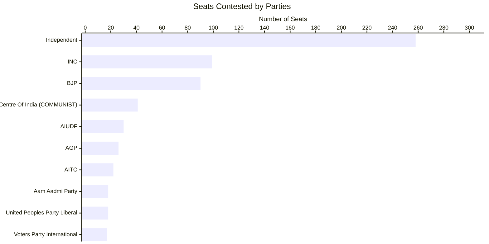

### Max and Mins

#### Maximum votes for a candidate

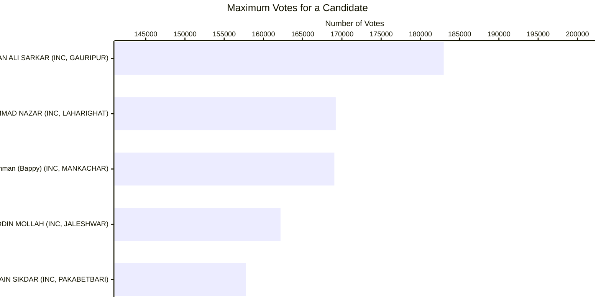

#### Least votes for a winning candidate

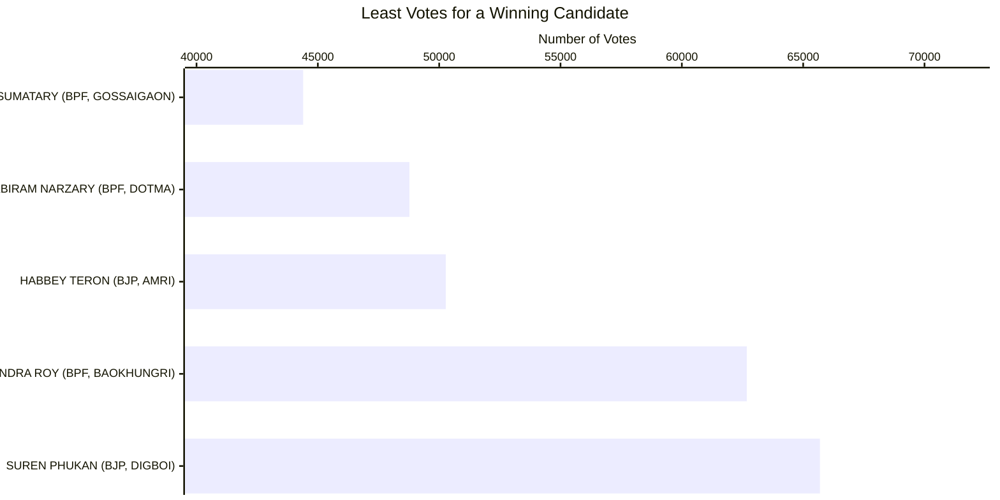

#### Max votes for a losing candidate

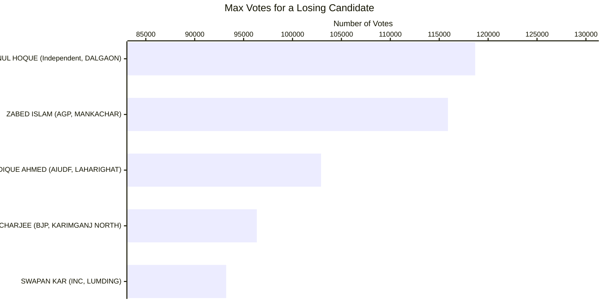

#### Candidates winning by Max margin (Unilateral winner)

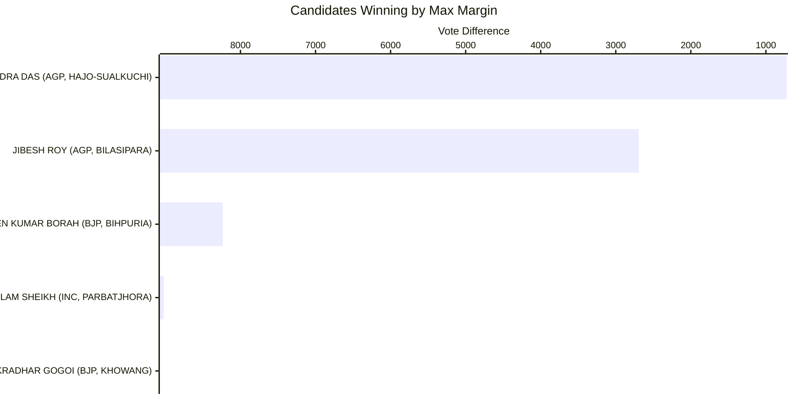

#### Candidates winning by Least margin (Fierce battle)

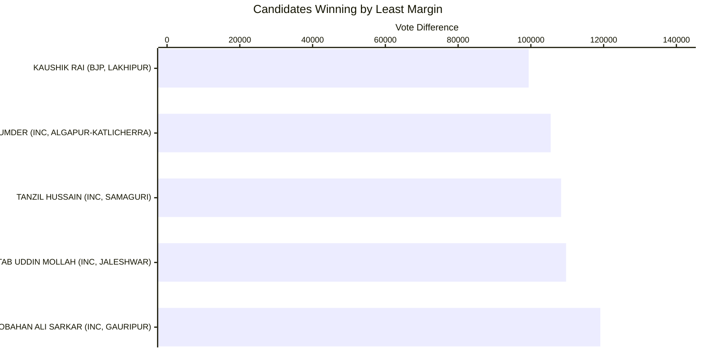

#### Max Total Votes in a Constituency

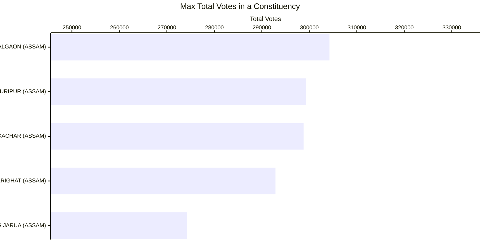

#### Min Total Votes Constituency

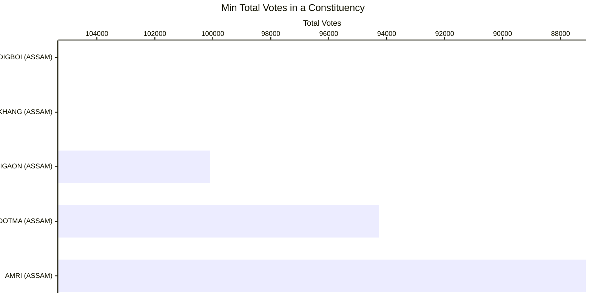

#### Max Candidates in a Constituency

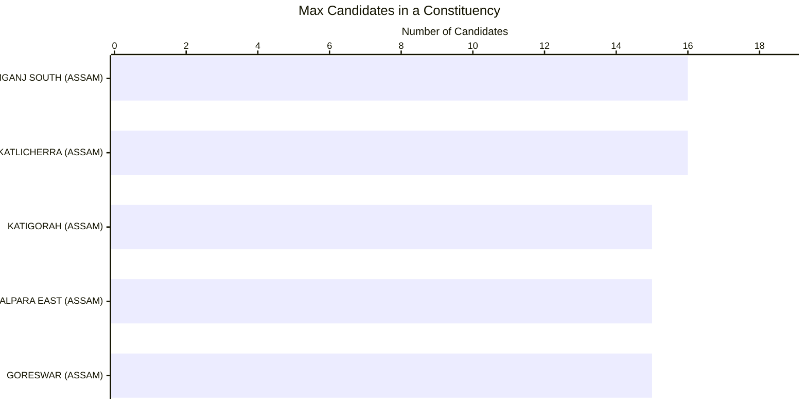

#### Least Candidates in a Constituency

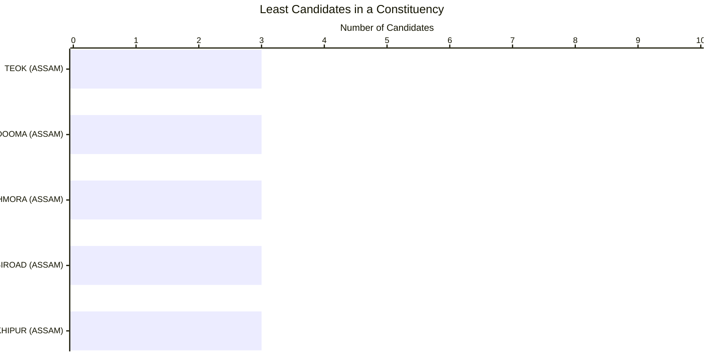

#### Total Vote Share of Parties

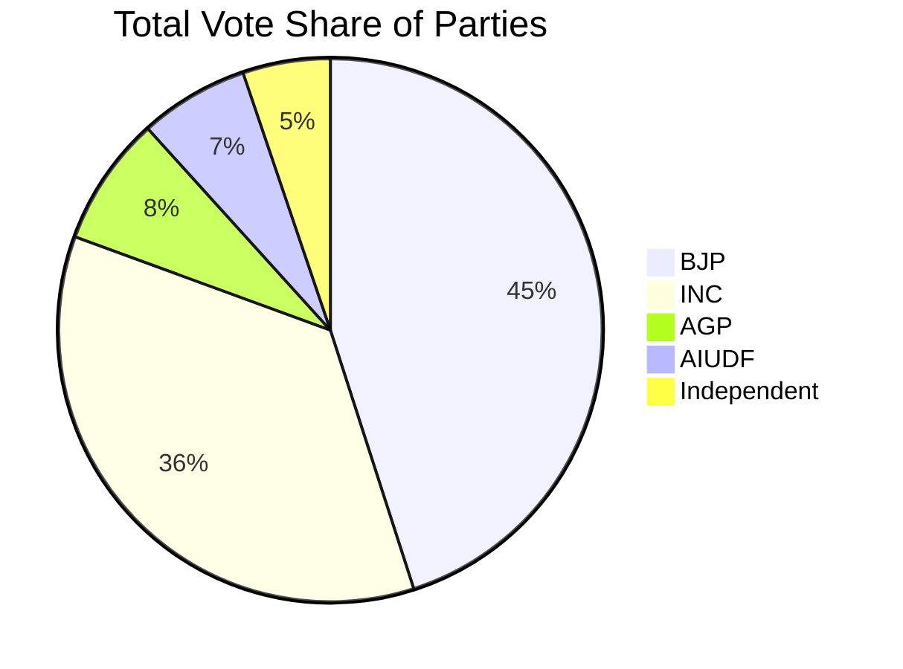

#### Maximum Vote Share of Winning Candidate

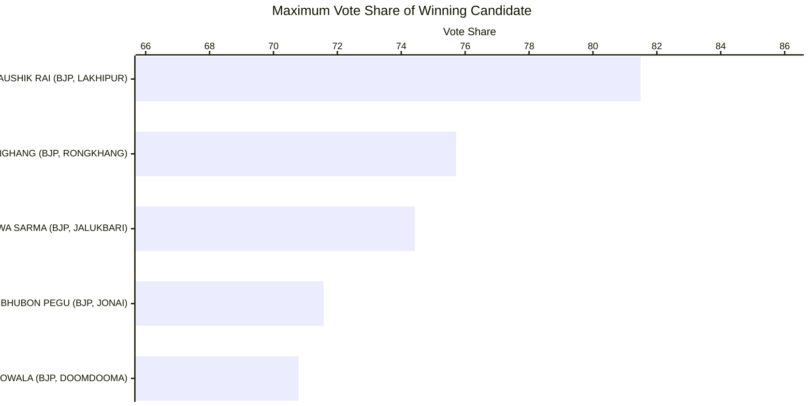

#### Least Vote Share for a Winning Candidate

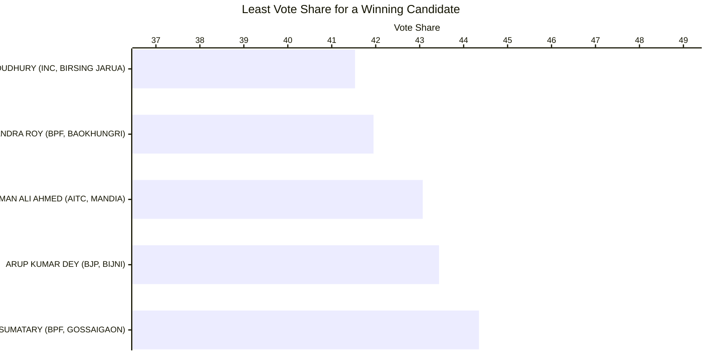

#### Max Vote Share of a Losing Candidate

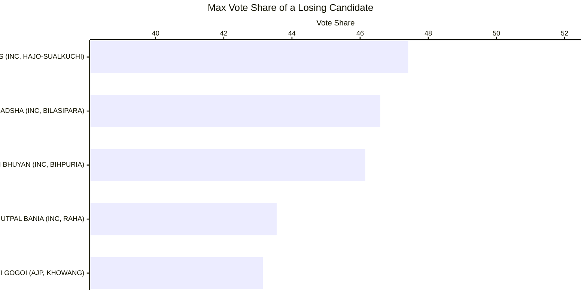

#### Seats in which Parties Lost Deposits (less than 1/6 vote share)

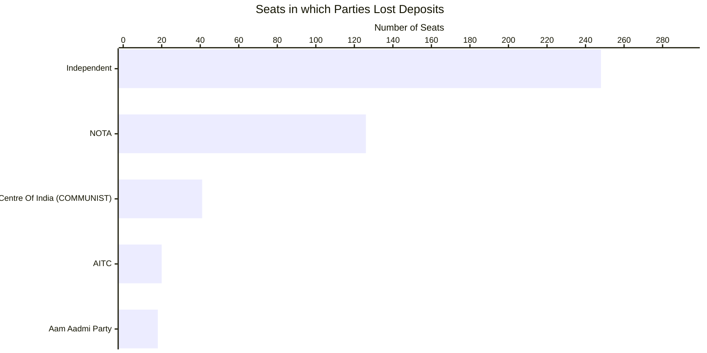

#### Gold (Seats that Parties Won)

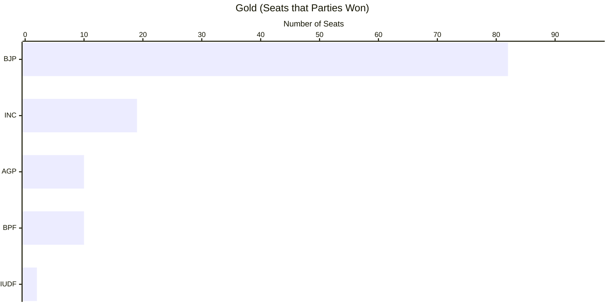

#### Silver (Seats that Parties Came in Second)

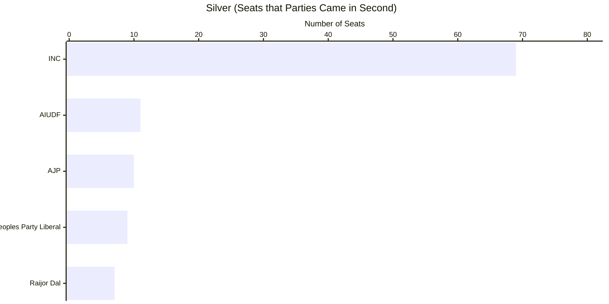

#### Cost per Vote - Best Value

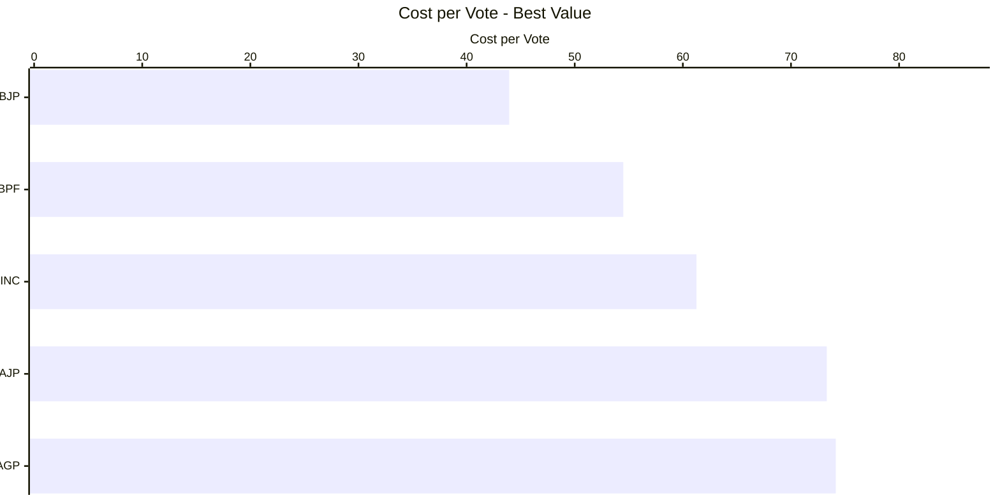

#### Cost per Vote - Worst Value

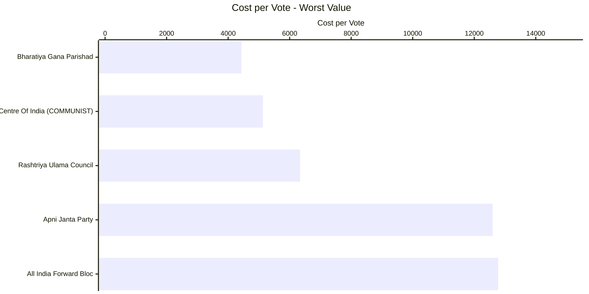

#### Success Ratio - Best


| Party | Seats Contested | Seats Won | Success Ratio |
| --- | --- | --- | --- |
| Asom Gana Parishad | 26 | 10 | 38.46153846153846153800 |
| Indian National Congress | 99 | 19 | 19.19191919191919191900 |
| Raijor Dal | 13 | 2 | 15.38461538461538461500 |
| All India United Democratic Front | 30 | 2 | 6.66666666666666666700 |
| All India Trinamool Congress | 22 | 1 | 4.54545454545454545500 |

#### Success Ratio - Worst


| Party | Seats Contested | Seats Won | Success Ratio |
| --- | --- | --- | --- |
| All India Trinamool Congress | 22 | 1 | 4.54545454545454545500 |
| All India United Democratic Front | 30 | 2 | 6.66666666666666666700 |
| Raijor Dal | 13 | 2 | 15.38461538461538461500 |
| Indian National Congress | 99 | 19 | 19.19191919191919191900 |
| Asom Gana Parishad | 26 | 10 | 38.46153846153846153800 |

### Multiple Seat Participation

#### Results of Candidates participating in multiple seats

| Candidate | Constituency | Code | Party | Result |
| --- | --- | --- | --- | --- |
| MAZIBUR RAHMAN | DALGAON | S0351 | All India United Democratic Front | WON |
| MAZIBUR RAHMAN | BARHAMPUR | S0359 | All India United Democratic Front | LOST |
| NABA KUMAR SARANIA | BIJNI | S0320 | Gana Suraksha Party | LOST |
| NABA KUMAR SARANIA | MANAS | S0341 | Gana Suraksha Party | LOST |
| DHANJEEP PRASAD RABHA | GOALPARA WEST | S0313 | Independent | LOST |
| DHANJEEP PRASAD RABHA | GOALPARA EAST | S0314 | Independent | LOST |
| HEMANTA BORUAH | SIBSAGAR | S0396 | Independent | LOST |
| HEMANTA BORUAH | LAKHIMPUR | S0376 | Independent | LOST |
| RABINDRA RONGPI | HOWRAGHAT | S03109 | Independent | LOST |
| RABINDRA RONGPI | DIPHU | S03110 | Independent | LOST |

### Close Contest Matrix
This matrix provides the number of seats in which parties lost by the number of votes provided in the columns.

| Losing Party | < 500 | < 2500 | < 5000 | < 10000 | < 15000 | < 25000 | < 50000 |
| --- | --- | --- | --- | --- | --- | --- | --- |
| All India United Democratic Front | 0 | 0 | 0 | 0 | 0 | 1 | 2 |
| Asom Gana Parishad | 0 | 0 | 0 | 0 | 0 | 1 | 2 |
| Assam Jatiya Parishad | 0 | 0 | 0 | 1 | 1 | 2 | 5 |
| Bharatiya Janata Party | 0 | 0 | 0 | 0 | 0 | 1 | 2 |
| Bodoland Peoples Front | 0 | 0 | 0 | 1 | 1 | 1 | 1 |
| Communist Party of India (Marxist) | 0 | 0 | 0 | 0 | 0 | 0 | 1 |
| Independent | 0 | 0 | 0 | 0 | 0 | 2 | 5 |
| Indian National Congress | 0 | 1 | 2 | 3 | 4 | 18 | 45 |
| Jharkhand Mukti Morcha | 0 | 0 | 0 | 0 | 0 | 1 | 1 |
| Raijor Dal | 0 | 0 | 0 | 0 | 0 | 1 | 5 |

#### Party Specific Close Contest Matrix


##### All India United Democratic Front

| Constituency | Code | Runner Up Votes | Winning Party | Winning Votes | Vote Difference |
| --- | --- | --- | --- | --- | --- |
| SRIJANGRAM | S0317 | 88411 | Indian National Congress | 106716 | 18305 |
| BIRSING JARUA | S039 | 78016 | Indian National Congress | 113901 | 35885 |


##### Asom Gana Parishad

| Constituency | Code | Runner Up Votes | Winning Party | Winning Votes | Vote Difference |
| --- | --- | --- | --- | --- | --- |
| NOWBOICHA | S0375 | 63230 | Indian National Congress | 86981 | 23751 |
| SONAI | S03119 | 62787 | Indian National Congress | 89957 | 27170 |


##### Bharatiya Janata Party

| Constituency | Code | Runner Up Votes | Winning Party | Winning Votes | Vote Difference |
| --- | --- | --- | --- | --- | --- |
| SIBSAGAR | S0396 | 69249 | Raijor Dal | 86521 | 17272 |
| KARIMGANJ NORTH | S03123 | 96353 | Indian National Congress | 122356 | 26003 |


##### Indian National Congress

| Constituency | Code | Runner Up Votes | Winning Party | Winning Votes | Vote Difference |
| --- | --- | --- | --- | --- | --- |
| HAJO-SUALKUCHI | S0330 | 80975 | Asom Gana Parishad | 81699 | 724 |
| BILASIPARA | S0310 | 83243 | Asom Gana Parishad | 85937 | 2694 |
| BIHPURIA | S0373 | 64814 | Bharatiya Janata Party | 73050 | 8236 |
| DULIAJAN | S0390 | 61008 | Bharatiya Janata Party | 71467 | 10459 |
| MAHMORA | S0394 | 53509 | Bharatiya Janata Party | 69530 | 16021 |


### Advanced Join Insights

#### Crowding pressure seats

Crowded ballots with thin margins are visualized below using "others" vote share as a proxy for fragmentation.

| Code | Constituency | Winning Party | Runner Up Party | Candidate Count | Others Vote % | Margin Votes | Margin % | Postal Gap | Crowding Band |
| --- | --- | --- | --- | --- | --- | --- | --- | --- | --- |
| S035 | PARBATJHORA | Indian National Congress | Bodoland Peoples Front | 9 | 11.59 | 9022 | 5.49 | -319 | Standard |
| S0389 | KHOWANG | Bharatiya Janata Party | Assam Jatiya Parishad | 5 | 6.14 | 9984 | 7.55 | -72 | Standard |
| S0310 | BILASIPARA | Asom Gana Parishad | Indian National Congress | 7 | 5.31 | 2694 | 1.50 | 652 | Standard |
| S0330 | HAJO-SUALKUCHI | Asom Gana Parishad | Indian National Congress | 6 | 4.75 | 724 | 0.43 | 310 | Standard |
| S0373 | BIHPURIA | Bharatiya Janata Party | Indian National Congress | 5 | 1.85 | 8236 | 5.86 | 69 | Standard |

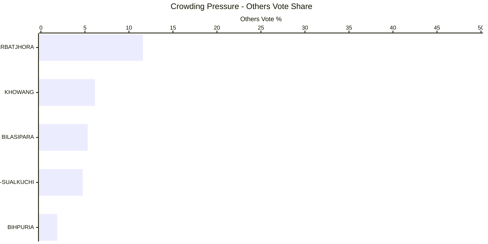

#### Runner-up overperformance vs party baseline

These runner-up candidates beat their party-wide average vote share even in defeat.

| Constituency | Candidate | Party | Runner Up % | Party Avg % | Overperformance % | Total Constituencies Contested |
| --- | --- | --- | --- | --- | --- | --- |
| DALGAON | MD AYNUL HOQUE | Independent | 39.01 | 2.09 | 36.92 | 258 |
| KALIABOR | JITEN GOUR | Independent | 34.20 | 2.09 | 32.11 | 258 |
| AMRI | BIKRAM HANSE | Independent | 33.19 | 2.09 | 31.10 | 258 |
| BARPETA | GAGAN CHANDRA HALOI | Independent | 31.20 | 2.09 | 29.11 | 258 |
| DIPHU | J. I  KATHAR | Independent | 28.49 | 2.09 | 26.40 | 258 |

```mermaid
---
config:
  xyChart:
    width: 1200
    height: 600
    chartOrientation: horizontal
  dataLabels:
    enabled: true
    placement: end
---
xychart-beta
title "Runner-up Overperformance"
x-axis ["DALGAON", "KALIABOR", "AMRI", "BARPETA", "DIPHU"]
y-axis "Overperformance %" 0 --> 35
bar [36.92, 32.11, 31.10, 29.11, 26.40]
```

#### HHI win mix by party

Competition bands (Herfindahl-Hirschman Index) show which parties dominate different contest types.

| Party | HHI Band | Seats Won |
| --- | --- | --- |
| All India Trinamool Congress | Fragmented | 1 |
| All India United Democratic Front | Competitive | 2 |
| Asom Gana Parishad | Competitive | 4 |
| Asom Gana Parishad | Dominant | 5 |
| Asom Gana Parishad | Fragmented | 1 |
| Bharatiya Janata Party | Competitive | 18 |
| Bharatiya Janata Party | Dominant | 63 |
| Bharatiya Janata Party | Fragmented | 1 |
| Bodoland Peoples Front | Competitive | 5 |
| Bodoland Peoples Front | Dominant | 1 |

```mermaid
---
config:
  xyChart:
    width: 1200
    height: 600
  dataLabels:
    enabled: true
    placement: end
---
xychart-beta
title "HHI Win Mix by Party"
x-axis ["Competitive", "Dominant", "Fragmented"]
y-axis "Seats Won" 0 --> 100
bar "Raijor" [0, 0, 0]
bar "Indian" [0, 0, 0]
bar "Bodoland" [0, 0, 0]
bar "Bharatiya" [0, 0, 0]
bar "Asom" [0, 0, 0]
```

#### Third-place spoilers in tight races

Third-place candidacies that materially exceeded their party's norm highlight potential spoiler roles.

```mermaid
---
config:
  xyChart:
    width: 1200
    height: 600
    chartOrientation: horizontal
  dataLabels:
    enabled: true
    placement: end
---
xychart-beta
title "Third-place Overperformance"
x-axis ["KHOWANG", "BIHPURIA", "HAJO-SUALKUCHI", "PARBATJHORA", "BILASIPARA"]
y-axis "Overperformance %" 0 --> 25
bar [1.21, -0.45, -2.25, -12.89, -13.39]
```
