# Table of contents

- [Analysis of Tamil Nadu Assembly Elections May 2026](#analysis-of-tamil-nadu-assembly-elections-may-2026)
* [Analysis](#analysis)
+ [Seats contested by Parties](#seats-contested-by-parties)
+ [Max and Mins](#max-and-mins)
- [Maximum votes for a candidate](#maximum-votes-for-a-candidate)
- [Least votes for a winning candidate](#least-votes-for-a-winning-candidate)
- [Max votes for a losing candidate](#max-votes-for-a-losing-candidate)
- [Candidates winning by Max margin (Unilateral winner)](#candidates-winning-by-max-margin-unilateral-winner)
- [Candidates winning by Least margin (Fierce battle)](#candidates-winning-by-least-margin-fierce-battle)
+ [Max and Mins - Constituencies](#max-and-mins---constituencies)
- [Max Total Votes in a Constituency](#max-total-votes-in-a-constituency)
- [Min Total Votes Constituency](#min-total-votes-constituency)
- [Max candidates in a Constituency](#max-candidates-in-a-constituency)
- [Least candidates in a Constituency](#least-candidates-in-a-constituency)
+ [Vote Shares](#vote-shares)
- [Total Vote Share of Parties](#total-vote-share-of-parties)
- [Maximum Vote share of Winning Candidate](#maximum-vote-share-of-winning-candidate)
- [Least Vote share for a winning candidate](#least-vote-share-for-a-winning-candidate)
- [Max Vote share of a losing candidate](#max-vote-share-of-a-losing-candidate)
- [Seats in which Parties lost deposits (less than 1/6 vote share)](#seats-in-which-parties-lost-deposits-less-than-16-vote-share)
+ [Medals](#medals)
- [Gold (Seats that Parties won)](#gold-seats-that-parties-won)
- [Silver (Seats that Parties came in second)](#silver-seats-that-parties-came-in-second)
+ [Strike Rates](#strike-rates)
- [Cost per vote - Best Value per vote](#cost-per-vote---best-value-per-vote)
- [Cost per vote - Worst Value per vote](#cost-per-vote---worst-value-per-vote)
- [Success Ratio - Best](#success-ratio---best)
- [Success Ratio - Worst](#success-ratio---worst)
+ [Multiple Seat Participation](#multiple-seat-participation)
- [Candidates participating in multiple seats (matches names)](#candidates-participating-in-multiple-seats-matches-names)
+ [Close Contest Matrix](#close-contest-matrix)
- [Party Specific Close Contest Matrix](#party-specific-close-contest-matrix)
     * [All India Anna Dravida Munnetra Kazhagam](#all-india-anna-dravida-munnetra-kazhagam)
     * [Dravida Munnetra Kazhagam](#dravida-munnetra-kazhagam)
     * [Indian National Congress](#indian-national-congress)
     * [Tamilaga Vettri Kazhagam](#tamilaga-vettri-kazhagam)
+ [Advanced Join Insights](#advanced-join-insights)
- [Crowding pressure seats](#crowding-pressure-seats)
- [Runner-up overperformance vs party baseline](#runner-up-overperformance-vs-party-baseline)
- [HHI win mix by party](#hhi-win-mix-by-party)
- [Third-place spoilers in tight races](#third-place-spoilers-in-tight-races)

# Analysis of Tamil Nadu Assembly Elections May 2026

The 2026 Tamil Nadu Legislative Assembly elections were conducted to elect members of the Vidhan Sabha, with counting overseen by the Election Commission of India soon after polling.

This page provides the highlights of the results. Complete results of the analysis can be seen [here](https://github.com/arjunswaj/elections/tree/2026-election/result/TAMIL NADU).

## Analysis
A total of 4023 candidates contested in the Tamil Nadu assembly elections and about 4.93 Crore (`49324121`) votes were cast during this period.

### Seats contested by Parties

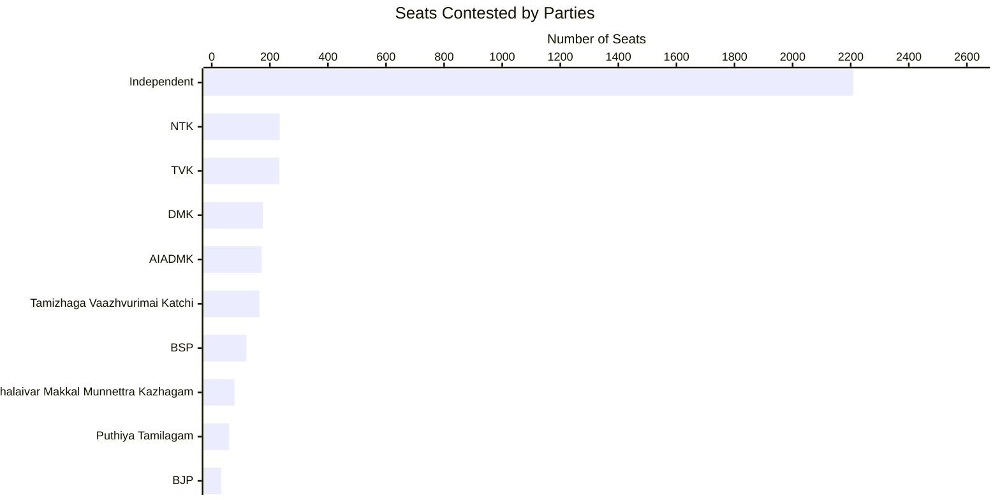

### Max and Mins

#### Maximum votes for a candidate

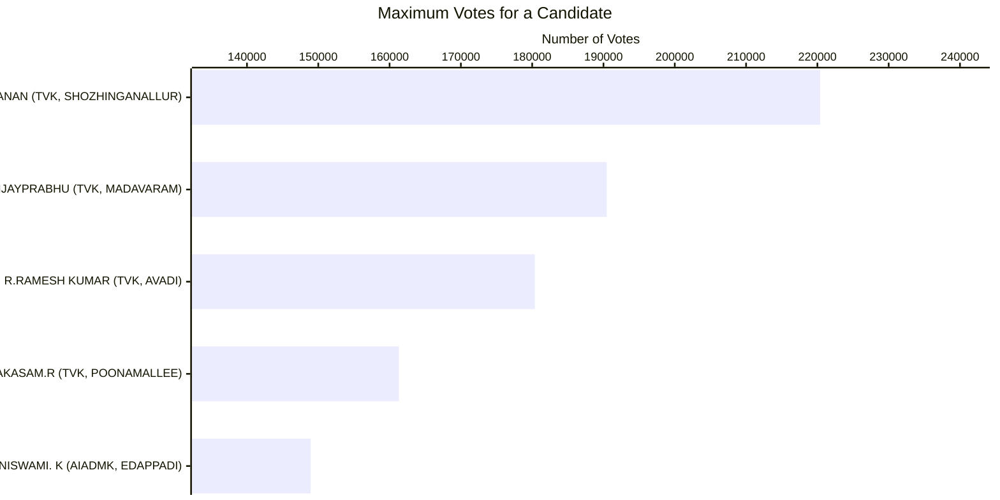

#### Least votes for a winning candidate

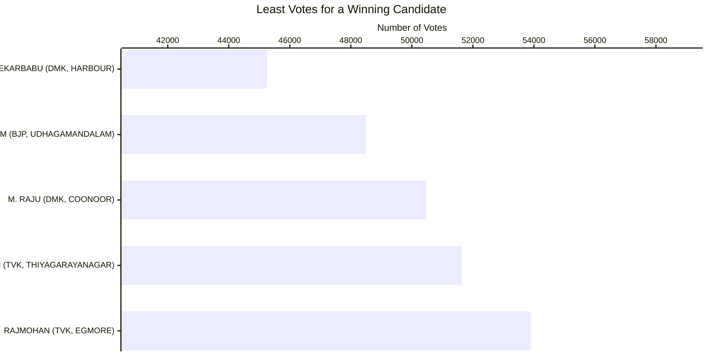

#### Max votes for a losing candidate

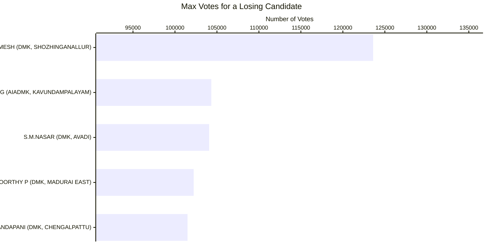

#### Candidates winning by Max margin (Unilateral winner)

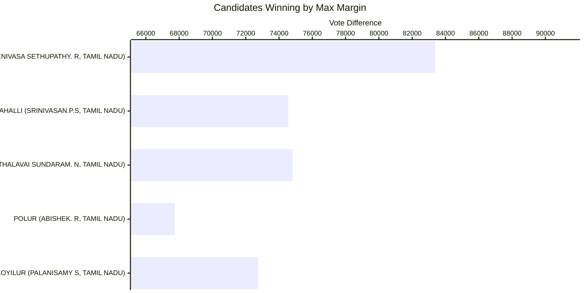

#### Candidates winning by Least margin (Fierce battle)

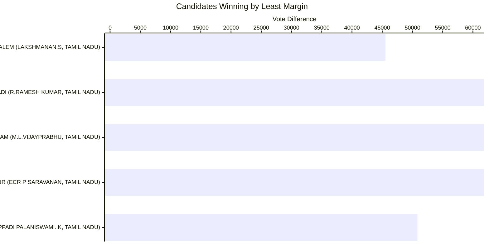

#### Max Total Votes in a Constituency

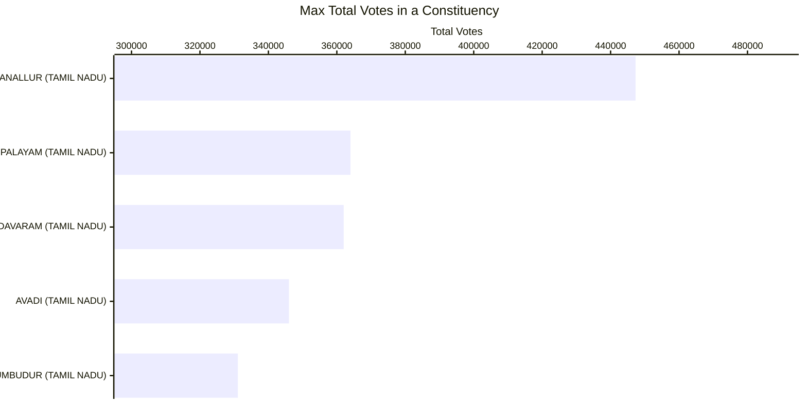

#### Min Total Votes Constituency

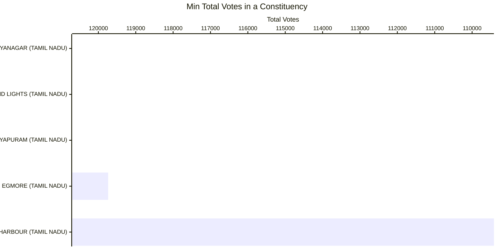

#### Max Candidates in a Constituency

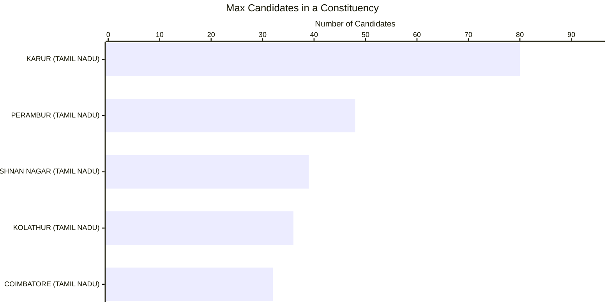

#### Least Candidates in a Constituency

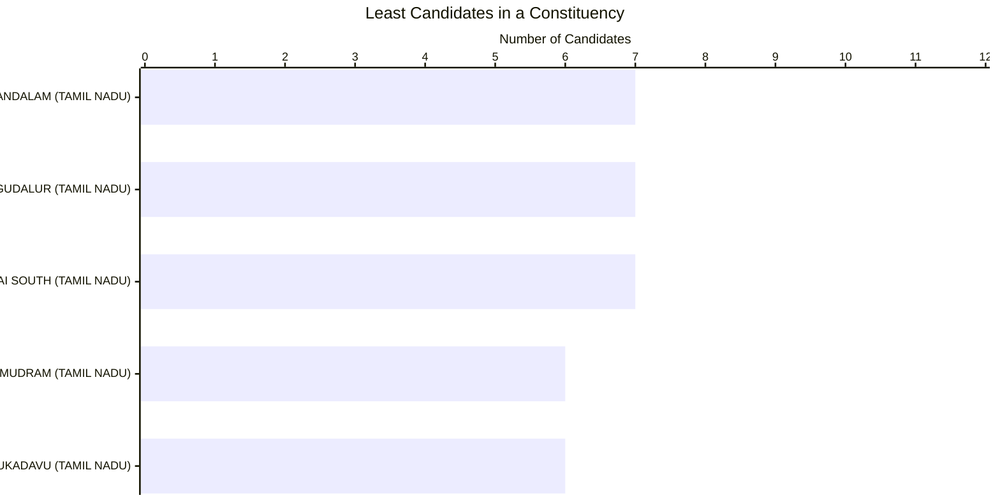

#### Total Vote Share of Parties

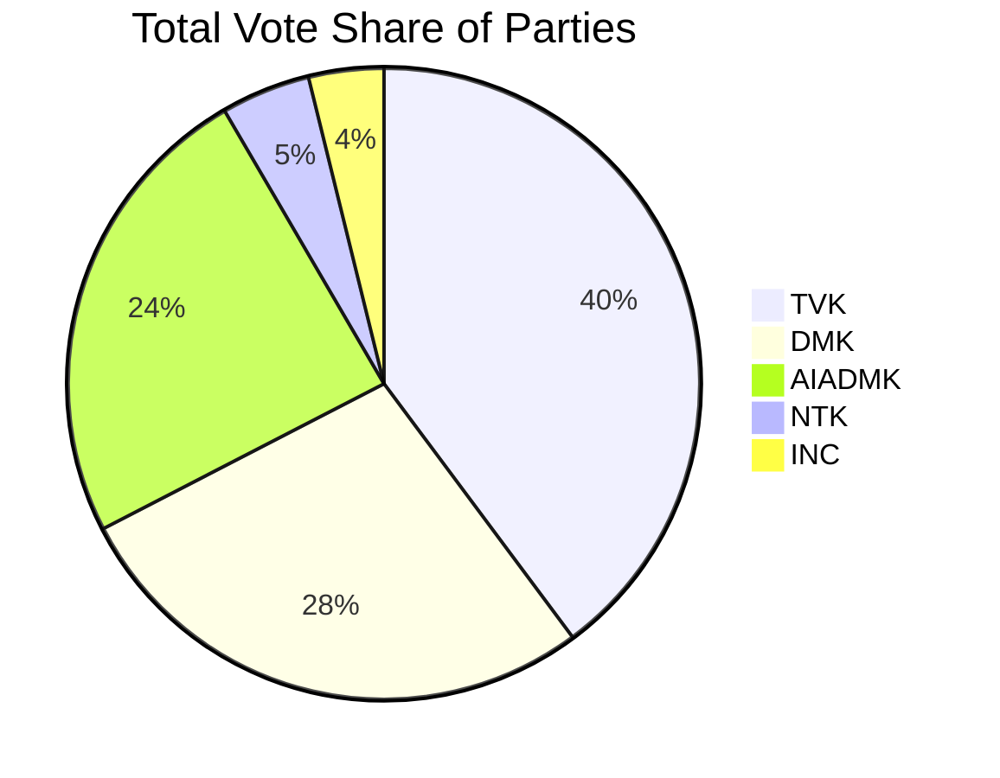

#### Maximum Vote Share of Winning Candidate

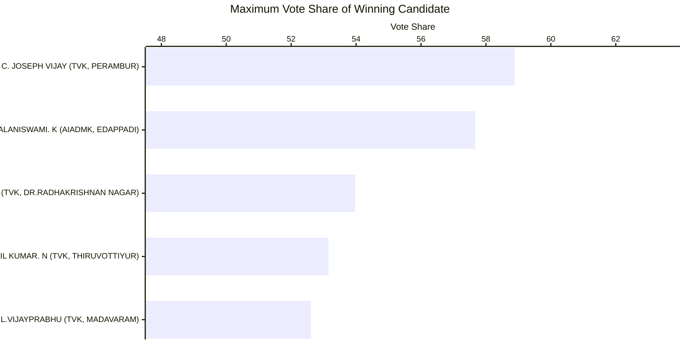

#### Least Vote Share for a Winning Candidate

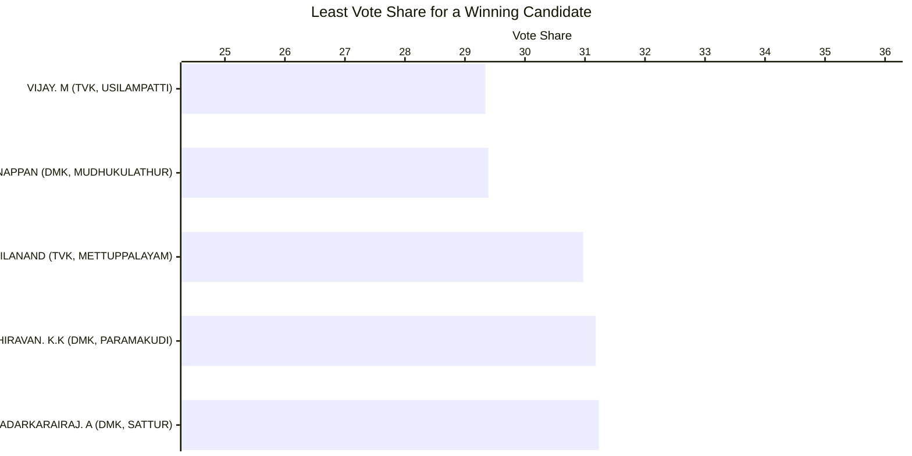

#### Max Vote Share of a Losing Candidate

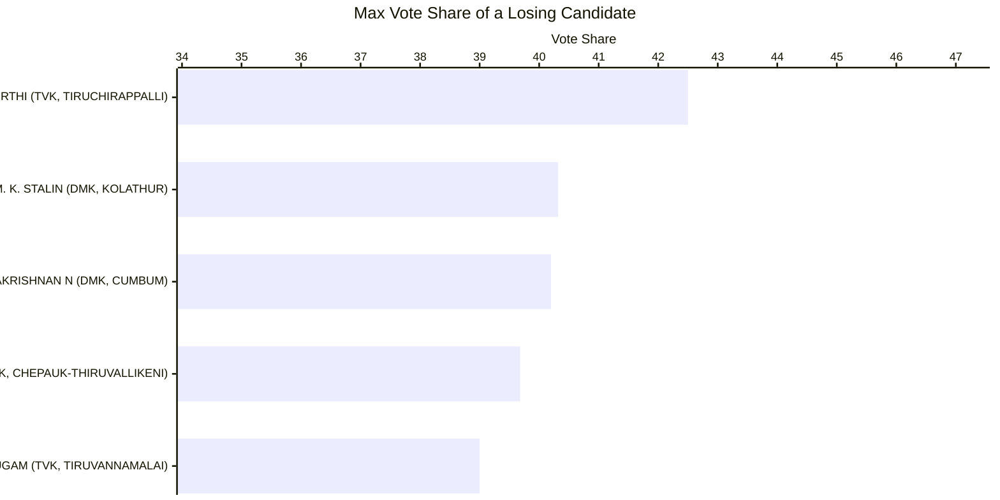

#### Seats in which Parties Lost Deposits (less than 1/6 vote share)

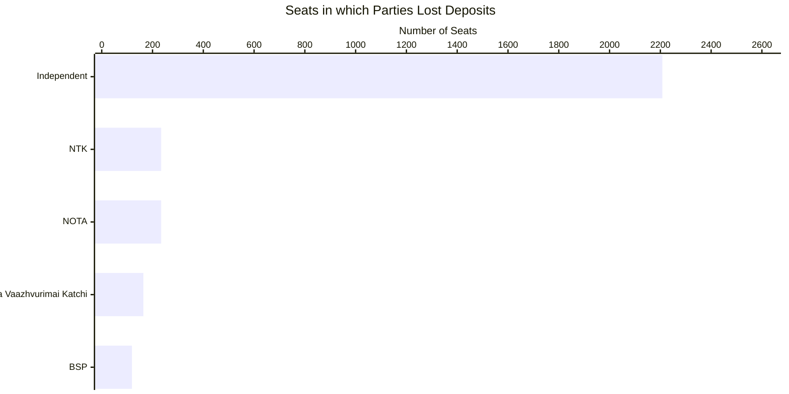

#### Gold (Seats that Parties Won)

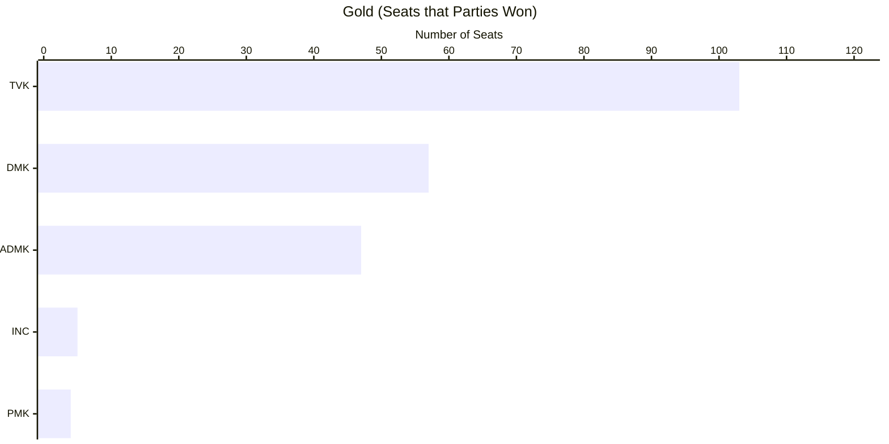

#### Silver (Seats that Parties Came in Second)

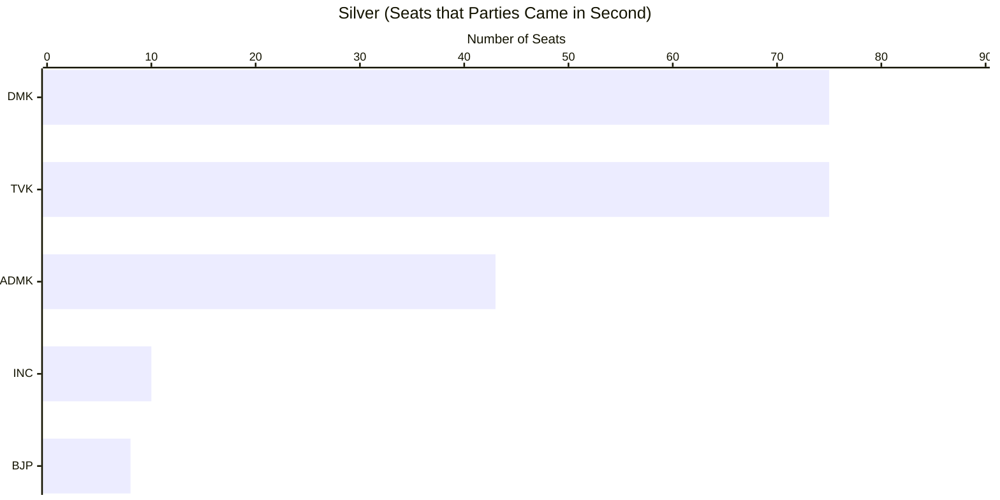

#### Cost per Vote - Best Value

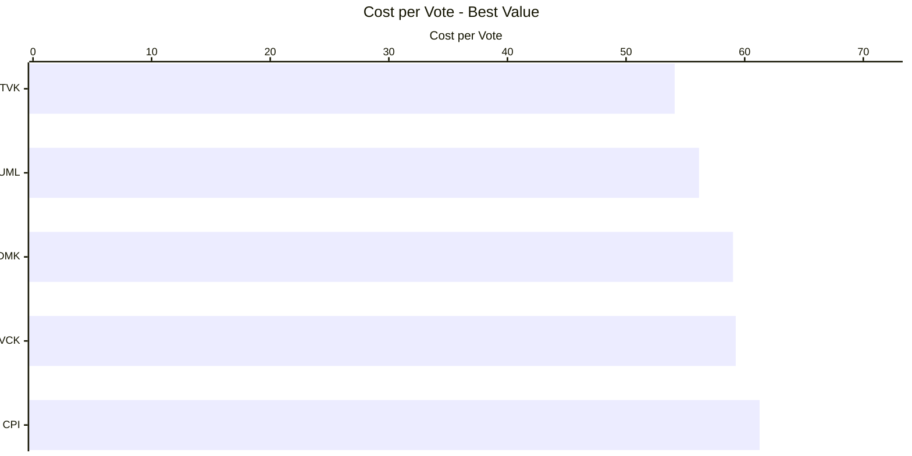

#### Cost per Vote - Worst Value

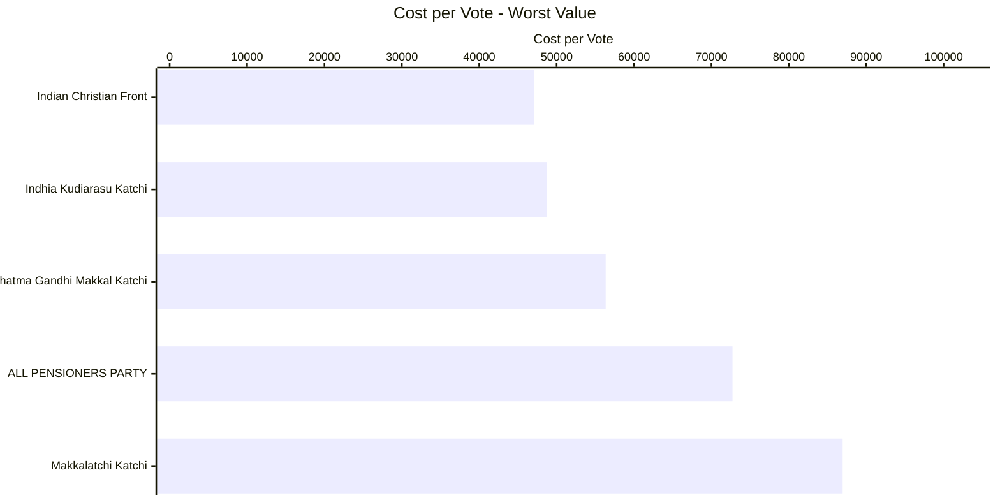

#### Success Ratio - Best


| Party | Seats Contested | Seats Won | Success Ratio |
| --- | --- | --- | --- |
| Pattali Makkal Katchi | 17 | 4 | 23.52941176470588235300 |
| Indian National Congress | 28 | 5 | 17.85714285714285714300 |
| Desiya Murpokku Dravida Kazhagam | 10 | 1 | 10.00000000000000000000 |
| Amma Makkal Munnettra Kazagam | 11 | 1 | 9.09090909090909090900 |
| Bharatiya Janata Party | 33 | 1 | 3.03030303030303030300 |

#### Success Ratio - Worst


| Party | Seats Contested | Seats Won | Success Ratio |
| --- | --- | --- | --- |
| Bharatiya Janata Party | 33 | 1 | 3.03030303030303030300 |
| Amma Makkal Munnettra Kazagam | 11 | 1 | 9.09090909090909090900 |
| Desiya Murpokku Dravida Kazhagam | 10 | 1 | 10.00000000000000000000 |
| Indian National Congress | 28 | 5 | 17.85714285714285714300 |
| Pattali Makkal Katchi | 17 | 4 | 23.52941176470588235300 |

### Multiple Seat Participation

#### Results of Candidates participating in multiple seats

| Candidate | Constituency | Code | Party | Result |
| --- | --- | --- | --- | --- |
| C. JOSEPH VIJAY | TIRUCHIRAPPALLI | S22141 | Tamilaga Vettri Kazhagam | WON |
| C. JOSEPH VIJAY | PERAMBUR | S2212 | Tamilaga Vettri Kazhagam | WON |
| SIVAKUMAR. K | PERAMBALUR | S22147 | Tamilaga Vettri Kazhagam | WON |
| SIVAKUMAR. K | SALEM | S2289 | Tamilaga Vettri Kazhagam | WON |
| R.MANOHARAN | SRIRANGAM | S22139 | All India Anna Dravida Munnetra Kazhagam | LOST |
| R.MANOHARAN | ERODE | S2298 | All India Anna Dravida Munnetra Kazhagam | LOST |
| AGNI AALVAR | CHEPAUK-THIRUVALLIKENI | S2219 | Independent | LOST |
| AGNI AALVAR | PERAMBUR | S2212 | Independent | LOST |
| A. RAMESH | PALLADAM | S22115 | Independent | LOST |
| A. RAMESH | COIMBATORE | S22118 | Independent | LOST |

### Close Contest Matrix
This matrix provides the number of seats in which parties lost by the number of votes provided in the columns.

| Losing Party | < 500 | < 2500 | < 5000 | < 10000 | < 15000 | < 25000 | < 50000 |
| --- | --- | --- | --- | --- | --- | --- | --- |
| All India Anna Dravida Munnetra Kazhagam | 1 | 7 | 16 | 26 | 31 | 38 | 43 |
| Amma Makkal Munnettra Kazagam | 0 | 0 | 0 | 0 | 0 | 1 | 1 |
| Bharatiya Janata Party | 0 | 1 | 1 | 4 | 6 | 7 | 8 |
| Communist Party of India | 0 | 0 | 0 | 1 | 1 | 1 | 1 |
| Desiya Murpokku Dravida Kazhagam | 1 | 1 | 1 | 2 | 3 | 3 | 3 |
| Dravida Munnetra Kazhagam | 3 | 9 | 13 | 22 | 37 | 55 | 73 |
| Indian National Congress | 0 | 0 | 1 | 1 | 4 | 8 | 9 |
| Pattali Makkal Katchi | 0 | 0 | 1 | 2 | 3 | 3 | 4 |
| Tamilaga Vettri Kazhagam | 1 | 17 | 28 | 46 | 58 | 68 | 73 |
| Viduthalai Chiruthaigal Katchi | 0 | 0 | 0 | 0 | 1 | 3 | 4 |

#### Party Specific Close Contest Matrix


##### All India Anna Dravida Munnetra Kazhagam

| Constituency | Code | Runner Up Votes | Winning Party | Winning Votes | Vote Difference |
| --- | --- | --- | --- | --- | --- |
| VEPPANAHALLI | S2254 | 74553 | Dravida Munnetra Kazhagam | 74691 | 138 |
| TINDIVANAM | S2272 | 63099 | Viduthalai Chiruthaigal Katchi | 63833 | 734 |
| KALLAKURICHI | S2280 | 80334 | Tamilaga Vettri Kazhagam | 81132 | 798 |
| SRIVAIKUNTAM | S22216 | 57628 | Tamilaga Vettri Kazhagam | 58814 | 1186 |
| MANAPPARAI | S22138 | 81615 | Tamilaga Vettri Kazhagam | 83041 | 1426 |


##### Dravida Munnetra Kazhagam

| Constituency | Code | Runner Up Votes | Winning Party | Winning Votes | Vote Difference |
| --- | --- | --- | --- | --- | --- |
| TIRUPPATTUR | S22185 | 83374 | Tamilaga Vettri Kazhagam | 83375 | 1 |
| KANNIYAKUMARI | S22229 | 74831 | All India Anna Dravida Munnetra Kazhagam | 75045 | 214 |
| PARAMATHI-VELUR | S2295 | 61041 | All India Anna Dravida Munnetra Kazhagam | 61349 | 308 |
| KUMBAKONAM | S22171 | 77971 | Tamilaga Vettri Kazhagam | 78650 | 679 |
| CUMBUM | S22201 | 84643 | Tamilaga Vettri Kazhagam | 85394 | 751 |


##### Indian National Congress

| Constituency | Code | Runner Up Votes | Winning Party | Winning Votes | Vote Difference |
| --- | --- | --- | --- | --- | --- |
| TIRUVADANAI | S22210 | 67038 | Tamilaga Vettri Kazhagam | 69551 | 2513 |
| ARANTHANGI | S22183 | 63182 | Tamilaga Vettri Kazhagam | 73244 | 10062 |
| AMBASAMUDRAM | S22225 | 55344 | All India Anna Dravida Munnetra Kazhagam | 65589 | 10245 |
| SIVAKASI | S22205 | 57039 | Tamilaga Vettri Kazhagam | 68709 | 11670 |
| CUDDALORE | S22155 | 55337 | Tamilaga Vettri Kazhagam | 70856 | 15519 |


##### Tamilaga Vettri Kazhagam

| Constituency | Code | Runner Up Votes | Winning Party | Winning Votes | Vote Difference |
| --- | --- | --- | --- | --- | --- |
| TIRUKKOYILUR | S2276 | 72748 | All India Anna Dravida Munnetra Kazhagam | 73033 | 285 |
| KULITHALAI | S22137 | 67559 | Dravida Munnetra Kazhagam | 68138 | 579 |
| PALANI | S22127 | 66293 | All India Anna Dravida Munnetra Kazhagam | 66986 | 693 |
| KOVILPATTI | S22218 | 60800 | Dravida Munnetra Kazhagam | 61643 | 843 |
| VIKRAVANDI | S2275 | 68817 | Pattali Makkal Katchi | 69727 | 910 |


### Advanced Join Insights

#### Crowding pressure seats

Crowded ballots with thin margins are visualized below using "others" vote share as a proxy for fragmentation.

| Code | Constituency | Winning Party | Runner Up Party | Candidate Count | Others Vote % | Margin Votes | Margin % | Postal Gap | Crowding Band |
| --- | --- | --- | --- | --- | --- | --- | --- | --- | --- |
| S22197 | USILAMPATTI | Tamilaga Vettri Kazhagam | All India Anna Dravida Munnetra Kazhagam | 13 | 42.12 | 1805 | 0.80 | 318 | Crowded |
| S22111 | METTUPPALAYAM | Tamilaga Vettri Kazhagam | Dravida Munnetra Kazhagam | 23 | 41.25 | 7768 | 3.18 | -409 | Ultra-crowded |
| S22223 | ALANGULAM | Dravida Munnetra Kazhagam | All India Anna Dravida Munnetra Kazhagam | 14 | 40.90 | 7798 | 3.53 | 408 | Crowded |
| S22204 | SATTUR | Dravida Munnetra Kazhagam | Bharatiya Janata Party | 23 | 40.56 | 5989 | 3.02 | 112 | Ultra-crowded |
| S22209 | PARAMAKUDI | Dravida Munnetra Kazhagam | Tamilaga Vettri Kazhagam | 13 | 39.51 | 3548 | 1.87 | 187 | Crowded |

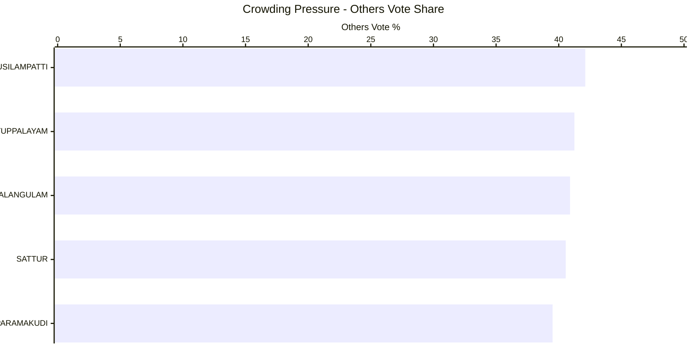

#### Runner-up overperformance vs party baseline

These runner-up candidates beat their party-wide average vote share even in defeat.

| Constituency | Candidate | Party | Runner Up % | Party Avg % | Overperformance % | Constituencies |
| --- | --- | --- | --- | --- | --- | --- |
| EDAPPADI | PREMKUMAR. K | Independent | 19.68 | 0.11 | 19.57 | 2209 |
| THALLI | DR.NAGESH KUMAR. C | Bharatiya Janata Party | 35.48 | 22.59 | 12.89 | 33 |
| MADATHUKULAM | C SHANMUGAVELU | Amma Makkal Munnettra Kazagam | 28.95 | 18.48 | 10.47 | 11 |
| MODAKKURICHI | S.KIRTHIKA | Bharatiya Janata Party | 30.55 | 22.59 | 7.96 | 33 |
| KOLATHUR | M. K. STALIN | Dravida Munnetra Kazhagam | 40.32 | 32.49 | 7.83 | 176 |

```mermaid
---
config:
  xyChart:
    width: 1200
    height: 600
    chartOrientation: horizontal
  dataLabels:
    enabled: true
    placement: end
---
xychart-beta
title "Runner-up Overperformance"
x-axis ["EDAPPADI", "THALLI", "MADATHUKULAM", "MODAKKURICHI", "KOLATHUR"]
y-axis "Overperformance %" 0 --> 35
bar [19.57, 12.89, 10.47, 7.96, 7.83]
```

#### HHI win mix by party

Competition bands (Herfindahl-Hirschman Index) show which parties dominate different contest types.

| Party | HHI Band | Seats Won |
| --- | --- | --- |
| All India Anna Dravida Munnetra Kazhagam | Competitive | 2 |
| All India Anna Dravida Munnetra Kazhagam | Fragmented | 45 |
| Amma Makkal Munnettra Kazagam | Fragmented | 1 |
| Bharatiya Janata Party | Fragmented | 1 |
| Communist Party of India | Fragmented | 2 |
| Communist Party of India (Marxist) | Fragmented | 2 |
| Desiya Murpokku Dravida Kazhagam | Fragmented | 1 |
| Dravida Munnetra Kazhagam | Competitive | 2 |
| Dravida Munnetra Kazhagam | Fragmented | 57 |
| Indian National Congress | Fragmented | 5 |

```mermaid
---
config:
  xyChart:
    width: 1200
    height: 600
  dataLabels:
    enabled: true
    placement: end
---
xychart-beta
title "HHI Win Mix by Party"
x-axis ["Competitive", "Dominant", "Fragmented"]
y-axis "Seats Won" 0 --> 100
bar "Viduthalai" [0, 0, 0]
bar "Tamilaga" [0, 0, 0]
bar "Pattali" [0, 0, 0]
bar "Indian" [0, 0, 0]
bar "Indian" [0, 0, 0]
```

#### Third-place spoilers in tight races

Third-place candidacies that materially exceeded their party's norm highlight potential spoiler roles.

```mermaid
---
config:
  xyChart:
    width: 1200
    height: 600
    chartOrientation: horizontal
  dataLabels:
    enabled: true
    placement: end
---
xychart-beta
title "Third-place Overperformance"
x-axis ["THIRUVAIYARU", "COLACHAL", "NAGERCOIL", "UDHAGAMANDALAM", "POLUR"]
y-axis "Overperformance %" 0 --> 25
bar [6.34, 4.74, 4.08, 2.10, 1.97]
```
