# Table of contents

- [Analysis of West Bengal Assembly Elections May 2026](#analysis-of-west-bengal-assembly-elections-may-2026)
* [Analysis](#analysis)
+ [Seats contested by Parties](#seats-contested-by-parties)
+ [Max and Mins](#max-and-mins)
- [Maximum votes for a candidate](#maximum-votes-for-a-candidate)
- [Least votes for a winning candidate](#least-votes-for-a-winning-candidate)
- [Max votes for a losing candidate](#max-votes-for-a-losing-candidate)
- [Candidates winning by Max margin (Unilateral winner)](#candidates-winning-by-max-margin-unilateral-winner)
- [Candidates winning by Least margin (Fierce battle)](#candidates-winning-by-least-margin-fierce-battle)
+ [Max and Mins - Constituencies](#max-and-mins---constituencies)
- [Max Total Votes in a Constituency](#max-total-votes-in-a-constituency)
- [Min Total Votes Constituency](#min-total-votes-constituency)
- [Max candidates in a Constituency](#max-candidates-in-a-constituency)
- [Least candidates in a Constituency](#least-candidates-in-a-constituency)
+ [Vote Shares](#vote-shares)
- [Total Vote Share of Parties](#total-vote-share-of-parties)
- [Maximum Vote share of Winning Candidate](#maximum-vote-share-of-winning-candidate)
- [Least Vote share for a winning candidate](#least-vote-share-for-a-winning-candidate)
- [Max Vote share of a losing candidate](#max-vote-share-of-a-losing-candidate)
- [Seats in which Parties lost deposits (less than 1/6 vote share)](#seats-in-which-parties-lost-deposits-less-than-16-vote-share)
+ [Medals](#medals)
- [Gold (Seats that Parties won)](#gold-seats-that-parties-won)
- [Silver (Seats that Parties came in second)](#silver-seats-that-parties-came-in-second)
+ [Strike Rates](#strike-rates)
- [Cost per vote - Best Value per vote](#cost-per-vote---best-value-per-vote)
- [Cost per vote - Worst Value per vote](#cost-per-vote---worst-value-per-vote)
- [Success Ratio - Best](#success-ratio---best)
- [Success Ratio - Worst](#success-ratio---worst)
+ [Multiple Seat Participation](#multiple-seat-participation)
- [Candidates participating in multiple seats (matches names)](#candidates-participating-in-multiple-seats-matches-names)
+ [Close Contest Matrix](#close-contest-matrix)
- [Party Specific Close Contest Matrix](#party-specific-close-contest-matrix)
     * [All India Trinamool Congress](#all-india-trinamool-congress)
     * [Bharatiya Janata Party](#bharatiya-janata-party)
     * [Indian National Congress](#indian-national-congress)
+ [Advanced Join Insights](#advanced-join-insights)
- [Crowding pressure seats](#crowding-pressure-seats)
- [Runner-up overperformance vs party baseline](#runner-up-overperformance-vs-party-baseline)
- [HHI win mix by party](#hhi-win-mix-by-party)
- [Third-place spoilers in tight races](#third-place-spoilers-in-tight-races)

# Analysis of West Bengal Assembly Elections May 2026

The 2026 West Bengal Legislative Assembly elections were conducted to elect members of the Vidhan Sabha, with counting overseen by the Election Commission of India soon after polling.

This page provides the highlights of the results. Complete results of the analysis can be seen [here](https://github.com/arjunswaj/elections/tree/2026-election/result/WEST BENGAL).

## Analysis
A total of 2926 candidates contested in the West Bengal assembly elections and about 6.37 Crore (`63753070`) votes were cast during this period.

### Seats contested by Parties

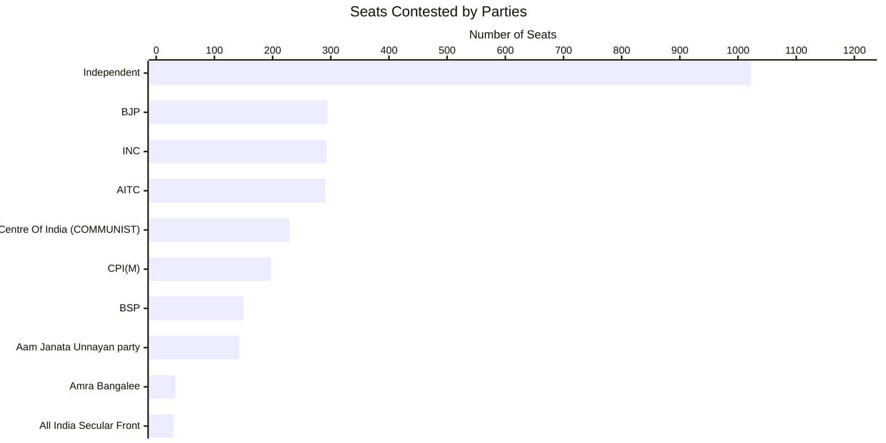

### Max and Mins

#### Maximum votes for a candidate

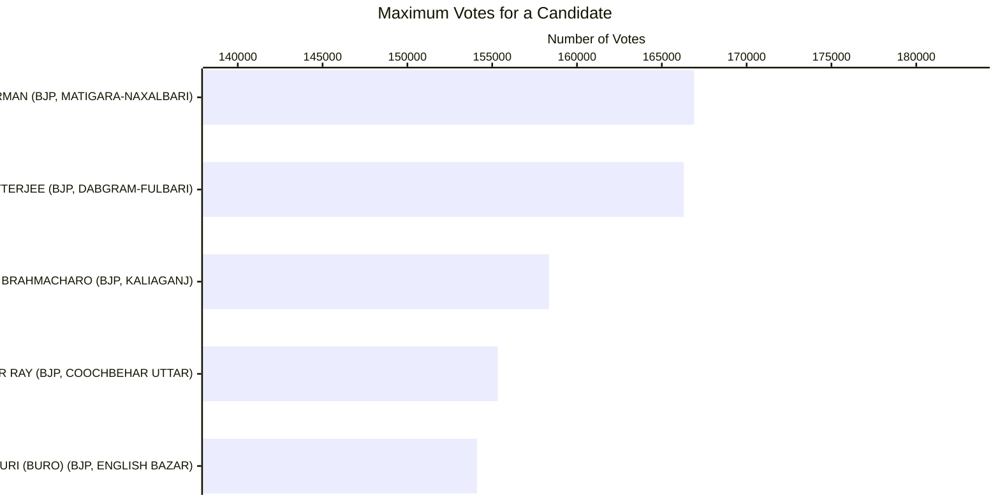

#### Least votes for a winning candidate

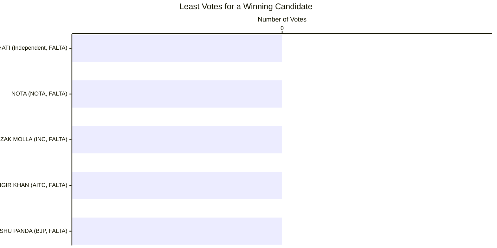

#### Max votes for a losing candidate

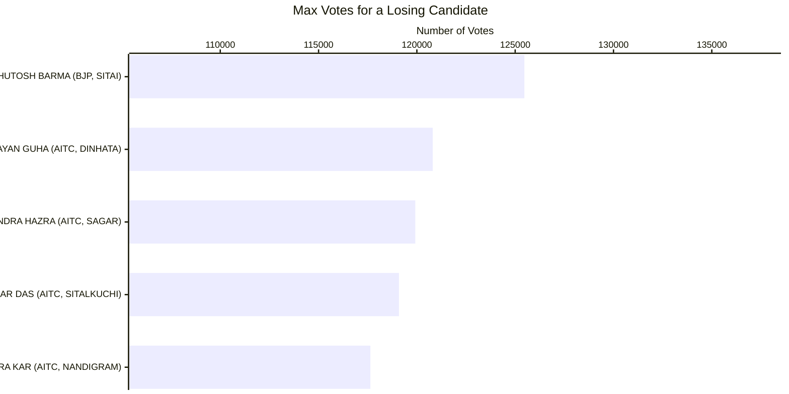

#### Candidates winning by Max margin (Unilateral winner)

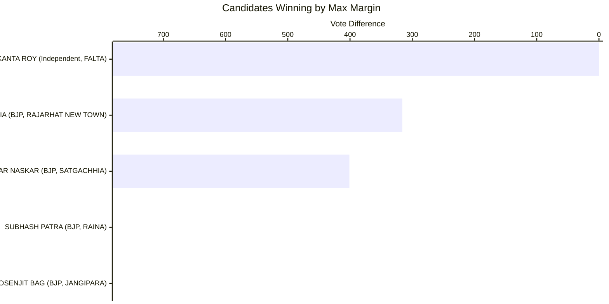

#### Candidates winning by Least margin (Fierce battle)

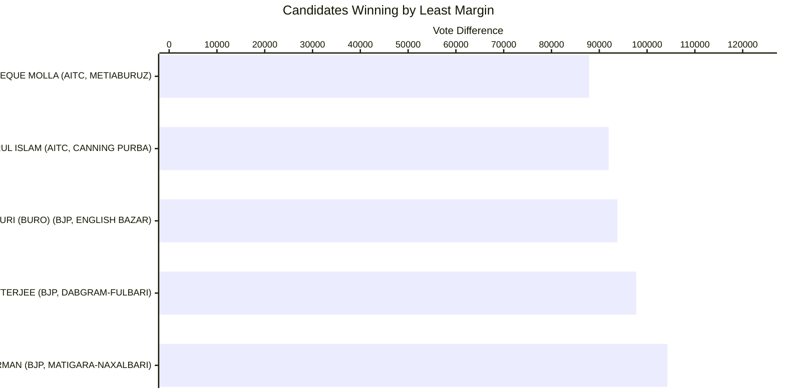

#### Max Total Votes in a Constituency

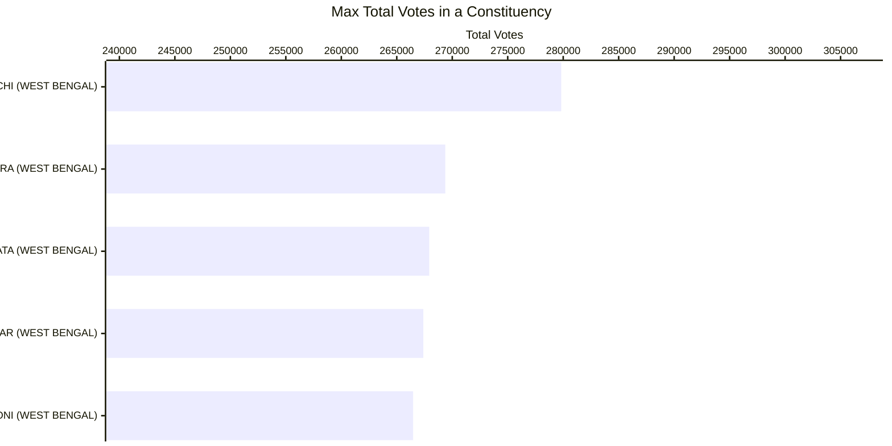

#### Min Total Votes Constituency

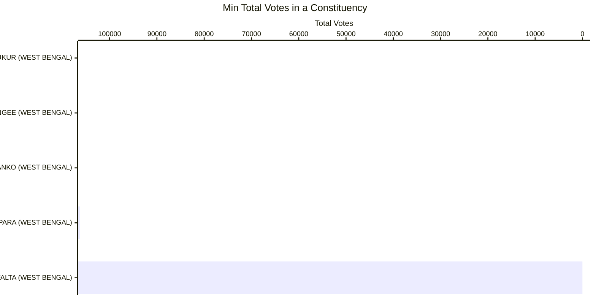

#### Max Candidates in a Constituency

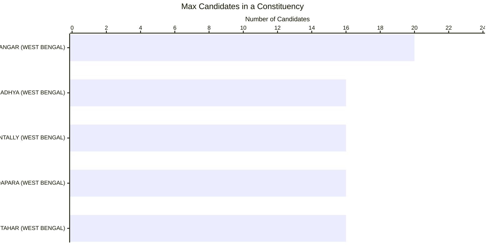

#### Least Candidates in a Constituency

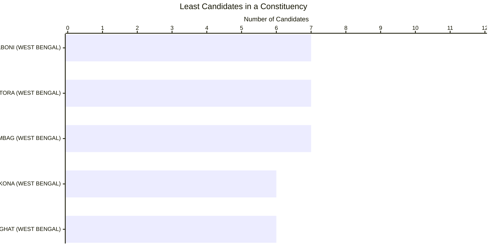

#### Total Vote Share of Parties

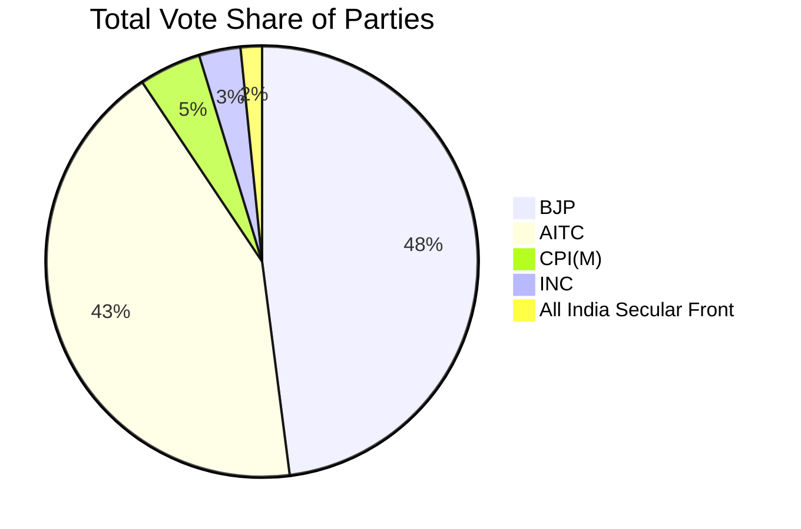

#### Maximum Vote Share of Winning Candidate

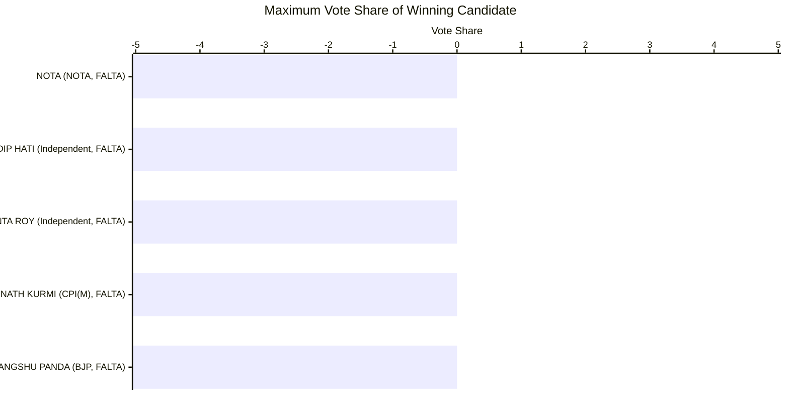

#### Least Vote Share for a Winning Candidate

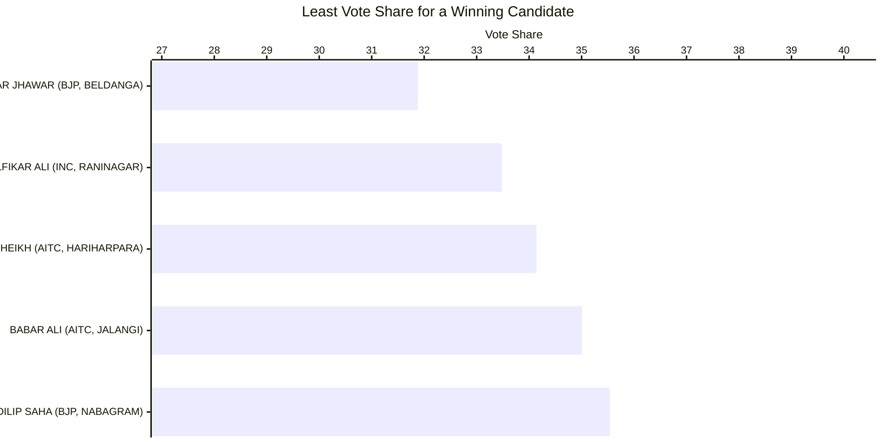

#### Max Vote Share of a Losing Candidate

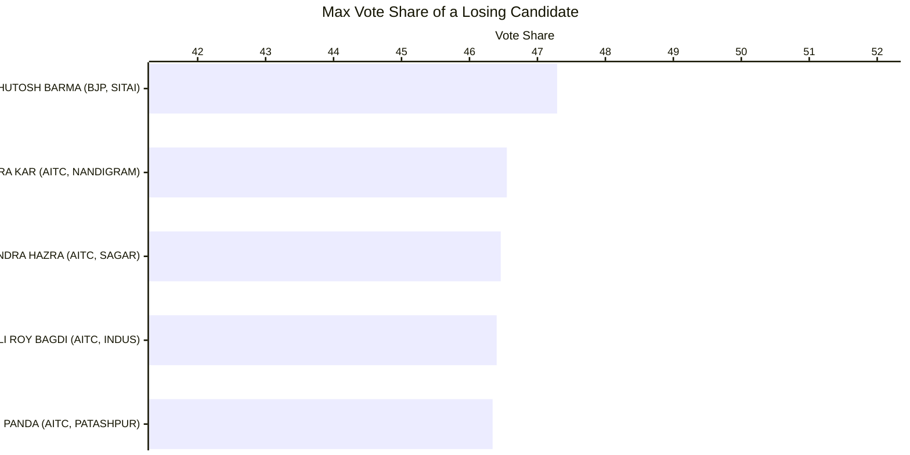

#### Seats in which Parties Lost Deposits (less than 1/6 vote share)

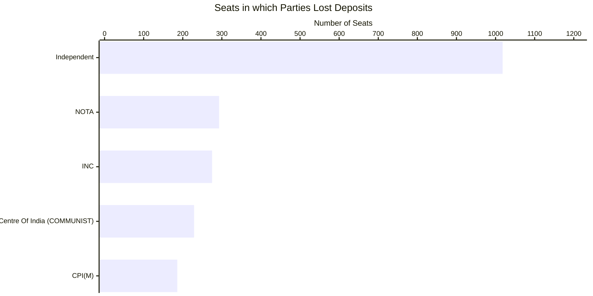

#### Gold (Seats that Parties Won)

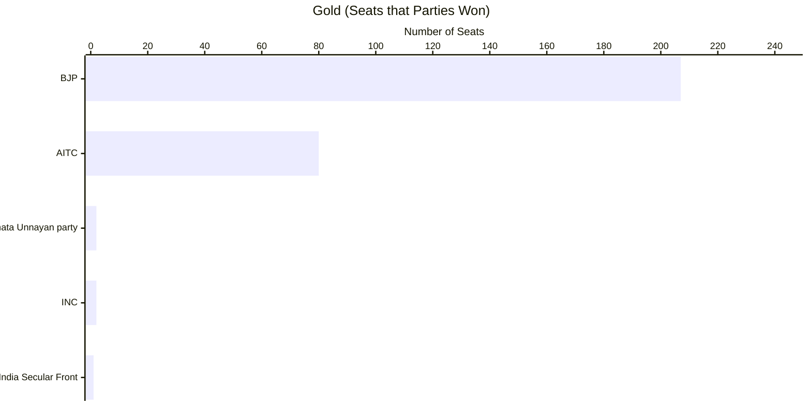

#### Silver (Seats that Parties Came in Second)

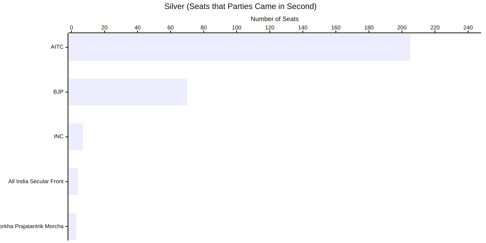

#### Cost per Vote - Best Value

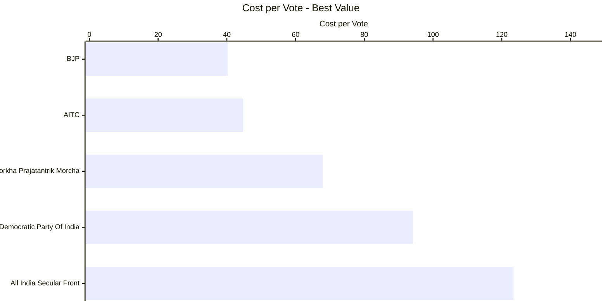

#### Cost per Vote - Worst Value

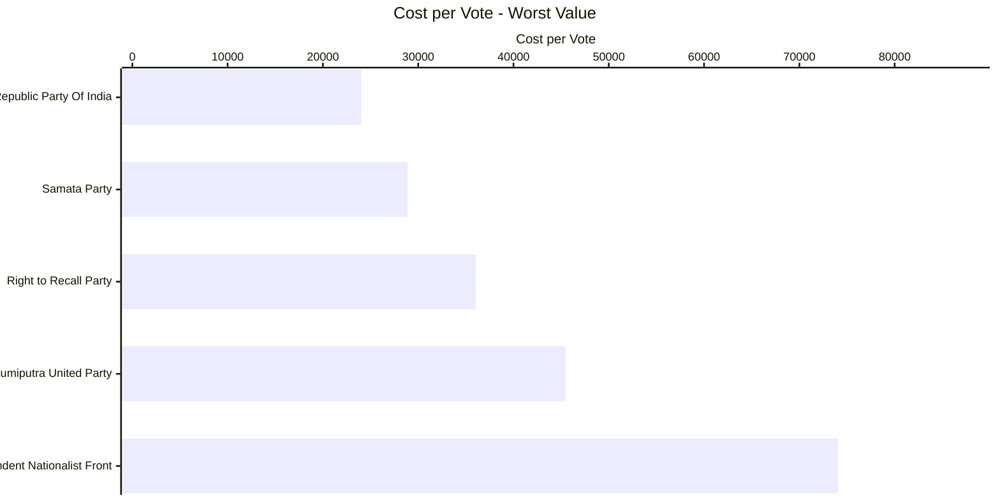

#### Success Ratio - Best


| Party | Seats Contested | Seats Won | Success Ratio |
| --- | --- | --- | --- |
| All India Trinamool Congress | 291 | 80 | 27.49140893470790378000 |
| All India Secular Front | 30 | 1 | 3.33333333333333333300 |
| Aam Janata Unnayan party | 143 | 2 | 1.39860139860139860100 |
| Indian National Congress | 293 | 2 | 0.68259385665529010200 |
| Communist Party of India (Marxist) | 197 | 1 | 0.50761421319796954300 |

#### Success Ratio - Worst


| Party | Seats Contested | Seats Won | Success Ratio |
| --- | --- | --- | --- |
| Communist Party of India (Marxist) | 197 | 1 | 0.50761421319796954300 |
| Indian National Congress | 293 | 2 | 0.68259385665529010200 |
| Aam Janata Unnayan party | 143 | 2 | 1.39860139860139860100 |
| All India Secular Front | 30 | 1 | 3.33333333333333333300 |
| All India Trinamool Congress | 291 | 80 | 27.49140893470790378000 |

### Multiple Seat Participation

#### Results of Candidates participating in multiple seats

| Candidate | Constituency | Code | Party | Result |
| --- | --- | --- | --- | --- |
| HUMAYUN KABIR | NOWDA | S2574 | Aam Janata Unnayan party | WON |
| HUMAYUN KABIR | REJINAGAR | S2570 | Aam Janata Unnayan party | WON |
| ADHIKARI SUVENDU | NANDIGRAM | S25210 | Bharatiya Janata Party | WON |
| ADHIKARI SUVENDU | BHABANIPUR | S25159 | Bharatiya Janata Party | WON |
| ARUP KUMAR DAS | SINGUR | S25188 | Bharatiya Janata Party | WON |
| ARUP KUMAR DAS | KANTHI DAKSHIN | S25216 | Bharatiya Janata Party | WON |
| DILIP GHOSH | KHARAGPUR SADAR | S25224 | Bharatiya Janata Party | WON |
| HUMAYUN KABIR | BHAGAWANGOLA | S2562 | Aam Janata Unnayan party | LOST |
| RAMKRISHNA MALIK (DEV) | BARDHAMAN UTTAR | S25266 | Bahujan Samaj Party | LOST |
| RAMKRISHNA MALIK (DEV) | MANGALKOT | S25272 | Bahujan Samaj Party | LOST |

### Close Contest Matrix
This matrix provides the number of seats in which parties lost by the number of votes provided in the columns.

| Losing Party | < 500 | < 2500 | < 5000 | < 10000 | < 15000 | < 25000 | < 50000 |
| --- | --- | --- | --- | --- | --- | --- | --- |
| Aam Janata Unnayan party | 0 | 0 | 0 | 0 | 1 | 1 | 1 |
| All India Secular Front | 0 | 0 | 0 | 0 | 0 | 1 | 2 |
| All India Trinamool Congress | 2 | 7 | 14 | 31 | 54 | 97 | 183 |
| Bharatiya Gorkha Prajatantrik Morcha | 0 | 0 | 0 | 1 | 1 | 3 | 3 |
| Bharatiya Janata Party | 0 | 3 | 7 | 16 | 27 | 35 | 59 |
| Communist Party of India (Marxist) | 0 | 0 | 0 | 0 | 0 | 1 | 1 |
| Independent | 1 | 1 | 1 | 1 | 1 | 1 | 1 |
| Indian National Congress | 0 | 0 | 0 | 1 | 1 | 3 | 5 |

#### Party Specific Close Contest Matrix


##### All India Trinamool Congress

| Constituency | Code | Runner Up Votes | Winning Party | Winning Votes | Vote Difference |
| --- | --- | --- | --- | --- | --- |
| RAJARHAT NEW TOWN | S25115 | 106248 | Bharatiya Janata Party | 106564 | 316 |
| SATGACHHIA | S25145 | 110622 | Bharatiya Janata Party | 111023 | 401 |
| RAINA | S25261 | 102653 | Bharatiya Janata Party | 103487 | 834 |
| JANGIPARA | S25195 | 101547 | Bharatiya Janata Party | 102409 | 862 |
| INDUS | S25257 | 107833 | Bharatiya Janata Party | 108733 | 900 |


##### Bharatiya Janata Party

| Constituency | Code | Runner Up Votes | Winning Party | Winning Votes | Vote Difference |
| --- | --- | --- | --- | --- | --- |
| HARIRAMPUR | S2542 | 91112 | All India Trinamool Congress | 93098 | 1986 |
| MANDIRBAZAR | S25135 | 91691 | All India Trinamool Congress | 93686 | 1995 |
| MADHYAMGRAM | S25118 | 93596 | All India Trinamool Congress | 95995 | 2399 |
| SITAI | S256 | 125467 | All India Trinamool Congress | 128188 | 2721 |
| KHARAGPUR | S25228 | 95448 | All India Trinamool Congress | 98320 | 2872 |


##### Indian National Congress

| Constituency | Code | Runner Up Votes | Winning Party | Winning Votes | Vote Difference |
| --- | --- | --- | --- | --- | --- |
| SAMSERGANJ | S2556 | 54331 | All India Trinamool Congress | 61918 | 7587 |
| BAHARAMPUR | S2572 | 73540 | Bharatiya Janata Party | 91088 | 17548 |
| LALGOLA | S2561 | 48994 | All India Trinamool Congress | 67954 | 18960 |
| MURARAI | S25294 | 59197 | All India Trinamool Congress | 96902 | 37705 |
| RAGHUNATHGANJ | S2559 | 48354 | All India Trinamool Congress | 88909 | 40555 |


### Advanced Join Insights

#### Crowding pressure seats

Crowded ballots with thin margins are visualized below using "others" vote share as a proxy for fragmentation.

| Code | Constituency | Winning Party | Runner Up Party | Candidate Count | Others Vote % | Margin Votes | Margin % | Postal Gap | Crowding Band |
| --- | --- | --- | --- | --- | --- | --- | --- | --- | --- |
| S2563 | RANINAGAR | Indian National Congress | All India Trinamool Congress | 15 | 34.16 | 2701 | 1.14 | 21 | Ultra-crowded |
| S2555 | FARAKKA | Indian National Congress | Bharatiya Janata Party | 13 | 32.57 | 8193 | 4.68 | -109 | Crowded |
| S2523 | DARJEELING | Bharatiya Janata Party | Bharatiya Gorkha Prajatantrik Morcha | 7 | 32.04 | 6057 | 3.49 | 764 | Standard |
| S2565 | NABAGRAM | Bharatiya Janata Party | All India Trinamool Congress | 8 | 31.60 | 5919 | 2.68 | 180 | Standard |
| S2566 | KHARGRAM | Bharatiya Janata Party | All India Trinamool Congress | 10 | 28.52 | 9333 | 4.56 | 73 | Crowded |

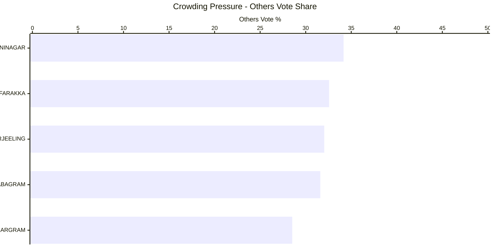

#### Runner-up overperformance vs party baseline

These runner-up candidates beat their party-wide average vote share even in defeat.

| Constituency | Candidate | Party | Runner Up % | Party Avg % | Overperformance % | Total Constituencies Contested |
| --- | --- | --- | --- | --- | --- | --- |
| SAMSERGANJ | MD NAJME ALAM | Indian National Congress | 34.96 | 3.03 | 31.93 | 293 |
| BAHARAMPUR | ADHIR RANJAN CHOWDHURY | Indian National Congress | 32.79 | 3.03 | 29.76 | 293 |
| HARIHARPARA | BIJOY SEKH | Aam Janata Unnayan party | 28.76 | 1.43 | 27.33 | 143 |
| LALGOLA | TOUHIDUR RAHAMAN SUMAN | Indian National Congress | 27.19 | 3.03 | 24.16 | 293 |
| RAGHUNATHGANJ | NASIR SAIKH | Indian National Congress | 24.83 | 3.03 | 21.80 | 293 |

```mermaid
---
config:
  xyChart:
    width: 1200
    height: 600
    chartOrientation: horizontal
  dataLabels:
    enabled: true
    placement: end
---
xychart-beta
title "Runner-up Overperformance"
x-axis ["SAMSERGANJ", "BAHARAMPUR", "HARIHARPARA", "LALGOLA", "RAGHUNATHGANJ"]
y-axis "Overperformance %" 0 --> 35
bar [31.93, 29.76, 27.33, 24.16, 21.80]
```

#### HHI win mix by party

Competition bands (Herfindahl-Hirschman Index) show which parties dominate different contest types.

| Party | HHI Band | Seats Won |
| --- | --- | --- |
| Aam Janata Unnayan party | Competitive | 1 |
| Aam Janata Unnayan party | Fragmented | 1 |
| All India Secular Front | Competitive | 1 |
| All India Trinamool Congress | Competitive | 45 |
| All India Trinamool Congress | Dominant | 11 |
| All India Trinamool Congress | Fragmented | 24 |
| Bharatiya Janata Party | Competitive | 140 |
| Bharatiya Janata Party | Dominant | 57 |
| Bharatiya Janata Party | Fragmented | 10 |
| Communist Party of India (Marxist) | Fragmented | 1 |

```mermaid
---
config:
  xyChart:
    width: 1200
    height: 600
  dataLabels:
    enabled: true
    placement: end
---
xychart-beta
title "HHI Win Mix by Party"
x-axis ["Competitive", "Dominant", "Fragmented"]
y-axis "Seats Won" 0 --> 100
bar "Independent" [0, 1, 0]
bar "Indian" [0, 0, 0]
bar "Communist" [0, 0, 0]
bar "Bharatiya" [0, 0, 0]
bar "All" [0, 0, 0]
```

#### Third-place spoilers in tight races

Third-place candidacies that materially exceeded their party's norm highlight potential spoiler roles.

```mermaid
---
config:
  xyChart:
    width: 1200
    height: 600
    chartOrientation: horizontal
  dataLabels:
    enabled: true
    placement: end
---
xychart-beta
title "Third-place Overperformance"
x-axis ["DARJEELING", "NABAGRAM", "KHARGRAM", "RANINAGAR", "TOLLYGANJ"]
y-axis "Overperformance %" 0 --> 25
bar [27.62, 19.60, 13.91, 13.88, 8.15]
```
